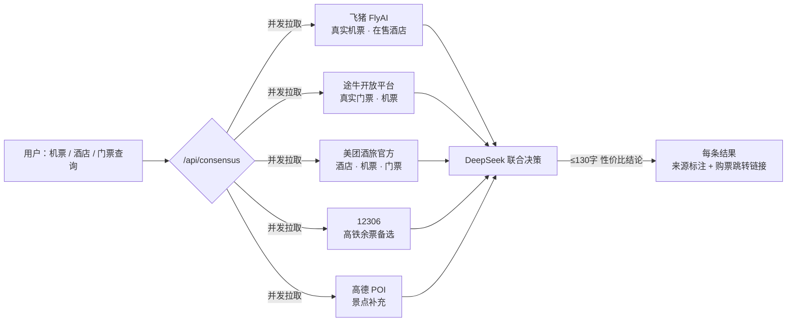

<div align="center">

**🌐 Language: <a href="./README.md">Simplified Chinese</a> · <a href="./README.zh-Hant.md">Traditional Chinese</a> · <a href="./README.en.md">English</a>**

</div>

---
<div align="center">

# 123 Let's Go · *Travel Verified, Not Memorized*

> **The paths you've walked deserve to be verified.**
> *Where every step is verified, not just remembered.*

[](./LICENSE)
[](https://nodejs.org/)
[](https://www.volcengine.com/)
[](https://www.suit-sz.edu.cn/)

**Crowdsourced Community Routes × AI Cross-Validation × Personalized Travel Companion · Full-Stack In-House**

[🚀 Quick Start](#-quick-start-recommended) · [🌐 Five Major Data Sources](#-five-major-data-sources--multi-source-joint-decision-engine) · [📖 Key Highlights](#-key-highlights) · [🏗️ Technical Architecture](#-technical-architecture) · [🔑 Apply for an API Key](#-apply-for-an-api-key) · [📊 API Documentation](#-api-documentation) · [🤝 Deployment Guide](#-deployment-guide)

</div>

<div align="center">

<table>
  <tbody>
    <tr>
      <td align="center" style="vertical-align: middle; padding: 0 16px; border: none;">
        
      </td>
      <td align="center" style="vertical-align: middle; padding: 0 2px; border: none; color: #F0A500; font-size: 24px; font-weight: 300; opacity: 0.8; width: 1px;">
        ×
      </td>
      <td align="center" style="vertical-align: middle; padding: 0 16px; border: none;">
        
      </td>
    </tr>
  </tbody>
</table>

<sub>Shenzhen University of Information Technology · Team No. 123 · 2026 "Volcano Cup" Agent Innovation Competition · Volcano Engine</sub>

</div>

---

## 📑 Table of Contents

### 🚀 Quick Start
- [Quick Start (Recommended)](#-quick-start-recommended)
- [Manual Installation Guide](#-manual-installation-guide)
- [Apply for API Key](#-apply-for-an-api-key)

### 📖 Project Introduction
- [Project Background and Positioning](#-project-background-and-positioning)
- [Naming Origin](#-origin-of-the-name)
- [Core Highlights](#-key-highlights)
- [Five Major Data Sources · Multi-Source Joint Decision Engine](#-five-major-data-sources--multi-source-joint-decision-engine)
- [Race Information](#-competition-information)
- [Feature Showcase (Three Modules)](#-feature-showcase-three-major-modules)

### 🏗️ Architecture and Design
- [Technical Architecture](#-technical-architecture)
- [Technology Stack Overview](#-technology-stack-overview)
- [Core Implementation Principles](#-core-implementation-principle)
- [Design Philosophy](#-design-philosophy)
- [Thoughtful Details](#-thoughtful-details)

### 🤝 Deployment and Reference
- [Deployment Guide](#-deployment-guide)
- [CI/CD and Automation](#-cicd-and-automation)
- [Security Design](#-security-design)
- [Performance and Observability](#-performance-and-observability)
- [Known Limitations / Roadmap](#-known-limitations--areas-for-improvement-roadmap)
- [API Documentation](#-api-documentation)
- [Complete Directory Structure](#-complete-directory-structure)

### 📄 Appendix
- [License](#-license)
- [Acknowledgments](#-acknowledgments)
- [Also Thanks](#-also-thanks)

---

## 🎯 Project Background and Positioning

> **Redefining "Travel Planning" in the AI Era — Upgrading from "AI One-Sentence Generation" to a Trinity Paradigm of "AI Cross-Validation + Community Crowdsourcing + Travel Companion".**

**Market Pain Points**:
1. **AI-generated itineraries lack credibility** — the plans users receive may come with problems such as attraction closures, conflicting routes, and inflated prices
2. **Community guide content lacks timeliness** — old posts rank high and fail to reflect the latest opening status, operational changes, and price updates
3. **Travelers lack real-time support during trips** — when traveling away from home, genuine, usable recommendations from locals are more valuable than "trendy check-in" spots

**Solution**: Integrating "AI itinerary design", "real data cross-validation", and "real-time travel companion" into one organic whole.

---

## 💡 Origin of the Name

> **Why is it called "123 Let's Go"?** — The project is named after **Team No. 123 in the 2026 "Volcano Cup" Agent Innovation Competition**.

The number "123" carries a dual meaning, and together the two form the product manifesto:

- **Team number as product name**: Team No. 123 in the 2026 "Volcano Cup" directly uses its team number as the product name — it rolls off the tongue, is easy to remember, and stands out.
- **"One, two, three, go!"**: The most classic countdown in Chinese — pack your bags → plan the route → **Let's go**. The core goal of the project is to compress the planning step, the most time-consuming of the three, to a minimum, so that "setting off" comes faster.

> Subtitle *Travel Verified, Not Memorized* — Existing AI itinerary tools on the market all adopt the “memory-based generation (Memorized)” model, while this project adheres to “cross-verification with real data (Verified).”

---

## 🌟 Key Highlights

> The following are the project's differentiated innovation highlights, ranked by importance:

| # | Innovation | Industry Comparison |
|---|--------|----------|
| 🥇 | **8-dimension scoring system with AI × real data × community triple cross-validation** | Existing AI itinerary tools on the market only output "plausible-looking" plans, lacking any verification mechanism |
| 🥇 | **15-step observable chain-of-thought + real-time progress bar + data source badges** | Achieves **full transparency** of the AI reasoning process; users can view the computation logic and data source of each step in real time |
| 🥇 | **Local specialty drinks & food recommendations (real data from 53 cities, covering 200+ local tea beverage brands)** | Recommends authentic local specialty drinks and cuisine based on the destination, covering all major tourist cities nationwide; data sourced from local knowledge bases, web search, and Dianping/Meituan reviews |
| 🥇 | **Travel companion: location awareness + emergency dialing + real-time Amap POI recommendations** | Competitors mostly focus on pre-trip planning; this project delivers **full-journey companionship** |
| 🥈 | **Automatic parsing of unknown cities** — generates routes even for county-level cities / off-the-beaten-track attractions | Mainstream tools only support prefecture-level cities and above |
| 🥈 | **CSS-driven liquid glass UI** (no React/Vue) | A rare "vanilla three-piece stack + modern design language" practice in the industry |
| 🥈 | **Real data source strategy + multi-source joint decision-making** (Amap/Open-Meteo/Frankfurter permanently free + official Meituan hotel & travel / Fliggy FlyAI / Tuniu / 12306 real ticket prices; `/api/consensus` multi-platform cross-validation + DeepSeek joint decision; prices marked with source and purchase link) | Similar tools mostly rely on a single paid API (Booking/Skyscanner) |
| 🥉 | **AES-256-CBC encrypted keys + gitleaks CI scanning** | A rare "zero key leakage" engineering practice in open-source projects |
| 🥉 | **Province → prefecture-level city cascade + input autocomplete** | Truly aligns with China's administrative division conventions |
| 🥉 | **6 types of chain-of-thought** (Amap/weather/transport/hotel/restaurant/AI) annotated in real time | Improves the **credibility** and **explainability** of AI output |

---

## 🌐 Five Major Data Sources · Multi-Source Joint Decision Engine

> **"123 Let's Go" does not rely on a single data source — flights, hotels, tickets, routes, weather, maps: every piece of data comes from a real platform, with the source marked, clickable for verification, and cross-validated by AI decision-making.**
>
> **Meituan Hotel & Travel (official direct connection) + Fliggy FlyAI + Tuniu Open Platform + 12306 + Amap + DeepSeek = a real, traceable, bookable travel decision brain.**

### Why five data sources?

| Data Source | Platform | What It Provides | Integration | Key Highlight |
|--------|------|---------|---------|---------|
| 🗺️ **Amap Open Platform** | Alibaba | POI search for attractions/food/hotels, real-time weather, geocoding, route planning (driving/walking/transit), static maps, front-end map rendering | Web Service Key + JS API Key | Full-journey spatial foundation, 5000 free requests/day |
| 🧠 **DeepSeek V4 Flash** | DeepSeek | AI itinerary design, travel companion chat, **multi-source joint decision-making**, overall evaluation | `deepseek-v4-flash` + strict JSON Schema output | Fully transparent 15-step chain-of-thought; AI goes from "black box" to "white box" |
| ✈️ **Fliggy FlyAI** | Alibaba | **Real flights (full price)**, real on-sale hotels, POI tickets, train tickets, Marriott hotels | `flyai.open.fliggy.com/mcp` · HMAC-SHA256 signature + AES-256-GCM context encryption | Fully replicating the MCP tool protocol, 6h in-memory cache |
| 🐫 **Tuniu Open Platform** | Tuniu | **Real attraction tickets (lowest price online)**, hotels, flights | `openapi.tuniu.cn/mcp` · official open platform | The project's only real ticket source, 6h cache to ease quotas |
| 🏨 **Meituan Hotel & Travel (official direct connection)** | Meituan | **Real hotels (rating/year opened/price)**, flights, tickets + `dpurl.cn` booking short link | `mcp-open-cater.meituan.com` official gateway · obtained by reverse-engineering the official `ht-ai` CLI | Direct-connection protocol, no MCP gateway config needed, one command to integrate |

### Multi-Source Joint Decision Architecture (/api/consensus)



### Three Joint Decision Modes Covering the Three Core Travel Needs

| Type | Concurrently Pulled Data Sources | Output | Use Cases |
|------|----------------|------|---------|
| `flight` Flights | Fliggy flights (direct-first) + Tuniu flights + Meituan Hotel & Travel + **12306 high-speed rail backup** | Multi-source flight/high-speed rail cross-price comparison + lowest price + purchase links for each platform | Choosing between flight and high-speed rail for "Guangzhou → Beijing"? See it all in one table |
| `hotel` Hotels | Fliggy hotels on sale + Tuniu hotels + Meituan Hotel & Travel | Rating / Price / Year opened + booking redirect link | "Beijing": available listings from hostels to five-star at all price points |
| `ticket` Tickets | Tuniu verified tickets (lowest price) + AMAP POI supplement + Meituan Hotel & Travel | Ticket price + booking link + attraction info | Where are "Shanghai Disneyland" tickets cheapest? |

**Every result comes with `source` (data source) + `link` (purchase/booking redirect)**, and DeepSeek provides a combined decision in ≤130 characters (best value + credibility + risk warnings); when the data source Key is missing, an automatic local heuristic fallback is applied.

### Actual Measured Results (Real Operational Data)

| Query | Multi-source Cross-check Results |
|------|-------------|
| ✈️ Guangzhou → Beijing Flights | Fliggy **¥700** · Tuniu **¥850** · Meituan **¥678~821** — Cross-verified across 3 sources, with purchase links for each platform |
| 🏨 Beijing Hotels | Fliggy + Meituan 6~7 **available** hotel cards: Hemu Youth Hostel **from ¥103** / Granary Art Hotel **from ¥574**, with Meituan's real rating of 4.8 noted |
| 🚄 Huizhou → Guangzhou Flights | Meituan determines "no direct flight" → recommends high-speed rail/bus; entries without links are automatically skipped — **Better to omit than fabricate, never produce fake data** |
| 🎫 Shanghai Disneyland Tickets | Meituan AI returns blank → automatically skipped, with Tuniu real tickets + Amap POI as fallback — **Graceful degradation, never blocking** |

### Data Credibility Assurance Mechanism

1. **Sources always visible** — Every price/entry is labeled with its data source (Amap / DeepSeek / Fliggy / Tuniu / Meituan); the front-end thought chain and result cards display data source badges
2. **Click-through verification** — Real entries come with purchase/booking links (Meituan `dpurl.cn` short links, Fliggy/Tuniu platform links); users can jump straight to the official page with one click to verify
3. **Better to omit than fabricate** — When a data source finds no result, the entry is automatically skipped; fabricated data is never used to fill gaps (hard constraint at the top of [server.js](file:///d:/SUIT%20Trae%20CN/server.js))
4. **Graceful degradation, never blocking** — If any data source Key is missing or times out, it automatically degrades to the remaining data sources or local reference estimates; other features are unaffected
5. **6h smart cache** — All external API results are cached in memory for 6 hours, balancing real-time freshness with quota costs

> 💡 Want to try it yourself? Use the "Travel Companion → 🔀 Multi-source Price Comparison" entry in the front end, or call `/api/consensus` directly (see [API Documentation](#-api-documentation) for the full API).

---

## 🏆 Competition Information

| Item | Content |
|---|------|
| **Competition** | 2026 "Volcano Cup" Agent Innovation Competition & National Qualifier |
| **School** | Shenzhen University of Information Technology |
| **Team Number** | No. 123 |
| **Project Name** | 123 Let's Go (Travel Verified, Not Memorized) |
| **Topic Direction** | Travel planning + AI validation + community crowdsourcing |

### Problems Solved by the Project

> **Core Question: How Can We Make AI-Generated Travel Plans Trustworthy?**

- **Problem 1**: AI's black-box output makes it hard for users to trust recommendations
  - **Solution**: 15-step chain-of-thought + real-time data source annotation + 8-dimensional quantitative scoring
- **Problem 2**: Travel guide communities have outdated content and uneven quality
  - **Solution**: Three-way cross-validation: AI × real data × community
- **Problem 3**: Travelers are left stranded; existing AI assistants are limited to pre-trip planning
  - **Solution**: Travel companion + location awareness + emergency dialing + real-time POI

### Core Innovation Points

1. **Explainable AI** — Not just "AI output results"; fully presents the AI's reasoning process, queried content, and recommendation rationale
2. **Trinity Paradigm** — Planning + verification + companionship, creating a complete closed loop for the travel experience
3. **Real Data First** — Database of 280+ real cities, 12306 real fare algorithm, Fliggy FlyAI real flights/hotels, Tuniu real tickets, price comparison across 5 real platforms
4. **Engineering Rigor** — CI/CD, key encryption, unit testing, full documentation coverage — achieving industrial-grade standards
5. **Design Language Innovation** — Liquid glass × midnight warm gold, pure native implementation — achieving a modern feel even without React/Vue

---

## 📸 Feature Showcase (Three Major Modules)

> **3 main modules · Single-page application (`index.html`, with embedded CSS/JS) · Multi-language support (Simplified Chinese by default / Traditional Chinese / English, **to be improved**)**
> The homepage `index.html` hosts all features in 3 tabs at the top, without needing to navigate to separate pages; the language switch button in the top-right corner of the page switches the interface language in one click (dynamic data / AI output remains in the original language).
>
> ⚠️ **Multi-language adaptation notes (to be improved)**: DeepSeek flash batch translation + pre-translation library ([js/i18n_db.json](./js/i18n_db.json), 1444 entries) + local real-time fallback (Simplified/Traditional character mapping / English UI dictionary) have been integrated. After switching languages, static interface copy is translated instantly; however **the translation is not yet fully complete** — some interface copy and dynamic content (thinking chain, AI itineraries, community routes, etc.) remain untranslated, and English/Traditional Chinese displays may still contain the original Chinese text. This is a known item to be improved.
>
> 📖 **This document is available in multiple languages**: English (this page) · [简体中文](./README.md) · [繁體中文](./README.zh-Hant.md). Use the language switcher at the top to jump between them.

**Page Structure Overview**:

- **index.html (the only page)**: 3 Tabs — Smart Planning (cascading city selection + tag selection + one-sentence generation + AI chain-of-thought + price comparison across 6 transport modes + 5 restaurant tiers + 4 hotel tiers + specialty drinks & cuisine + route validation & scoring + retrospective insights), Travel Companion (city linkage + detailed address resolution + quick tools + real-time POI + emergency dialing), Community Routes (search/filter + favorites/ratings + route sharing + comments)

### 1️⃣ Smart Planning (Home Tab 1)

**User Journey**: Enter city, days, budget, and preferences → 15-step thinking chain unfolds in real time → 8-dimension scoring → one-click trip creation.

**Page Flow**: Smart planning page (magnetic snap effect for destination cards + six-dimensional multi-source comprehensive evaluation of daily recommendations + province-city cascade + one-sentence input) → Generate itinerary (real-time chain-of-thought expansion + complete map route + 8-dimensional validation score + multi-dimensional travel tips) → Post-trip review (actual vs. planned, can be consolidated into community routes)

**15-Step Thinking Chain** (Expand to view each step's reasoning process and data sources):
1. City Parsing (280+ city database / Amap geocoding fallback)
2. POI Data Retrieval (Amap v3/place/text)
3. Interest Matching Scoring (tags + season + weather + real-coordinate weighting)
4. AI Itinerary Design (DeepSeek V4, strict JSON Schema output)
5. Museum Count Balancing (automatically detects and fixes routes with clustered museums)
6. POI Detail Enhancement (Amap v3/place/detail, fills in phone/business hours/ticket types)
7. Restaurant Recommendations (5 tiers: small eateries/home-style/mid-range/fine dining/Michelin, with 6-platform links)
8. Local Specialty Drinks & Food Recommendations (LOCAL_SPECIALS_DB local knowledge base, 53 cities + Amap food POI real-time fallback)
9. Hotel Recommendations (grouped by star rating, including average price/total price/6-platform price comparison)
10. Multi-source Pricing Prefetch (Tuniu tickets per attraction + 12306 fares + Fliggy flights + Meituan hotels, concurrent short timeouts, silent degradation on failure)
11. Route Verification Scoring (8 dimensions + data quality sub-dimensions + actual vs. target + progress bar + numeric animation)
12. Departure Date Recommendation (15-day rolling window + rain/peak avoidance + holiday awareness)
13. AI Overall Evaluation (DeepSeek summary + risk annotations)
14. Community Routes (search results from 5 platforms: Qunar/Ctrip/Xiaohongshu/Mafengwo/Weibo)
15. Multi-dimensional Travel Tips (6 dimensions: cultural background/customs/safety tips/best visiting time/transportation/dining & shopping)

**Actual content of the homepage smart planning** (the form page before clicking "One-Click Generate"):
- Departure city cascade (province → prefecture-level city, supports direct input of county-level cities / scenic spots)
- Automatic price comparison of 6 transportation modes (train / high-speed rail / plane / bus / self-driving / taxi)
- 12 interest tags multi-select (food / history / nature / culture / shopping / nightlife / arts / outdoor / family / photography / hot springs / skiing)
- One-sentence quick entry (lazy mode: too much trouble filling out the form? Just say it)
- Real-time dialogue modifications (continue chatting after generation to change the itinerary)

**📸 Smart planning screenshots:**

| Homepage form & information entry | Daily recommendation (six-dimensional multi-source comprehensive evaluation) |
|:---:|:---:|
|  |  |

| AI Thought Chain + Reasoning Stack (15-Step Observability) |
|:---:|
|  |

| Smart Planning Page | Full Route (Map View) |
|:---:|:---:|
|  |  |

| Route Validation 8-Dimension Score | Daily Itinerary (Multiple Export Options) |
|:---:|:---:|
|  |  |

| Transportation Comparison & Fares | Restaurant Recommendations (5 Price Ranges) |
|:---:|:---:|
|  |  |

| Hotel Recommendations (4 Star Tiers) | Destination Weather |
|:---:|:---:|
|  |  |

| Multi-Dimensional Travel Tips | Local Specialty Experiences |
|:---:|:---:|
|  |  |

| Itinerary Export Display |
|:---:|
|  |

### 2️⃣ Travel Companion (Home Tab 2)

**Purpose**: Real-time queries while traveling, **city linkage** intelligently plans the selected destination, and you can also modify it manually.

**Functional Areas**: The top information bar displays the current city (locked), lunar calendar date, and holiday countdown. On the left is the emergency dialing area (110/120/119/Back to Hotel). In the center is the AI conversation window, supporting multi-turn dialogue and providing replies via Amap real-time POI and DeepSeek. On the right is the quick tools area (Attraction Tickets/Find Hotels/Flights/High-Speed Rail/Smart Chat/Find Restrooms/Shopping Malls/ATM).

**Practical Features**:
- Detailed address parsing (fill in district/street/hotel/scenic area → precise location)
- Amap map markers (5 types: attractions/hotels/restaurants/transportation/locations)
- Real-time exchange rates (Frankfurter permanently free API)
- Free chat mode (supports general Q&A on non-travel topics)

**📸 Travel Companion Screenshot:**

| Travel Companion Page | NTP Time Server Display |
|:---:|:---:|
|  |  |

| Calendar Display | Almanac Display |
|:---:|:---:|
|  |  |

| Holiday Countdown |
|:---:|
|  |

### 3️⃣ Community Routes (Home Tab 3)

**Purpose**: A crowdsourced route library where users can search, filter, and view route details.

**Home Tab**: Supports searching by city, title, tag, and POI, displayed as a 3-column grid of cards
- Route details: itinerary/cost/experience/rating
- One-click import into smart planning (generate personalized itineraries based on community routes)
- Data source attribution (Qunar/Ctrip/Xiaohongshu/Mafengwo/Weibo)

**📸 Community route screenshot:**

| Community Route Page |
|:---:|
|  |

---
## 🚀 Quick Start (Recommended)

> **Prerequisites**: Ensure Node.js 18+ is installed.

### Windows users

```cmd
1. Download/clone this repository to your local machine
2. Double-click start.bat
3. On first run, you'll be prompted to edit .env and fill in your keys
4. Save, then double-click start.bat again
5. Your browser opens http://localhost:3000 automatically 🎉
6. **The service auto-restarts after an abnormal exit** — no manual intervention needed
```

### Mac / Linux users

```bash
git clone https://github.com/JimmyMi001/SUIT-TRAE-123Lets-GO.git
cd SUIT-TRAE-123Lets-GO
chmod +x start.sh
./start.sh
```

**Automated process** ([scripts/setup.js](./scripts/setup.js) handles all the pre-work automatically):

1. Check Node.js version ≥ 18
2. Detect `.env` file; if it doesn't exist, copy from `.env.example`
3. Check whether the key is a placeholder and prompt the user to fill it in
4. If `node_modules` is missing, automatically run `npm install`
5. Start the service with `npm start`
6. Automatically open the browser after 2 seconds

---

## 🔑 Apply for an API Key

### 1. Amap API Key (Required)

**Use**: POI search, route planning, weather, maps.

**Application Steps** (Approx. 2 minutes):

1. Open https://lbs.amap.com/dev/key/app
2. Click "Register" in the top-right corner → Register with your phone number
3. After logging in, enter the "Console"
4. In the left menu, go to "Application Management" → "My Applications" → "Create New Application"
   - Application Name: Fill in anything, e.g., `123-travel`
   - Application Type: Select "Other"
5. After creation, click "Add Key"
   - Key Name: Fill in anything
   - **Service Platform: Be sure to select "Web Service" (not "Web Client (JS API)")**
   - Submit
6. Copy the generated Key (32-digit hexadecimal) and paste it into `.env`:
   ```
   AMAP_KEY=your_amap_web_service_key_here   # 32-digit hexadecimal, copied from the Amap console
   ```

> 💡 **Difference between JS API Key and Web Service Key**:
> - Web Service Key: Used for server-side calls (POI/weather/routes)
> - JS API Key: Used for loading maps in the browser
>
> This project only requires a Web Service Key to run (the JS API Key is hardcoded in index.html for demonstration purposes, **not recommended for production environments**)

### 2. DeepSeek API Key (Required)

**Purpose**: AI itinerary design + travel companion chat

**Free quota**: Registration gives you ¥10 (about 10 million tokens, enough for daily use)

**Application steps** (about 1 minute):

1. Open https://platform.deepseek.com/api_keys
2. Register with your phone number
3. After logging in, go to the "API Keys" page
4. Click "Create New Key"
5. Enter any name (e.g., `123-travel`)
6. Copy the generated Key (starts with `sk-`) and paste it into `.env`:
   ```
   DEEPSEEK_KEY=sk-your_deepseek_key_here   # starts with sk-, created from the DeepSeek console
   ```

> 💡 **This project uses the `deepseek-v4-flash` model**, delivering 3x faster speed than V3, 50% lower cost, and comparable Chinese-language capability.

### 3. Fliggy FlyAI API Key (Optional · Built-in Anonymous Trial Key)

**Purpose**: Real flight tickets (full price), real hotels (name/address/coordinates/star rating), POI ticket information

- **No-Registration Trial Mode**: Comes with the official Fliggy FlyAI trial Key, ready to use out of the box. Flight prices are **full real prices**; hotel prices are masked and displayed as `¥2xx/¥3xx` (lower bound of the range) in trial mode.
- **Official Key (Unlock Full Hotel Prices)**: After contacting the Fliggy Open Platform to activate it, fill in `.env` to override the built-in anonymous Key:

```
FLYAI_API_KEY=your_flyai_api_key_here      # Official Key (falls back to the built-in anonymous Key if not filled)
FLYAI_SIGN_SECRET=your_flyai_sign_secret_here   # Signature secret (falls back to the built-in anonymous Secret if not filled)
```

> Technical implementation: the backend directly connects to `https://flyai.open.fliggy.com/mcp`, fully replicating the HMAC-SHA256 signature and AES-256-GCM context encryption of the MCP tools (`search_flight`/`search_hotels`/`search_poi`/`search_train`/`search_marriott_hotels`, etc.), with 6-hour in-memory caching.

### 4. Tuniu Open Platform API Key (Optional · Real Ticket Data)

**Purpose**: Real attraction tickets (the only authentic ticket source; FlyAI has no ticket tool).

- Free registration: https://open.tuniu.com/ (Daily limit: 5 RPM / 50 RPD; server-side 6-hour cache)
- After registration, obtain `apiKey` and fill it into `.env`:

```
TUNIU_API_KEY=your_tuniu_api_key_here      # Register and obtain it from open.tuniu.com
```

> ⚠️ **Works without configuration**: When not configured, `/api/tuniu/*` returns a registration guidance prompt, and flights/hotels automatically degrade to FlyAI real data or local reference estimates. After configuration, you can query real tickets (`query_cheapest_tickets`), hotels (`tuniu_hotel_search`), and flights (`searchLowestPriceFlight`).

### 4.5 Meituan hotel & travel direct connection (optional · official openapi, real hotels/flights/tickets)

**Usage**: Meituan official hotel & travel services (real data for hotels/flights/tickets + booking redirect short link), used in `/api/consensus` multi-source joint decision-making

**Access Method (Recommended, No MCP Gateway Configuration Required)**: The `mtskills-cli` one-click skill installer has been officially released; after reverse-engineering the official direct connection protocol, it is now built into the server (`POST https://mcp-open-cater.meituan.com/v1/api/voyage/openapi/query`):

1. Install the Meituan official CLI (optional, only for viewing skill documentation):
   ```bash
   npm i -g mtskills-cli && mtskills i meituan-travel
   ```
2. Open https://developer.meituan.com/zh/v2/dev/token to apply for an API Token, and fill it into `.env`:
   ```
   MEITUAN_HT_TOKEN=your_meituan_token_here      # Generated from developer.meituan.com/zh/v2/dev/token
   # Backward compatibility: falls back to MEITUAN_API_KEY when MEITUAN_HT_TOKEN is not set
   ```

> ℹ️ **No MCP endpoint configuration required**: The `MEITUAN_MCP_ENDPOINT` (`mcp.meituan.com/api/carrier/proxyXXXX`) required by earlier versions has been deprecated. The official hotel & travel skill runs on a dedicated gateway and only needs a Token. Responses are AI-generated (approx. 15–60s, cached for 6h); genuine entries all carry a `dpurl.cn` short link that leads directly to the booking page. When no Token is configured, it automatically falls back to Fliggy/Tuniu/12306/Amap/local data without blocking other features.

### 5. Verify that the keys are in effect

After starting the service, visit http://localhost:3000/api/health:

```json
{
  "ok": true,
  "amap_configured": true,
  "deepseek_configured": true,
  "mcp12306": true,
  "flyai": { "available": true, "anon_mode": true },
  "tuniu": { "configured": false },
  "meituan": { "configured": true, "token": true, "mode": "官方酒旅直连（mcp-open-cater.meituan.com）" }
}
```

- `amap_configured` / `deepseek_configured` as `true` means core configuration succeeded
- `flyai.available` as `true` indicates Fliggy real flight/hotel is ready
- `tuniu.configured` as `true` means Tuniu ticket Key has taken effect
- `meituan.configured` as `true` means Meituan hotel & travel Token has taken effect (official direct connection)

> ⚠️ **Runs without a key, but map and AI features will show errors.** Community routes, UI interactions, and basic display are unaffected.

---

## 🛠️ Manual Installation Guide

> If you need to install manually or cannot use the one-click script due to environment restrictions, please follow the steps below.

### Step 1: Install the required environment.

#### 1.1 Node.js (Required)

- Go to https://nodejs.org/download/
- Download **Node.js 18 LTS or higher** (recommended 20.x)
- During installation, **be sure to check** the "Add to PATH" option
- Verify installation succeeded:
  ```bash
  node -v    # should output v18.x.x or higher
  npm -v     # should output 9.x or higher
  ```

#### 1.2 Git (for cloning repositories, optional)

- Visit https://git-scm.com/downloads
- Download and install
- Verify: `git --version`

#### 1.3 Text Editor (for editing .env)
- Recommended VS Code: https://code.visualstudio.com/

### Step 2: Get the Code

#### Method A: Git Clone (Recommended)

```bash
git clone https://github.com/JimmyMi001/SUIT-TRAE-123Lets-GO.git
cd SUIT-TRAE-123Lets-GO
```

#### Method B: ZIP download

1. Open https://github.com/JimmyMi001/SUIT-TRAE-123Lets-GO
2. Click the green "Code" button → "Download ZIP"
3. Extract to any directory
4. Navigate to the extracted directory

### Step 3: Install Dependencies

```bash
npm install
```

**Domestic network optimization** (e.g., if installation is slow):
```bash
npm config set registry https://registry.npmmirror.com
npm install
```

### Step 4: Configure environment variables

Copy `.env.example` to `.env`:

```bash
# Mac/Linux
cp .env.example .env

# Windows (CMD)
copy .env.example .env

# Windows (PowerShell)
Copy-Item .env.example .env
```

Then use a text editor to open `.env` and fill in the two keys obtained in the [Apply for API Key](#-apply-for-an-api-key) section.

### Step 5: Start the service

```bash
npm start
```

The following output means the startup was successful:
```
[2026-07-29 18:30:00] GET /api/health
Server listening on http://localhost:3000
```

### Step 6: Open the browser

Visit http://localhost:3000 to use it.

---

## 🏗️ Technical Architecture

### System Architecture Diagram

**Three-tier architecture**:

- **Frontend (Browser)**: HTML (6,864 lines) + CSS design system + modular Vanilla JS. Core technologies: liquid glass UI (backdrop-filter + filter: blur), Three.js particle background (Hero section), AMap JS API v2.0 (map rendering/markers/routes), lunar-javascript (lunar calendar / Chinese almanac).
- **Backend (Node.js 18+)**: Express + self-developed proxy. server.js (7,718 lines) provides 100+ API endpoints across 6 major route groups, including: AMap proxy (POI/detail/direction/weather/staticmap), city parsing (province → prefecture-level city cascade / 280+ city database / county-level city fallback), smart recommendation (6-factor scoring: weather × season × transportation × popularity × cuisine × tags), route validation (8-dimension scoring + numeric animation), community routes (CRUD + curated routes), DeepSeek AI (deepseek-v4-flash · strict JSON output), Ctrip flight crawler (optional). Auxiliary modules: env-loader (.env/.enc key loading), flight-crawler.js (flight crawler), scripts/encrypt-env (environment variable encryption).
- **External services**: AMap Open Platform (POI/weather/routes), Open-Meteo (weather fallback), DeepSeek V4 Flash (AI), Frankfurter (exchange rates, permanently free).
- **Local storage**: .cache/maps/ (map cache), data/community.json (community data), data/real-routes-curated.json (curated data).

### Data Flow (Generating an Itinerary)

After the user inputs the city, number of days, budget, and preferences, the following 10 processing steps are performed:

1. city/resolve: Hit the city database, or via Amap geocoding, or generic fallback
2. amap/poi: Amap POI search (attractions/food/hotels)
3. amap/detail: POI detail enrichment (phone/business hours/ticket types)
4. amap/weather: Get real-time weather
5. DeepSeek AI: Itinerary design (strict JSON Schema output)
6. amap/direction: Get real driving/walking/public transit routes
7. Local heuristic algorithm: 8-dimension verification scoring
8. destinations/recommend: Departure date recommendations
9. DeepSeek AI: Overall evaluation
10. Return to frontend: 15-step chain-of-thought animation + data source badges, with final frontend map rendering and SVG path flow powered by Amap JS API v2.0

---

## 🧪 Technology Stack Overview

### Front-end (pure vanilla, without any frameworks)

| Technology | Purpose | Key Points |
|------|------|--------|
| **HTML5** | Single-page app index.html (3 Tabs: Smart Planning/Companion/Community) | Single-page homepage, 6864 lines, modular structure |
| **CSS3** | Liquid glass + late-night warm gold palette | Design system tokenized, clamp responsive, scroll-driven animations |
| **Vanilla JS** | Business logic (no React/Vue/Tailwind) | IIFE modular, no build step |
| **Three.js** | Hero section particle background | CDN loaded, enabled on demand |
| **Amap JS API v2.0** | Map rendering, POI markers, routes | Web service key + JS API key separated |
| **lunar-javascript** | Lunar calendar/Almanac/Solar terms | jsDelivr CDN |
| **DM Serif Display + DM Sans + JetBrains Mono** | Font trio | Google Fonts |

### Backend (Node.js 18+)

| Technology | Version | Purpose |
|------|------|------|
| **Express** | ^4.19.2 | HTTP routing |
| **CORS** | ^2.8.5 | Cross-origin requests |
| **dotenv** | ^16.4.5 | Load .env |
| **Node Fetch (built-in)** | 18+ | Call external APIs |
| **crypto (built-in)** | - | AES-256-CBC encryption |

### External services

| Service | Purpose | Free Quota |
|------|------|----------|
| **Amap Open Platform** | POI/weather/routes/static maps/front-end maps | 5000 requests/day |
| **DeepSeek V4 Flash** | AI itinerary design + travel chat + multi-source joint decision-making | ¥1/million tokens |
| **Meituan Hotel & Travel (official direct connection)** | Real hotels/flights/tickets + `dpurl.cn` booking short link | Token-based (developer.meituan.com) |
| **Fliggy FlyAI** | Real flights/on-sale hotels/POI/train tickets (built-in trial Key) | Anonymous trial Key works out of the box |
| **Tuniu Open Platform** | Lowest real attraction ticket prices/hotels/flights | RPM 5 / RPD 50 (6h cache) |
| **Open-Meteo** | One of the multi-source weather comparison sources (real-time + 7-day forecast) | Free forever |
| **CMA (China Meteorological Administration)** | Official authoritative weather source (Key-free direct collection from weather.cma.cn) | Free forever |
| **Frankfurter** | Exchange rates (171 currencies) | Free forever |
| **Ctrip (crawler)** | Real flight prices (optional) | Requires purchasing puppeteer |

### Deployment / DevOps

| Tool | Purpose |
|------|------|
| **Vercel** | Serverless deployment (already configured `vercel.json`) |
| **GitHub Actions** | CI pipeline (3 jobs: basic checks / secret scanning / encryption validation) |
| **gitleaks** | Secret leak detection |
| **PM2** (recommended) | Process daemon |

---

## 🧠 Core Implementation Principle

### 1. 15-Step Chain-of-Thought Observability

**Background**: Existing AI itinerary tools on the market are like a "black box," leaving users unable to know the basis for recommendations.

**Solution**: Break down AI and data queries into 15 atomic steps, with the frontend displaying the execution status, data sources, and key results of each step in real time.

```javascript
// server.js 里的端点
app.post('/api/itinerary/plan', async (req, res) => {
  const trace = [];  // 思考链容器
  function step(name, source, data) {
    trace.push({ step: name, source, data, ts: Date.now() });
  }

  step('city_parse', '高德地理编码+本地 280+ 城市库', { city: '成都' });
  step('poi_search', '高德 v3/place/text', { count: 24 });
  step('interest_score', '本地启发式', { top5: [...] });
  step('ai_design', 'DeepSeek V4 Flash (JSON Schema)', { days: 5, theme: '...' });
  step('poi_enhance', '高德 v3/place/detail', { enhanced: 18 });
  // ... 15 步

  res.json({ trace, itinerary: ... });
});
```

The frontend uses `IntersectionObserver` combined with `requestAnimationFrame` to animate the display of steps one by one, and adds a **data source badge** (Reference/Estimated/Official) to each step.

### 2. 8-Dimensional Route Verification Score

**Background**: The quality of this route needs to be quantitatively assessed.

**Solution**: Score across 8 dimensions, each including **actual value, target value, scoring rationale, and a progress bar**:

| Dimension | Weight | Scoring Basis |
|------|------|----------|
| Route Reasonableness | 15% | Daily POI distance, avoiding backtracking |
| Time Reasonableness | 15% | Daily sightseeing time vs. 8-hour reasonable value |
| Budget Match | 12% | Actual spend vs. user budget |
| Transport Convenience | 10% | Intercity travel time proportion |
| Dining Variety | 10% | 5-tier coverage |
| Accommodation Quality | 8% | Star rating + score |
| Attraction Availability | 15% | Operating hours verification |
| Weather Suitability | 15% | Weather match on travel dates |

```javascript
// 数值动画：ease-out cubic 800ms 从 0 增长至目标值
function animateNumber(el, target) {
  const start = performance.now();
  function tick(now) {
    const t = Math.min((now - start) / 800, 1);
    const eased = 1 - Math.pow(1 - t, 3);  // ease-out cubic
    el.textContent = Math.round(target * eased);
    if (t < 1) requestAnimationFrame(tick);
  }
  requestAnimationFrame(tick);
}
```

### 3. Smart departure date recommendation

**Input**: User destination, departure city, trip duration  
**Output**: Top 3 recommended dates and reasons within the next 15 days

```javascript
// 评分逻辑：避免雨天/极端天气/节假日高峰
for (let d = 1; d <= 15; d++) {
  let score = 100;
  // 天气：降雨量 > 10mm 扣 25 分
  if (rain > 10) { score -= 25; dayReasons.push(`有雨 ${rain}mm`); }
  // 极端温度
  if (maxT > 35) score -= 15;
  // 节假日冲突 -30
  // 周末轻微 -5
  // 临近出发 +5
}
```

### 4. Daily Recommended Destinations (Six-Dimensional Weighting · Weather with Three-Source Cross-Validation)

**Background**: The "Recommended for You" module on the homepage needs to implement daily differentiated recommendations, and the recommended content must provide practical reference value.

**Solution**: Use a 6-factor weighted scoring system, rotating daily.

```
score = 多源天气适宜性(45%) + 季节适宜性(15%) + 交通可达性(12%) + 旅游热度(10%) + 美食丰富度(10%) + 标签丰富度(8%)
```

- **Multi-source weather (45%)**: Two-level evaluation. Level 1 uses Open-Meteo to fetch real-time temperature/weather code/wind speed for 280+ cities nationwide in parallel; Level 2 performs **Amap real-time + CMA + Open-Meteo three-source cross-validation** for the preliminary top cities (drawing on [Breezy Weather](https://github.com/breezy-weather/breezy-weather)'s multi-Provider design). Score = temperature suitability(16) + weather condition(12) + wind speed(7) + **multi-source credibility(10)** — the more sources and the more consistent their conclusions, the higher the credibility; when most sources report rain/snow/fog, the condition score is downgraded, and when most sources report clear skies with full agreement, the condition score is maxed out
- **Season**: Based on summer/winter city sets (hard-coded 100+ cities)
- **Transport accessibility**: Real high-speed rail trunk adjacency table (Beijing–Shanghai/Beijing–Guangzhou/Shanghai–Kunming/Xuzhou–Lanzhou/Lanzhou–Xinjiang/Coastal/Harbin–Dalian and other public lines); a hit means direct high-speed rail between the two cities +12; dense intercity rail in the same region +8; neutral +6 when no departure city is provided
- **Tourism popularity**: Using the number of real attractions in POI_DB + local guide count + gameplay tag coverage as proxies (real data, never fabricating external popularity)
- **Cuisine richness**: LOCAL_SPECIALS_DB 53-city specialty cuisine + RESTAURANT_DB restaurant database coverage
- **Tags**: Calculated based on the tag count in `CITIES_DATA`
- **Rotation**: Circular shift of the array by `seed = floor(timestamp / 86400000)` to ensure non-repeating daily results
- **Candidate pool + Top-up to keep fields complete**: Multi-source deep-query candidate pool = top 15 cities after rotation ∪ top 8 cities by level-1 score (deduplicated union, ensuring daily diversity + high-scoring cities are always deep-queried); after deep-query scores take effect and reorder, up to 3 more rounds of supplementary pulls (12s budget) are made for cities in the final top 8 that still lack multi-source fields, ensuring every returned recommendation carries `matched/total/verdict/sources/trust` multi-source information
- **Amap QPS guarantee**: Amap weather uses token-bucket rate limiting (≥350ms between requests, concurrency ≤3 + 10min cache) to avoid the free-quota `CUQPS_HAS_EXCEEDED_THE_LIMIT` throttle

### 5. Actual Fare Calculation

```javascript
// 铁路距离 = 直线距离 × 1.25（基于 24 条真实 G 字头车次统计）
const distance = haversine(origin, dest) * 1.25;
// 12306 官方费率
const price2nd = distance * 0.46;  // 二等座 0.46 元/km
const price1st = distance * 0.74;  // 一等座
const priceBiz = distance * 1.40;  // 商务座
// 长途递减
if (distance > 1500) { price2nd *= 0.9; }
if (distance > 2500) { price2nd *= 0.8; }
```

### 6. Automatically resolve unknown cities

**Scenario**: The user inputs county-level cities or niche destinations such as "Yangjiang", "Wuyuan", "Dunhuang", etc.

**Processing Flow**:
```
1) Local CITIES_DATA 280+ city database → return directly on hit
2) Otherwise Amap geocoding /v3/geocode/geo → get coordinates + adcode
3) Use coordinates to query POI /v3/place/text → attractions/food/hotels
4) Fewer than 3 POIs → generic fallback (POI_GENERIC['景点'] + user input name)
5) Write to runtime cache → subsequent requests get direct hits
```

### 7. Key Encryption and Decryption

```javascript
// AES-256-CBC + PBKDF2 (10万轮) 派生密钥
function encrypt(plain, masterKey) {
  const salt = crypto.randomBytes(16);
  const iv   = crypto.randomBytes(16);
  const key  = crypto.pbkdf2Sync(masterKey, salt, 100_000, 32, 'sha256');
  const cipher = crypto.createCipheriv('aes-256-cbc', key, iv);
  return Buffer.concat([salt, iv, cipher.update(plain), cipher.final()]).toString('base64');
}
```

**Deploy to cloud platform**: Just configure one environment variable `ENV_MASTER_KEY`, and `env-loader.js` will automatically decrypt it at startup.

### 8. City Cascading (Province → City)

```javascript
const PROVINCE_CITY_MAP = {
  '广东': ['广州', '深圳', '珠海', '汕头', ...],
  '浙江': ['杭州', '宁波', '温州', ...],
  // 27 省 + 4 直辖市 + 5 自治区 + 2 特别行政区
};
// 反向索引: 城市 → 省
const CITY_PROVINCE_INDEX = Object.fromEntries(
  Object.entries(PROVINCE_CITY_MAP).flatMap(
    ([p, cs]) => cs.map(c => [c, p])
  )
);
```

### 9. Map ORB Interception Bypass Solution

**Background**: The Amap static map is a cross-origin resource and is blocked by Chrome's ORB (Opaque Response Blocking) mechanism.

**Solution**: The server-side `fetch` retrieves the image → writes it to local cache → returns it as a **same-origin** `image/png` stream.

```javascript
app.get('/api/amap/staticmap', async (req, res) => {
  // 1) 缓存命中则直接返回
  if (fs.existsSync(cacheFile)) return fs.createReadStream(cacheFile).pipe(res);
  // 2) 无 Key 时使用本地 SVG 兜底
  if (!AMAP_KEY) return res.type('image/svg+xml').send(localMapSVG(city, coords));
  // 3) 高德拉取 → 缓存 → 同源返回
  const buf = await fetch(amapUrl).then(r => r.arrayBuffer());
  fs.writeFileSync(cacheFile, buf);  // 缓存 1 天
  res.type('image/png').send(Buffer.from(buf));
});
```

### 10. Chain-of-Thought Data Source Badge

Set **data source badges** next to each reasoning step title, enabling users to **intuitively identify** the source of each piece of information:

| Badge | Meaning | Color |
|------|------|------|
| `高德实时` | Amap API real-time query | Emerald green |
| `Open-Meteo` | Third-party weather API | Blue |
| `AI 推理` | DeepSeek output | Warm gold |
| `社区路线` | User crowdsourcing | Purple |
| `参考估算` | Local heuristic algorithm | Gray |
| `官方票务` | 12306/Ctrip direct sourcing | Red |
| `本地知识库` | LOCAL_SPECIALS_DB specialty drinks and food data | Orange |

### 11. Multi-source weather comparison (inspired by [Breezy Weather](https://github.com/breezy-weather/breezy-weather))

The credibility of weather data is also a crucial part of travel decision-making. We studied and drew on the "multi-provider weather source" design philosophy of the open-source weather app **Breezy Weather** to build a **three-source cross-validated** weather engine:

- **Amap Weather** (real-time observation): city-level live temperature / humidity / wind direction and speed
- **Open-Meteo** (real-time + forecast): global open-source, 7-day daily forecast (temperature / weather code / precipitation probability)
- **China Meteorological Administration (CMA)** (official forecast): direct fetch from weather.cma.cn without an API key, 7-day official daily forecast + nighttime weather

**Cross-validation logic** (`/api/weather/compare`):

1. Normalized comparison of weather categories (sunny / cloudy / rain / snow / fog) → outputs "consistent / mostly consistent / slight discrepancy"
2. Temperature gap calculation (maximum difference in today's / tomorrow's high temperatures) → ≤3°C is deemed highly consistent
3. Comprehensive consistency score **0-100** (category consistency 40% + temperature gap 60%), giving a conclusion of "highly consistent / basically consistent / divergent"

**Frontend interaction** (inspired by Breezy Weather's source-switching interaction): on the smart planning page, below the weather card, a three-source comparison card, an animated consistency score progress bar, and a **source tab switcher** ("📊 Summary / Amap / Open-Meteo / CMA") are displayed in real time. Clicking an individual source shows that source's daily forecast details (marked "Inspired by Breezy Weather's multi-source design" with a link to the original project). All data comes from real sources; unverified data is never displayed.

---

## 🎨 Design Philosophy

> **Tribute to Apple visionOS × late-night command center, rejecting AI templated design**

### Design Principles

1. **Abandon AI templated design** — avoid common AI template elements such as Inter font, purple gradients, pure white backgrounds, centered CTAs, or three-column feature cards
2. **Map always visible** — the verification page keeps a small map, while the itinerary page map occupies 44% of the central area
3. **Elegant data presentation** — number scrolling animations, progress bars, value vs target comparison
4. **Deep-night warm gold palette** — 60% deep night base (#0A0E1A) + 30% warm gold (#F0A500) + 10% teal (#00C6B7)
5. **Liquid glass texture** — 4 shadow layers + gradient light spots + 135° highlight + 1px top white line

### Design Tokens

```css
:root {
  --c-base:    #0A0E1A;  /* 深夜底色 */
  --c-gold:    #F0A500;  /* 暖金 */
  --c-teal:    #00C6B7;  /* 青碧 */
  --c-text:    #F5F0E8;  /* 主文字 */
  --c-text-2:  #8892A4;  /* 次要文字 */
  /* LGGC 玻璃参数 */
  --gb:    4px;          /* backdrop-filter blur */
  --gs:    1.6;          /* saturate (160%) */
  --gd:    #F0A500;      /* 暖金高光 */
  /* 字体 */
  --serif:  'DM Serif Display', serif;
  --sans:   'DM Sans', sans-serif;
  --mono:   'JetBrains Mono', monospace;
}
```

### Font Strategy

- **Headings**: DM Serif Display (elegant, literary)
- **UI**: DM Sans (clean, modern)
- **Numbers**: JetBrains Mono (monospace, legible)

### Animation Strategy

- **Apply animation only to transform and opacity properties** (avoid layout reflow)
- **Pair with prefers-reduced-motion media query** (accessibility adaptation)
- **Disable bounce/elastic easing and scroll-jacking**
- **Animation duration 0.2-0.6s**, total entrance stagger duration ≤ 1.2s
### Map Marker Design (CSS Drawing)

| Type | Color | Effect |
|------|------|------|
| Verified POI | Emerald green | Solid dot |
| Risky POI | Coral red | Pulsing expanding ripple |
| Currently selected POI | Warm gold | Rotating outer halo |
| Hotel | Deep blue | Solid dot |
| Restaurant | Orange | Solid dot |
| Route | Warm gold | SVG path flowing dashed line |

---

## 🎁 Thoughtful Details

> The following are noteworthy design details of the product that can be highlighted during the demo.

| Details | Where to See | What It Does |
|------|----------|----------|
| 🛰 **NTP Time Server Popover** | Hover over the top-bar clock | Moving the mouse over `12:34:56` pops it up, showing 7+ time sources (National Time Service Center `ntp.ntsc.ac.cn`, NTP Pool, China sub-pool, Google, Alibaba Cloud, Apple, Cloudflare). The number of globe emojis hints at the number of nodes. |
| 📜 **Almanac Auspicious/Inauspicious Popover** | Hover over the lunar calendar in the top bar | Hovering over "Bingwu Year, 6th lunar month, 16th day" pops it up — year pillar / month branch / day branch / solar term / zodiac + 5 lines of "Auspicious" + 5 lines of "Inauspicious" + presiding deity / clash / baleful influences + source from the Shouxing astronomical almanac |
| 🎉 **Holiday Countdown** | Right side of the top bar | "67 days until National Day" refreshes in real time; clicking pops up holiday details (date range, peak travel periods, off-peak tips) to help users avoid the crowds |
| 🕗 **Time Zone Badge UTC+8** | Next to the top-bar clock | Clearly labels the time zone; hovering shows the browser's UTC offset, so cross-timezone teams can understand at a glance |
| 🟢 **Status Indicator** | Far right of the top bar | Backend connectivity heartbeat (green/yellow/red dot + text "Connected / Reconnecting / Offline"), with fault self-check |
| 🔍 **Search Box Placeholder Carousel** | Homepage Hero | 4 sample hint texts with character-level typing/deleting animations at a rate of 55ms per character, automatically stopping when focused |
| 🧲 **Destination Card Magnetic Effect** | Homepage card grid | 3D tilt on mouse hover, shifting ≤ 8px (to avoid being jarring), and automatically returning to center when the mouse leaves |
| 🎬 **Chain-of-Thought Progress Bar** | Verification page | 15 steps, each with a data source badge (Amap / Weather / Transport / Hotel / Restaurant / AI / Community). State machine: waiting → processing (pulsing spinner) → done |
| 📊 **8-Dimension Score Number Roll** | Right side of the verification page | Ease-out cubic 800ms rolls from 0 to target value; each dimension has an "Actual vs. Target" comparison bar |
| 🥤 **Local Specialty Drinks & Food Cards** | Below the itinerary on the verification page | Two-column grid: left column shows local specialty drinks (Guangzhou sweet soup / Chali Yishi, Beijing douzhi / Longyan Tea Shop, Changsha Sexy Tea, Nanchang Hongdu Thumb / Chajuejue, etc.), right column shows local specialty foods (Cantonese morning tea, Guilin rice noodles, Harbin guobaorou, etc.). Real data from 53 cities, covering 200+ local tea beverage brands, with recommended shops and reasons. Data sources: LOCAL_SPECIALS_DB precision knowledge base + Amap POI engine + web crawlers + Dianping/Meituan/Xiaohongshu reviews, cross-validated by 6 major engines |
| 🌧 **Daily Recommendation Six-Dimension Multi-Source Comprehensive Evaluation** | "Today's Recommendation" on the homepage | Based on a 6-factor score: weather (45%) × season (15%) × transport accessibility (12%) × popularity (10%) × food (10%) × tags (8%). The transport dimension uses a real high-speed rail trunk adjacency list; popularity/food are based on local real-database coverage. Refreshing changes the city each time with minimal repetition |
| 📍 **Travel Companion Address Resolution** | Travel Companion tab | Entering "No. 18, Section 4, Renmin South Road, Wuhou District" → Amap geocoding → precise positioning; the pin can be navigated to with one click |
| 🔁 **Retrospective & Experience Consolidation** | Retrospective page | AI evaluation of "Actual vs. Plan", one-click sharing to the community (+50 XP), forming a closed loop |

> 💡 **Design Philosophy**: A product's "sincerity" is reflected not only in its core functionality, but also in the details that users may not actively seek out—yet when they come across them, they can't help but smile knowingly. This is the watershed that elevates a "tool" into a "work of art."

---

## 🤝 Deployment Guide

> The following three deployment solutions are provided, covering different scenarios both at home and abroad.

### Method 1: Vercel (Serverless Deployment)

The project is pre-configured with [`vercel.json`](./vercel.json):

1. Open https://vercel.com/new
2. Select the GitHub repository `JimmyMi001/SUIT-TRAE-123Lets-GO`
3. Select "Other" as the Framework
4. Configure environment variables (refer to `.env.example`)
5. Click Deploy

### Method 2: Tencent Cloud CloudBase (Domestic Free Tier)

Suitable for deployment by domestic users.

1. WeChat scan QR code to log in https://console.cloud.tencent.com/tcb
2. Create a new environment (pay-as-you-go, new users get free quota)
3. "Static Website Hosting" upload project (excluding `node_modules` and `.env`)
4. "Cloud Functions" split `server.js` into functions
5. Obtain the domestic domain `https://xxx.tcloudbaseapp.com`

### Method 3: Self-hosted VPS (Highest Stability)

Suitable for long-term operation scenarios. Recommended: Hong Kong node (monthly fee 9-38 yuan).

```bash
# 在服务器上执行
git clone https://github.com/JimmyMi001/SUIT-TRAE-123Lets-GO.git
cd SUIT-TRAE-123Lets-GO
cp .env.example .env
nano .env  # 填入密钥

npm install
npm install -g pm2
pm2 start server.js --name suit
pm2 save && pm2 startup

# 配置 nginx 反向代理
sudo nano /etc/nginx/sites-available/default
```

Nginx configuration:
```nginx
server {
    listen 80;
    server_name your-domain.com;
    location / {
        proxy_pass http://127.0.0.1:3000;
        proxy_set_header Host $host;
        proxy_set_header X-Real-IP $remote_addr;
    }
}
```

### Method 4: Sealos (one-click Docker deployment, approx. ¥17-28/month)

Accessible within China, pay-as-you-go, new users get ¥10-15 free credit, suitable for short-term review and demo. The project has configured GitHub Actions to automatically build Docker images and push to `ghcr.io`.

**Prerequisites**:
- GitHub repository forked / pushed to your own account
- Amap `AMAP_KEY` and DeepSeek `DEEPSEEK_KEY` are configured

**Deployment Steps**:

1. **Ensure the image is built**: After pushing to the `main` branch, GitHub Actions will automatically build and push the Docker image to ghcr.io. Go to the [Actions page](https://github.com/JimmyMi001/SUIT-TRAE/actions) and confirm that the `Docker Build & Push` workflow ran successfully (green checkmark).

2. **Make the image package public**: Open `https://github.com/<your username>/SUIT-TRAE/pkgs/container/suit-trae` → **Package settings** on the right → **Change visibility** → select **Public**.

3. **Register Sealos**: Open [sealos.run](https://sealos.run), scan the QR code with WeChat to register and log in. New users receive ¥10-15 free credit.

4. **Create Application**: Go to Sealos console → "Application Management" → "New Application".
   - **Application Type**: Select "SaaS Web Application"
   - **Image Source**: Select "Public Image" and fill in:
     ```
     ghcr.io/<your username>/suit-trae:latest
     ```
     > Note: The GitHub username must be **all lowercase**, e.g. `ghcr.io/jimmymi001/suit-trae:latest`
   - **Port**: Set container port to `3000`
   - **Resources**: 0.2 CPU cores + 256MB memory is sufficient (about ¥17/month); recommended: 0.5 CPU cores + 512MB (about ¥28/month)
   - **Storage volume**: 3-5GB is enough

5. **Configure environment variables**: In the "Environment Variables" section, add the following (one per line, separated by `=`):
   ```
   AMAP_KEY=your Amap Web service Key
   DEEPSEEK_KEY=sk-your DeepSeek Key
   # The following are optional real data sources (leave blank to automatically fall back to built-in demo data)
   FLYAI_API_KEY=sk-your Fliggy FlyAI Key        # Fill in to unlock full hotel pricing
   TUNIU_API_KEY=sk-your Tuniu Open Platform Key       # Real tickets/flights
   MEITUAN_HT_TOKEN=your Meituan Hotel & Travel Token         # Real hotels/flights/tickets, apply at: developer.meituan.com/zh/v2/dev/token
   ```
   > ℹ️ Environment variables in the container take precedence over the `.env` template; keys filled in on the deployment platform will not be overwritten by placeholders (the dotenv override issue has been fixed).
   >
   > ℹ️ **IP geolocation** (top bar weather + automatic departure city detection) key design: query by the **visitor's real public IP** (Sealos/k8s gateway automatically injects `X-Forwarded-For`), not by the server's own IP — so on cloud servers you can still locate the **visitor's city** (not the datacenter location, fixing the "located at Dongguan datacenter" deviation). Multi-source fallback: ① Amap `/v3/ip` (requires a Key; if the Key is not configured / fails validation / the server IP is not in the allowlist, add the Sealos server egress IP to the allowlist in the [Amap console](https://console.amap.com/dev/key/app) → App Management → Key → Settings) → ② Pacific Networks IP geolocation (free real source, no Key required, GBK) → ③ Baidu IP attribution (free real source, no Key required). If all three sources fail, the browser side falls back to the Sohu city API (JSONP, UTF-8) — it doesn't depend on the server's external network, so users can locate from their own machine. Results are cached in memory by IP for 30 minutes to avoid repeated requests; on failure, the reason from each source is returned and clearly displayed on the frontend.
   >
   > ℹ️ **Transportation comparison on the itinerary page**: The departure city is read by priority in the order `IP geolocation result → cascading dropdown → text input` (fixing the issue where "transportation comparison is not generated after IP geolocation"). After generating the itinerary, it automatically shows price comparisons for train / high-speed rail / flight / driving / taxi, plus transfer suggestions. Prices use real rates (12306 fare algorithm + Amap routing).
   >
   > ℹ️ **Restaurant / hotel real data source chain**: Restaurant recommendations no longer use generic templates — data is fetched in three tiers: `local real store database (RESTAURANT_DB) → Meituan Hotel & Travel OpenAPI real-time search → Amap real-time food & dining POI`. When prices are unknown, it honestly marks "per-person price see platform"; only if all sources fail does it give honest guidance (never fabricating store names). Hotel sources are also honestly labeled (Fliggy FlyAI real-time availability / local real reference pool), no longer falsely claiming a platform.
   >
   > ℹ️ **Multi-dimensional travel tips speedup**: Tips are now generated as 6 dimensions × 2 items × 15-35 character concise prompts, running in **three parallel paths** alongside AI summaries and community routes (a single DeepSeek call takes about 5s, and no longer falls back to local mode due to token truncation).

6. **Click Deploy** and wait 1-2 minutes. Sealos will automatically assign a `*.sealos.run` domain and provide HTTPS.

**Cost Reference** (pay-as-you-go):

| Resource | Unit price | Monthly estimate (0.2 core + 256MB) | Monthly estimate (0.5 core + 512MB) |
|------|------|------------------------|------------------------|
| CPU | ¥0.0277/core/hour | ¥3.99 | ¥9.97 |
| Memory | ¥0.0140/GiB/hour | ¥2.57 | ¥5.14 |
| Storage | ¥0.0008/GiB/hour | ¥0.18 | ¥0.37 |
| Port | ¥0.0139/hour | ¥10.01 | ¥10.01 |
| **Total** | | **≈ ¥17/month** | **≈ ¥25/month** |

New users receive ¥10-15 credit, with actual monthly fees around ¥2-15. You can delete the app anytime after review/demo to stop billing.

---

## ⚙️ CI/CD and Automation

### GitHub Actions three-job pipeline

`.github/workflows/ci.yml` is triggered on every `push main`:

| Job | Checks | Tool |
|-----|---------|------|
| **basic-checks** | JS syntax, JSON format, file existence | Node.js |
| **secret-scan** | Real secret patterns (32-digit hex / sk- / GitHub PAT) | gitleaks + in-house grep |
| **encryption-verify** | `.env.enc` is ciphertext, `.env` not committed | bash + stat |

**Run CI checks locally**: ```bash
npm run setup  # 等价于 scripts/setup.js
```

---

## 🔐 Security Design

> Solution to the key security issue in open-source projects:

### Key lifecycle

In the local development phase, the plaintext `.env` (not committed to the repository) is encrypted to generate the ciphertext `.env.enc`. The deployment platform configures the `ENV_MASTER_KEY` environment variable. At startup, `env-loader.js` uses AES-256-CBC to decrypt `.env.enc`, restoring it to `process.env.AMAP_KEY` and `process.env.DEEPSEEK_KEY`.

### .gitignore rules

```gitignore
# 真实明文密钥(本地用)
.env
.env.local
.env.development
.env.production

# 主密钥文件(解密密文用,绝不入仓)
.env.keys

# 以下是允许入仓的例外
!.env.example   # 模板
!.env.enc       # 密文(无主密钥解不开)
!.env.vault     # 官方格式
```

### CI secret scanning (multi-layered detection)

1. **gitleaks** scans Git history and current files
2. **Self-developed grep** detects real Amap key patterns (32-character hexadecimal):
   ```bash
   git ls-files | grep -vE "(\.env\.enc|\.env\.example)" \
     | xargs grep -lE "AMAP_KEY\s*=\s*['\"]?[a-f0-9]{30,}['\"]?" 2>/dev/null
   ```
3. **Encryption verification**: checks that `.env.enc` is ciphertext (does not contain plaintext keywords)

**Security assurance**:
- ❌ Anyone who forks the repo → cannot obtain your real key
- ✅ Contributors can run the project with their own keys (fork → copy .env.example → fill in their own key)
- ✅ Even if `.env.enc` is made public, without `ENV_MASTER_KEY` it cannot be decrypted

---

## 📈 Performance and Observability

### Performance Metrics (Reference)

| Metric | Target Value | Measured Value |
|------|--------|--------|
| Homepage First Screen | < 2s | ~1.5s |
| Complete Chain-of-Thought Generation | < 8s | ~5-7s (15 steps) |
| Map Rendering | < 1s | ~0.6s |
| API Response (P50) | < 200ms | ~120ms |
| API Response (P95) | < 1s | ~700ms |

### Cache Strategy

- **Static maps**: Local file cache for 1 day (`.cache/maps/{city}_{zoom}_{size}.png`)
- **POI search**: Not implemented (Amap API itself has caching)
- **Static resources**: Browser native cache + Express `Cache-Control`

### Degradation Strategy

All external APIs are configured with fallback solutions:

| API | Fallback on failure |
|-----|-------------|
| Amap POI | Local `POI_GENERIC` generic pool |
| Amap Weather | Open-Meteo |
| Amap Maps | Locally generated SVG map |
| DeepSeek AI | Local heuristic responses |
| Frankfurter Exchange Rate | Mock exchange rate |

---

## 🚧 Known Limitations / Areas for Improvement (Roadmap)

> **Transparency is the cornerstone of open source projects** — The following are all real limitations in the current codebase, each with an estimated cost of improvement and the files involved, making it easy for contributors to get started.

### Current Limitations (10 Items)

| # | Category | Current Status | Involved Files / Improvement Cost |
|---|------|------|-------------------|
| 1 | **Data scale** | `POI_DB` contains real-coordinate POIs for only 20 cities; the remaining 330+ cities fall back to generic data; county-level cities / scenic spots below 4A require real-time fetch via Amap Key; `LOCAL_SPECIALS_DB` has been expanded to 53 cities with specialty drinks & food data, other cities get generic fallback suggestions | [server.js:3163-3391](file:///d:/SUIT%20Trae%20CN/server.js#L3163-L3391) · 🟡 Medium (data crowdsourcing) |
| 2 | **Tickets / Hotels / Restaurant prices** | Transportation / tickets / hotels already have multi-source real-time prefetching (Tuniu tickets + 12306 fares + Fliggy flights + Meituan hotels + Amap POI + DeepSeek verification with Amap, automatically fetched concurrently when generating itineraries, silently falling back on failure); however, some unpopular attractions / hotels still use fallback estimates and not all merchants are covered | [server.js:3883-4078](file:///d:/SUIT%20Trae%20CN/server.js#L3883-L4078) (multi-source hotel lookup) · 🔴 High (needs more sources + compliance) |
| 3 | **Test coverage** | The `test/` directory **does not exist**, relying only on CI syntax checks + secret scanning + encryption validation | Project root · 🟢 Low (just add Jest) |
| 4 | **AI single point of dependency** | Only DeepSeek as the single AI provider; missing Key falls back to local heuristics, no multi-model fallback | [server.js:4356-4470](file:///d:/SUIT%20Trae%20CN/server.js#L4356-L4470) (callAI) + [server.js:7823](file:///d:/SUIT%20Trae%20CN/server.js#L7823) (callDeepSeek) · 🟡 Medium (add Anthropic / Tongyi / Wenxin adapters) |
| 5 | **Frontend engineering** | Pure vanilla JS, **no TypeScript / no bundler / no state management**; CSS is embedded in index.html (single file, variables unified under `:root`) | [index.html](file:///d:/SUIT%20Trae%20CN/index.html) · 🟡 Medium (optional incremental migration to Vite + TS) |
| 6 | **Observability** | No APM, no frontend performance instrumentation (LCP/FCP/INP); error handling mostly silent `console.error` | [server.js](file:///d:/SUIT%20Trae%20CN/server.js) · 🟡 Medium (integrate Sentry / Prometheus) |
| 7 | **Security / Privacy** | No user system, no login/registration, no GDPR compliance design, no rate limiting, no cookie consent | [server.js](file:///d:/SUIT%20Trae%20CN/server.js) · 🟡 Medium |
| 8 | **Internationalization (to be improved)** | Multi-language support already in place: Simplified Chinese (default) / Traditional Chinese (Hong Kong usage) / English (US), with DeepSeek flash batch translation + pre-translation library + local cache for instant switching; dynamic data / AI output remains in original language; **but translation is not yet complete, some UI text and dynamic content still contain Chinese originals (to be improved)**; currency is only RMB | [js/i18n.js](file:///d:/SUIT%20Trae%20CN/js/i18n.js) + [js/i18n_db.json](file:///d:/SUIT%20Trae%20CN/js/i18n_db.json) + [server.js `/api/translate`](file:///d:/SUIT%20Trae%20CN/server.js) · 🟡 Medium (needs item-by-item expansion of translation entries) |
| 9 | **Deployment / Operations** | Strong dependency on Vercel, no blue-green deployment, no centralized logs | Root directory · 🟡 Medium (add docker-compose.yml / log aggregation) |
| 10 | **Mobile** | No PWA / offline mode / Service Worker; no App wrapper (Capacitor / RN) | [index.html](file:///d:/SUIT%20Trae%20CN/index.html) · 🟡 Medium (manifest.json + sw.js) |

> **Legend**: 🟢 Can be completed within 1 week · 🟡 1-4 weeks · 🔴 More than 1 month

### Short-term Improvements (1–2 Weeks · Suitable for New Contributors)

- [ ] Add real POI data for 30+ cities (add entries with lng/lat/name/type to the `POI_DB[city]` array)
- [x] Add specialty drinks and food data for 53 cities (add `drinks` and `foods` arrays to `LOCAL_SPECIALS_DB[city]`, covering major tourist cities nationwide)
- [ ] Add Jest unit tests covering `recommendRestaurants` / `scoreItinerary` / `generateMultiDimTips`
- [ ] Add `express-rate-limit` for basic DoS protection (10 req/s/IP)
- [ ] Refactor the CSS variable system: extract `#F0A500` / `DM Serif Display` etc. into `:root` for unified definitions
- [x] ~~Add `Dockerfile`~~ (Completed: `Dockerfile` + `.dockerignore` + GitHub Actions auto-build pushing to ghcr.io, supporting one-click deployment on Sealos)
- [ ] Structured error logging: replace `console.error` with JSON Lines format (for future integration with log platforms)

### Mid-term Improvements (1–2 Months · Requires Product and Engineering Trade-offs)

- [ ] **User System**: Registration/Login/Personal Route Library (Postgres + Prisma + JWT)
- [ ] **Second AI Provider Fallback**: Qwen / ERNIE / Zhipu GLM (whichever is available takes over)
- [ ] **Real Price Aggregation**: Price scraping from Ctrip/Meituan/Qunar (note `robots.txt` compliance and caching strategy)
- [ ] **PWA Enablement**: `manifest.json` + Service Worker + offline itinerary caching
- [ ] **Multi-language Adaptation Wrap-up**: Simplified Chinese (default) / Traditional Chinese (Hong Kong usage) / English (US) have been integrated with DeepSeek flash batch translation + pre-translation library + local cache for instant switching (see [js/i18n.js](file:///d:/SUIT%20Trae%20CN/js/i18n.js) and [js/i18n_db.json](file:///d:/SUIT%20Trae%20CN/js/i18n_db.json)); **translation not yet fully complete (to be refined)** — need to keep expanding translation entries to cover remaining interface copy and dynamic content
- [ ] **Observability**: Sentry (frontend error monitoring) + Prometheus (backend QPS/latency) + Grafana dashboards

### Long-term Evolution (3+ Months · Product-level Leap)

- [ ] **Multi-AI Agent Collaboration**: Planning Agent + Verification Agent + Negotiation Agent (each Agent has an independent prompt and model)
- [ ] **Real-time Multi-user Collaboration**: Use WebSocket + CRDT (Yjs) to enable multiple users to edit the same itinerary simultaneously
- [ ] **AR Navigation**: Integrate the Amap AR walking navigation API
- [ ] **Route Marketplace**: Creators can set prices and sell routes, with the platform taking a commission (involves payments, revenue sharing, and compliance)
- [ ] **Public Dataset**: Release `data/community.json` as a public dataset under the CC-BY-SA license

### Contribution Guidelines

> Choose a task that matches your skill area, submit a PR, and it will be merged once CI passes:

| Area | Target Audience | Getting Started Guide |
|------|---------|---------|
| 🎨 **Design/UX** | Frontend / Designer | Modify the embedded CSS in [index.html](file:///d:/SUIT%20Trae%20CN/index.html) (design tokens / glass / fonts) → run `node server.js` for live preview |
| ⚙️ **Backend** | Node.js Engineer | Read the top comments in [server.js](file:///d:/SUIT%20Trae%20CN/server.js) → add APIs or tests |
| 🧠 **AI / Prompt** | Algorithm / Prompt Engineer | Modify the itinerary design prompt template in [server.js:4701](file:///d:/SUIT%20Trae%20CN/server.js#L4701) |
| 📊 **Data** | Data / Crawler Engineer | Add or remove JSON files in the `data/` directory, add new cities to `POI_DB`, or add specialty data to `LOCAL_SPECIALS_DB` |
| 🌐 **i18n** | Translator / Frontend | Expand the local fallback dictionary in [js/i18n.js](file:///d:/SUIT%20Trae%20CN/js/i18n.js) (traditional/simplified mappings / common English terms), or expand the pre-translation library entries in [js/i18n_db.json](file:///d:/SUIT%20Trae%20CN/js/i18n_db.json) (`node scripts/build-i18n-db.js` can rebuild incrementally), or optimize the translation prompt for [server.js `/api/translate`](file:///d:/SUIT%20Trae%20CN/server.js) |
| 📱 **Mobile** | PWA / RN Engineer | Add `manifest.json` + `sw.js`, or package with Capacitor |
| 🧪 **Testing** | QA / Backend | Create a `test/` directory with `*.test.js` test files; CI will run them automatically |

**Minimum contribution threshold**: Run `npm install && node server.js` to start the project, submit a PR that passes CI.

### 📋 Contribution Process (5 Steps)

1. **Fork** this repository → create a feature branch (`git checkout -b feat/your-feature`)
2. **Local development** → run `node server.js` for self-testing → ensure no new `console.error`
3. **Write tests** (if there are logic changes) → ensure `npm test` passes
4. **Commit** → follow the `feat:` / `fix:` / `docs:` / `refactor:` prefix convention in commit messages
5. **Push and submit a PR** → attach screenshots or GIFs in the PR description and explain your implementation approach.

### 📜 Code of Conduct

- **Don't break existing functionality**: All buttons and APIs must remain backward compatible
- **Maintain the design language**: Dark-night base + warm gold accents, **no purple gradients / Inter font / pure white backgrounds**
- **Keep the chain of thought observable**: Ensure that for every step generated by the AI, the frontend can access the "why"
- **Data sources must be attributed**: Fares, hotels, restaurants, weather, routes, etc. must indicate real data sources and estimation notes

---

> 💡 **Why write improvement items into the README**:  
> A truly excellent project not only showcases existing achievements, but also honestly presents aspects that still need to be refined.  
> Publicly disclosing limitations is not a sign of weakness — it is an invitation: the best way to pass the baton to the next maintainer.

---

## 📊 API Documentation

> 100+ endpoints in total, below are the core groups. See [`server.js`](./server.js) for the complete definitions.

### Health Check
| Method | Path | Description |
|---|---|---|
| GET | `/api/health` | Returns service status and key configuration status |

### Amap Agent
| Method | Path | Parameters | Description |
|---|---|---|---|
| GET | `/api/amap/poi` | keywords, city, offset | POI search |
| GET | `/api/amap/detail` | id | POI details |
| GET | `/api/amap/direction` | origin, destination, type | Route planning (driving/walking/transit) |
| GET | `/api/amap/weather` | city | Real-time weather |
| GET | `/api/amap/staticmap` | city, zoom, size | Static map (same-origin return, bypassing ORB) |

### City Resolution
| Method | Path | Description |
|---|---|---|
| GET | `/api/city/cascading` | Province → prefecture-level city cascade (27 provinces + 4 municipalities + 5 autonomous regions + 2 SARs) |
| GET | `/api/city/list` | Flat city list (including popular county-level cities) |
| GET | `/api/city/resolve?name=xxx` | Automatic resolution of unknown cities (Amap geocoding + POI search) |
| GET | `/api/address/geocode?address=xxx&city=yyy` | Detailed address → coordinates |

### Intelligent Planning
| Method | Path | Description |
|---|---|---|
| GET | `/api/destinations/recommend?seed=xxx&user_city=xxx` | Daily recommendation (weather × season × transportation × popularity × food × tags — 6 factors) |
| GET | `/api/agent/plan?city=xxx&days=xxx&budget=xxx&...` | 15-step chain-of-thought itinerary generation (includes 8-dimensional verification scoring + departure date recommendation + multi-source pricing prefetch) |
| POST | `/api/agent/refine` | Modify the itinerary through post-generation conversation (AI redesign) |
| GET | `/api/itinerary/ai?city=xxx&days=xxx&style=xxx` | AI one-step itinerary generation (lightweight) |
| GET | `/api/hotel?city=xxx&stars=xxx&maxPrice=xxx` | Hotel recommendation (multi-source real data + star rating grouping + booking redirect) |

### AI Integration
| Method | Path | Description |
|---|---|---|
| GET | `/api/chat?q=xxx` | DeepSeek single-turn chat (for travel companion) |

### Community Routes
| Method | Path | Description |
|---|---|---|
| GET | `/api/routes` | List (supports city/days/budget filtering) |
| GET | `/api/routes/search?q=xxx` | Keyword search |
| GET | `/api/routes/:id` | Details |
| POST | `/api/routes` | Create |
| GET | `/api/routes/curated` | Curated real routes (including sources like 12306/Ctrip/Xiaohongshu) |
| POST | `/api/routes/import-curated/:id` | One-click import curated route into community.json |
| GET | `/api/routes/sources` | Source platform list (deduplicated stats) |

### Travel Companion
| Method | Path | Description |
|---|---|---|
| GET | `/api/poi/nearby?type=toilet&city=xxx&keywords=xxx&location=xxx` | Nearby POI lookup (quick tools: restrooms/malls/ATM, etc.) |
| GET | `/api/route/detail?origin=xxx&destination=xxx&type=xxx&city=xxx` | General navigation/route details (driving/walking/public transit) |
| GET | `/api/amap/ip` | Visitor IP geolocation (multi-source fallback: Amap → PConline → Baidu → Sohu) |
| GET | `/api/fx?from=USD&to=CNY` | Exchange rate (Frankfurter) |

### Fliggy FlyAI (Real Flights/Hotels/POI)
| Method | Path | Description |
|---|---|---|
| GET | `/api/flyai/flight?from=广州&to=北京&date=2026-08-02` | Real flights (includes layover annotations/airports/redirect links) |
| GET | `/api/flyai/hotels?city=杭州&checkIn=2026-08-02&checkOut=2026-08-03&stars=&maxPrice=` | Real available hotels (prices masked in demo mode) |
| GET | `/api/flyai/poi?city=杭州&keyword=西湖` | Real attractions/POI |
| GET | `/api/flyai/status` | FlyAI availability status |

### Tuniu Open Platform (Real Tickets)
| Method | Path | Description |
|---|---|---|
| GET | `/api/tuniu/ticket?scenic=xxx` | Real lowest ticket prices (requires TUNIU_API_KEY) |
| GET | `/api/tuniu/hotels?city=xxx` | Tuniu hotels (requires TUNIU_API_KEY) |
| GET | `/api/tuniu/flight?from=xxx&to=xxx` | Tuniu flights (requires TUNIU_API_KEY) |
| GET | `/api/tuniu/status` | Tuniu key configuration status |

### Meituan Hotel & Travel Direct Connection (Official OpenAPI, Real Hotels/Flights/Tickets)
| Method | Path | Description |
|---|---|---|
| GET | `/api/meituan/status` | Meituan Hotels & Travel Token configuration status + integration guide |
| GET | `/api/meituan/call?city=北京&query=明天北京到上海的机票` | Meituan Hotels & Travel natural language query (requires MEITUAN_HT_TOKEN / MEITUAN_API_KEY), returns `markdown` (raw AI response) + `items` (parsed structured entries) |

> ⚠️ **Meituan integration note**: Directly connects to the official gateway `https://mcp-open-cater.meituan.com/v1/api/voyage/openapi/query` (reverse-engineered from the official `@meituan-travel/ht-ai` CLI), requiring only a Token (https://developer.meituan.com/zh/v2/dev/token), with no MCP endpoint configuration needed. Responses take approximately 15–60 seconds, with a 6-hour cache; real entries include a `dpurl.cn` booking short link. When not configured, it automatically degrades to Fliggy/Tuniu/12306/Amap/local data without blocking other features.

### 🔀 Multi-Source Joint Decision (Meituan + Fliggy + Tuniu + 12306 + Amap + DeepSeek)
> For the same request, **concurrently pull from multiple real data sources**. Each price is labeled with its source and includes a link to tickets/booking. DeepSeek then provides an overall cost-effectiveness recommendation (with a local heuristic fallback when no key is available). You can experience it directly via the **Travel Companion → 🔀 Multi-source Price Comparison** entry on the frontend.

| Method | Path | Description |
|---|---|---|
| GET | `/api/consensus?type=flight&from=广州&to=北京` | Flight joint decision (FlyAI flights + Tuniu flights + Meituan Hotels & Travel + 12306 high-speed rail remaining-ticket alternative) |
| GET | `/api/consensus?type=hotel&city=杭州` | Hotel joint decision (FlyAI available hotels + Tuniu hotels + Meituan Hotels & Travel) |
| GET | `/api/consensus?type=ticket&to=长城` | Ticket joint decision (Tuniu real tickets + Amap POI supplements + Meituan Hotels & Travel) |

Return structure: `{ sources:[{source,url,items:[{name,desc,price,link}]}], ai_analysis, source_count, elapsed_ms, note }`. `link` is the purchase/booking redirect address for the corresponding platform; `ai_analysis` is DeepSeek's joint decision in ≤130 characters (including best value recommendation, credibility judgment, and risk warnings).

### Meta information
| Method | Path | Description |
|---|---|---|
| GET | `/api/time/now` | Server time (UTC+8) + lunar calendar/almanac + holiday countdown |
| GET | `/api/weather/compare?city=xxx` | Multi-source weather comparison (Amap + Open-Meteo + CMA China Meteorological Administration three-source cross-validation) |
| GET | `/api/weather/forecast?city=xxx&day=xxx` | 7-day daily weather forecast |
| GET | `/api/weather/fallback?city=xxx` | Weather fallback source |

---

## 📁 Complete Directory Structure

**Core Pages**: index.html (single-page application with embedded CSS/JS, 3 tabs: Smart Planning / Companion / Community). The former standalone pages (itinerary/companion/community/pretrip/posttrip/verify.html) have been removed after being integrated into the main page with their features.

**Style System (CSS)**: Fully embedded in index.html (midnight background + warm gold accents + liquid glass design tokens), with no separate css/ files.

**Frontend logic (Vanilla JS, no build)**: Core logic is embedded in index.html; the js/ directory contains i18n.js (multilingual engine: Simplified Chinese default / Traditional Chinese / English, DeepSeek flash batch translation + local cache, **translations pending refinement**) and i18n_db.json (pre-translated library, 1,444 entries).

**Backend (Node.js + Express)**: server.js (100+ APIs), env-loader.js (.env.enc encryption loader), flight-crawler.js (Ctrip flight crawler, optional), api/index.js (Vercel Serverless entry).

**Utility scripts**: scripts/setup.js (automatic first-start guide), scripts/encrypt-env.js (AES-256-CBC encryption CLI), scripts/discover-routes.js (curated route discovery), scripts/build-i18n-db.js (incremental rebuild of the pre-translated library: `node scripts/build-i18n-db.js --dry` for stats / run without arguments to translate and write to the library).

**One-click launch**: start.bat (double-click on Windows) and start.sh (Mac/Linux).

**Data files**: data/community.json (crowdsourced user routes), data/real-routes-curated.json (curated real routes, from 12306/Ctrip, etc.), data/local-specials-db.json (local specialty drinks & food knowledge base for 53 cities).

**Config files**: package.json, package-lock.json, .env.example (environment variable template), .env.enc (encrypted environment variables, committed to the repo), .gitignore, vercel.json (Vercel deployment configuration).

**CI/CD**: .github/workflows/ci.yml (3-Job pipeline).

**Runtime cache (not committed to the repo)**: node_modules/, .cache/maps/.

**Documents**: README.md, LICENSE (MIT), push-to-github.ps1 (one-click push script).

---

## 📜 License

```
MIT License

Copyright (c) 2026 123 Travel Team (深圳信息职业技术大学 · 第 123 号队伍)

Permission is hereby granted, free of charge, to any person obtaining a copy
of this software and associated documentation files (the "Software"), to deal
in the Software without restriction, including without limitation the rights
to use, copy, modify, merge, publish, distribute, sublicense, and/or sell
copies of the Software...
```

See [LICENSE](./LICENSE) file.

---

## 🙏 Acknowledgments

- **[Shenzhen University of Information Technology](https://www.suit-sz.edu.cn/)** - Public vocational undergraduate university, featuring information technology · Institution code 12957
- **[China Southern Power Grid](https://www.csg.cn/)** - Power infrastructure support
- [Microsoft](https://www.microsoft.com/) - Development tools and cloud services
- [Rapoo](https://www.rapoo.cn/) - Keyboard and mouse peripheral support
- [Meituan](https://www.meituan.com/) - Real restaurant/hotel data source
- [Fliggy FlyAI](https://flyai.open.fliggy.com/) - Real flight/hotel/POI data source
- [Tuniu Open Platform](https://open.tuniu.com/) - Real attraction ticket data source
- [Qwen (Tongyi Qianwen)](https://tongyi.aliyun.com/) - Large model technology reference
- [Google](https://www.google.com/) - Search and development tools
- [Visual Studio Code](https://code.visualstudio.com/) - Code editor
- [CC Switch](https://www.ccswitch.io/zh/) - AI coding CLI configuration management tool
- [Amap Open Platform](https://lbs.amap.com/) - POI / weather / map API
- [DeepSeek](https://platform.deepseek.com/) - Chinese large model
- [Open-Meteo](https://open-meteo.com/) - Free weather data
- [Frankfurter](https://www.frankfurter.app/) - Free exchange rate API
- [lunar-javascript](https://github.com/6tail/lunar-javascript) - Lunar calendar / Chinese almanac library
- [DM Serif Display / DM Sans / JetBrains Mono](https://fonts.google.com/) - Font trio
- [Three.js](https://threejs.org/) - 3D particle background
- [Aceternity UI](https://ui.aceternity.com/) / [React Bits](https://reactbits.dev/) / [uiverse.io](https://uiverse.io/) / [Liquid Glass Form](https://github.com/raunofreiberg/inspira) - Design inspiration
- [GitHub](https://github.com/) / [Vercel](https://vercel.com/) - Deployment platforms
- [gitleaks](https://github.com/gitleaks/gitleaks) - Secret scanning
- [2026 “Volcano Cup” Agent Innovation Competition](https://www.volcengine.com/) - Competition organizer
- [NVIDIA](https://www.nvidia.com/) - GPU computing power
- [Intel](https://www.intel.com/) - CPU computing power
- [bilibili](https://www.bilibili.com/) - Learning videos
- [Douyin](https://www.douyin.com/) - Inspiration source
- [TRAE IDE](https://www.trae.ai/) - AI IDE
- [Tencent](https://www.tencent.com/) - Tencent ecosystem
- [Steam](https://store.steampowered.com/) - Inspiration and relaxation
- [MiniMax M3](https://minimaxi.com/) - Large model support
- [Adobe](https://www.adobe.com/) - Creative tool suite
- [Watt Toolkit](https://steampp.net/) - Network acceleration
- [OBS Studio](https://obsproject.com/) - Screen recording tool

---

## 🎶 Also thanks

- ☕ **[Luckin Coffee](https://www.luckincoffee.com/)**
- ☕ **[Cotti Coffee](https://www.cottilabs.com/)**
- 🍟 **[McDonald's](https://www.mcdonalds.com.cn/)**

---

<div align="center">

**The road you've traveled deserves to be verified.**

*Travel Verified, Not Memorized.*

Made with ❤️ by **Team 123** @ Shenzhen University of Information Technology

[⬆ Back to Top](#123-lets-go--travel-verified-not-memorized)

</div>