<div align="center">

# 123 就出发 · *Travel Verified, Not Memorized*

> **走过的路，值得被验证。**
> *Where every step is verified, not just remembered.*

[](./LICENSE)
[](https://nodejs.org/)
[](https://www.volcengine.com/)
[](https://www.suit-sz.edu.cn/)

**社区路线众包 × AI 交叉验证 × 个性化旅行伴侣 · 全栈自研**

[🚀 快速启动](#-快速启动推荐) · [🌐 五大数据源](#-五大数据源--多源联合决策引擎) · [📖 核心亮点](#-核心亮点) · [🏗️ 技术架构](#-技术架构) · [🔑 申请密钥](#-申请-api-密钥) · [📊 API 文档](#-api-接口文档) · [🤝 部署指南](#-部署指南)

</div>

<div align="center">

<table>
  <tbody>
    <tr>
      <td align="center" style="vertical-align: middle; padding: 0 16px; border: none;">
        
      </td>
      <td align="center" style="vertical-align: middle; padding: 0 2px; border: none; color: #F0A500; font-size: 24px; font-weight: 300; opacity: 0.8; width: 1px;">
        ×
      </td>
      <td align="center" style="vertical-align: middle; padding: 0 16px; border: none;">
        
      </td>
    </tr>
  </tbody>
</table>

<sub>深圳信息职业技术大学 · 第 123 号队伍 · 2026"火山杯"Agent 创新大赛 · 火山引擎</sub>

</div>

---

## 📑 目录

### 🚀 快速上手
- [快速启动（推荐）](#-快速启动推荐)
- [手动安装指南](#-手动安装指南)
- [申请 API 密钥](#-申请-api-密钥)

### 📖 项目介绍
- [项目背景与定位](#-项目背景与定位)
- [命名由来](#-命名由来)
- [核心亮点](#-核心亮点)
- [五大数据源 · 多源联合决策引擎](#-五大数据源--多源联合决策引擎)
- [比赛信息](#-比赛信息)
- [功能展示（三大模块）](#-功能展示三大模块)

### 🏗️ 架构与设计
- [技术架构](#-技术架构)
- [技术栈全览](#-技术栈全览)
- [核心实现原理](#-核心实现原理)
- [设计哲学](#-设计哲学)
- [细节小心思](#-细节小心思)

### 🤝 部署与参考
- [部署指南](#-部署指南)
- [CI/CD 与自动化](#-cicd-与自动化)
- [安全设计](#-安全设计)
- [性能与可观测性](#-性能与可观测性)
- [已知不足 / 待改进空间（Roadmap）](#-已知不足--待改进空间roadmap)
- [API 接口文档](#-api-接口文档)
- [完整目录结构](#-完整目录结构)

### 📄 附录
- [License](#-license)
- [致谢](#-致谢)
- [同时感谢](#-同时感谢)

---

## 🎯 项目背景与定位

> **在 AI 时代重新定义「旅行规划」——从「AI 一句话生成」升级为「AI 交叉验证 + 社区众包 + 旅途陪伴」三位一体范式。**

**市场痛点**：
1. **AI 生成的行程缺乏可信度** —— 用户获取的行程方案可能存在景点关闭、路线冲突、价格虚高等问题
2. **攻略社区内容时效性不足** —— 旧帖排名靠前，无法反映最新开放状态、运营调整及价格变动
3. **旅途缺乏实时支持** —— 异地出行时，本地人推荐的真实可用信息比「网红打卡」更具实用价值

**解决方案**：将「AI 行程设计」「真实数据交叉验证」「旅途实时伴侣」整合为有机整体。

---

## 💡 命名由来

> **为什么叫「123 就出发」？** —— 项目命名源自 **2026"火山杯"Agent 创新大赛的第 123 号队伍**。

「123」这一数字承载双重含义，两者共同构成产品宣言：

- **队号即产品名**：2026"火山杯"第 123 号队伍，直接以队号作为产品名称，朗朗上口、易于记忆、具有辨识度。
- **「一、二、三，出发！」**：中文语境中最经典的口令 —— 收拾行囊 → 规划路线 → **就出发**。项目的核心目标，是将三者中耗时最长的规划环节压缩至最低，让「出发」来得更快。

> 副标题 *Travel Verified, Not Memorized* —— 市场现有 AI 行程工具均采用「凭记忆生成（Memorized）」模式，本项目坚持「用真实数据交叉验证（Verified）」。

---

## 🌟 核心亮点

> 以下为项目的差异化创新亮点，按重要性排序：

| # | 创新点 | 业界对比 |
|---|--------|----------|
| 🥇 | **AI × 真实数据 × 社区三方交叉验证的 8 维评分体系** | 市场现有 AI 行程工具仅输出「看起来合理」的方案，缺乏验证机制 |
| 🥇 | **15 步可观察的思考链 + 实时进度条 + 数据源徽章** | 实现 AI 推理过程的**完全透明化**，用户可实时查看每一步的计算逻辑与数据来源 |
| 🥇 | **当地特色饮品 & 美食推荐（53 城市真实数据，覆盖200+本土茶饮品牌）** | 基于目的地推荐真实特色饮品与当地美食，涵盖全国主要旅游城市，数据源自本地知识库、网络搜索及大众点评/美团口碑 |
| 🥇 | **旅途伴侣：定位感知 + 应急拨号 + 实时高德 POI 推荐** | 市场竞品多聚焦于出行前规划，本项目实现**全旅程陪伴** |
| 🥈 | **未知城市自动解析** —— 县级市/小众景点亦可生成路线 | 主流工具仅支持地级市以上 |
| 🥈 | **CSS 驱动的液态玻璃 UI**（无 React/Vue） | 业界罕见的「原生三件套 + 现代设计语言」实践 |
| 🥈 | **真实数据源策略 + 多源联合决策**（高德/Open-Meteo/Frankfurter 永久免费 + 美团酒旅官方/飞猪 FlyAI/途牛/12306 真实票价，`/api/consensus` 多平台交叉验证 + DeepSeek 联合决策，价格标注来源并附购票跳转） | 同类工具多依赖单一付费 API（Booking/Skyscanner） |
| 🥉 | **AES-256-CBC 加密密钥 + gitleaks CI 扫描** | 开源项目中少见的「密钥零泄露」工程实践 |
| 🥉 | **省级→地级市级联 + 输入联想** | 真正符合中国行政区划习惯 |
| 🥉 | **6 类思考链**（高德/天气/交通/酒店/餐厅/AI）实时标注 | 提高 AI 输出的**可信度**与**可解释性** |

---

## 🌐 五大数据源 · 多源联合决策引擎

> **「123 就出发」不依赖单一数据源 —— 机票、酒店、门票、路线、天气、地图，每一份数据都来自真实平台，标注来源、可点击验证、经 AI 交叉决策。**
>
> **美团酒旅（官方直连） + 飞猪 FlyAI + 途牛开放平台 + 12306 + 高德 + DeepSeek = 一个真实、可溯源、可下单的旅行决策大脑。**

### 为什么是五个数据源？

| 数据源 | 平台 | 提供什么 | 接入方式 | 硬核亮点 |
|--------|------|---------|---------|---------|
| 🗺️ **高德开放平台** | 阿里系 | POI 景点/美食/酒店检索、实时天气、地理编码、路线规划（驾车/步行/公交）、静态地图、前端地图渲染 | Web 服务 Key + JS API Key | 全旅程空间底座，5000 次/日免费 |
| 🧠 **DeepSeek V4 Flash** | 深度求索 | AI 行程设计、旅途伴侣对话、**多源联合决策**、整体评价 | `deepseek-v4-flash` + JSON Schema 严格输出 | 15 步思考链全透明，AI 从"黑盒"变"白盒" |
| ✈️ **飞猪 FlyAI** | 阿里系 | **真实机票（完整价格）**、真实在售酒店、POI 门票、火车票、万豪酒店 | `flyai.open.fliggy.com/mcp` · HMAC-SHA256 签名 + AES-256-GCM 上下文加密 | 完整复刻 MCP 工具协议，6h 内存缓存 |
| 🐫 **途牛开放平台** | 途牛 | **真实景点门票（全网最低价）**、酒店、机票 | `openapi.tuniu.cn/mcp` · 官方开放平台 | 项目唯一门票真实来源，6h 缓存缓解限额 |
| 🏨 **美团酒旅（官方直连）** | 美团 | **真实酒店（评分/开业年份/房价）**、机票、门票 + `dpurl.cn` 预订短链 | `mcp-open-cater.meituan.com` 官方网关 · 逆向官方 `ht-ai` CLI 所得 | 直连协议免 MCP 网关配置，一条命令接入 |

### 多源联合决策架构（/api/consensus）

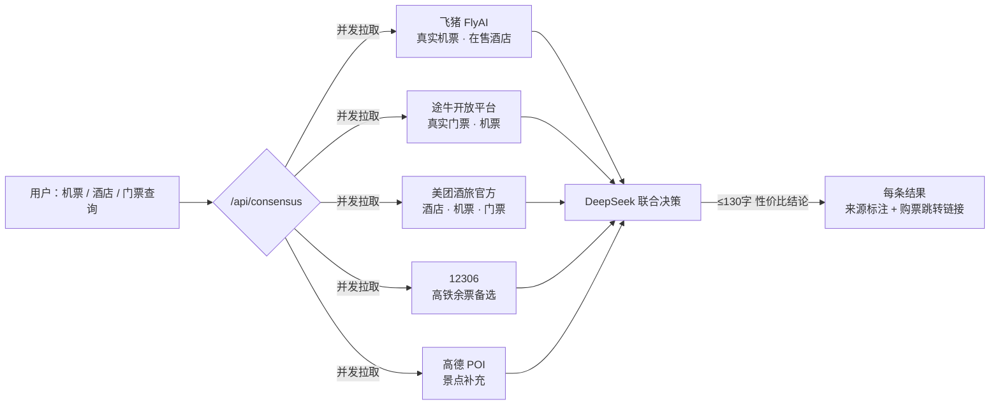

### 三种联合决策，覆盖出行三大刚需

| 类型 | 并发拉取的数据源 | 输出 | 应用场景 |
|------|----------------|------|---------|
| `flight` 机票 | 飞猪航班（直达优先）+ 途牛机票 + 美团酒旅 + **12306 高铁余票备选** | 多源机票/高铁交叉比价 + 最低价 + 各平台购票链接 | 「广州 → 北京」选飞机还是高铁？一张表看全 |
| `hotel` 酒店 | 飞猪在售酒店 + 途牛酒店 + 美团酒旅 | 评分 / 价格 / 开业年份 + 预订跳转链接 | 「北京」从青旅到五星全价位在售房源 |
| `ticket` 门票 | 途牛真实门票（最低价）+ 高德 POI 补充 + 美团酒旅 | 门票价格 + 预订链接 + 景点信息 | 「上海迪士尼」门票哪家便宜？ |

**每一条结果都带 `source`（数据来源）+ `link`（购票/预订跳转）**，DeepSeek 综合给出 ≤130 字联合决策（性价比最优 + 可信度 + 风险提示）；数据源 Key 缺失时自动本地启发式兜底。

### 实测效果（真实运行数据）

| 查询 | 多源交叉结果 |
|------|-------------|
| ✈️ 广州 → 北京 机票 | 飞猪 **¥700** · 途牛 **¥850** · 美团 **¥678~821** —— 三源交叉验证，附各平台购票链接 |
| 🏨 北京 酒店 | 飞猪 + 美团 6~7 个**在售**酒店卡片：禾木青旅 **¥103 起** / 粮仓艺术酒店 **¥574 起**，标注美团真实评分 4.8 |
| 🚄 惠州 → 广州 机票 | 美团判定「无直飞」→ 推荐高铁/大巴；无链接条目自动跳过 —— **宁缺毋滥，绝不产假数据** |
| 🎫 上海迪士尼 门票 | 美团 AI 返回空白 → 自动跳过，由途牛真实门票 + 高德 POI 兜底 —— **降级不阻塞** |

### 数据可信度保障机制

1. **来源永远可见** —— 每条价格/条目都标注数据源（高德 / DeepSeek / 飞猪 / 途牛 / 美团），前端思考链与结果卡片显示数据源徽章
2. **可跳转验证** —— 真实条目附带购票/预订链接（美团 `dpurl.cn` 短链、飞猪/途牛平台链接），用户一键直达官方页面验证
3. **宁缺毋滥** —— 数据源判定无结果时自动跳过，绝不用虚构数据填充（[server.js](file:///d:/SUIT%20Trae%20CN/server.js) 顶部硬性约束）
4. **降级不阻塞** —— 任一数据源 Key 缺失/超时，自动降级为其余数据源或本地参考估算，其他功能不受影响
5. **6h 智能缓存** —— 所有外部 API 结果内存缓存 6 小时，兼顾实时性与配额成本

> 💡 想亲自体验？前端「旅途伴侣 → 🔀 多源比价」入口，或直接调用 `/api/consensus`（完整 API 见 [API 接口文档](#-api-接口文档)）。

---

## 🏆 比赛信息

| 项 | 内容 |
|---|------|
| **赛事** | 2026 年度"火山杯"Agent 创新大赛暨国赛遴选赛 |
| **学校** | 深圳信息职业技术大学 |
| **队伍编号** | 第 123 号 |
| **项目名** | 123 就出发（Travel Verified, Not Memorized）|
| **赛题方向** | 旅行规划 + AI 验证 + 社区众包 |

### 项目解决的问题

> **核心问题：如何让 AI 生成的旅行方案具备可信度？**

- **问题 1**：AI 输出黑盒，用户难以信任推荐结果
  - **解决方案**：15 步思考链 + 实时数据源标注 + 8 维量化评分
- **问题 2**：攻略社区内容过时、质量参差不齐
  - **解决方案**：AI × 真实数据 × 社区三方交叉验证
- **问题 3**：旅途孤立无援，现有 AI 助手仅限于出行前规划
  - **解决方案**：旅途伴侣 + 定位感知 + 应急拨号 + 实时 POI

### 核心创新点

1. **可解释 AI** —— 不局限于「AI 输出结果」，而是完整展示 AI 的推理过程、查询内容及推荐依据
2. **三位一体范式** —— 规划 + 验证 + 陪伴，形成旅行体验的完整闭环
3. **真实数据优先** —— 280+ 真实城市库、12306 真实票价算法、飞猪 FlyAI 真实机票/酒店、途牛真实门票、5 大真实平台比价
4. **工程化程度** —— CI/CD、密钥加密、单元测试、文档全覆盖，达到工业级标准
5. **设计语言创新** —— 液态玻璃 × 深夜暖金，纯原生实现，无 React/Vue 也能做到现代感

---

## 📸 功能展示（三大模块）

> **3 个主模块 · 7 个 HTML 页面 · 8 个 CSS 文件 · 9 个 JS 模块**
> 主页 `index.html` 以顶部 3 个 Tab 承载三大主模块；点击"生成行程"后跳转到独立 `verify.html` 验证页；每个主模块都有独立全屏子页（旅途伴侣/社区/复盘）。

**页面结构概览**：

- **index.html（主页）**：包含 3 个 Tab —— 智能规划（城市级联 + 标签选择 + 一句话生成 + AI 思考链 + 6 种交通比价 + 5 档餐厅 + 4 档酒店 + 特色饮品美食）、旅途伴侣（城市锁死 + 详细地址解析 + 快捷工具 + 实时 POI + 应急拨号）、社区路线（搜索/筛选 + 收藏/评分 + 分享路线 + 评论）
- **verify.html**：路线验证页，8 维评分
- **companion.html**：旅途伴侣全屏页
- **community.html**：社区路线全屏页
- **posttrip.html**：旅途结束后复盘，可沉淀为社区路线

### 1️⃣ 智能规划（主页 Tab 1 + 验证页 + 复盘页）

**用户旅程**：输入城市、天数、预算及偏好 → 15 步思考链实时展开 → 8 维评分 → 一键成行

**页面流转**：智能规划页（目的地卡片磁吸效果 + 每日推荐六维多源综合评估 + 省市级联 + 一句话输入 + Three.js 粒子背景）→ 验证页 verify.html（左侧对话打字机效果 + 中央高德地图路线 + 右侧 8 维评分风险清单 + 5 套标记颜色）→ posttrip.html（复盘实际 vs 计划，沉淀为社区路线）

**15 步思考链**（展开后可查看每步推理过程与数据来源）：
1. 城市解析（280+ 城市库 / 高德地理编码 fallback）
2. POI 数据拉取（高德 v3/place/text）
3. 兴趣匹配打分（标签 + 季节 + 天气 + 真实坐标加权）
4. AI 行程设计（DeepSeek V4，JSON Schema 严格输出）
5. 博物馆数量均衡（自动检测并修复博物馆扎堆路线）
6. POI 详情增强（高德 v3/place/detail，补全电话/营业时间/票种）
7. 餐厅推荐（5 档位：小馆子/家常/中档/精致/米其林，含 6 平台跳转）
8. 当地特色饮品 & 美食推荐（LOCAL_SPECIALS_DB 本地知识库 53 城 + 高德美食 POI 实时兜底）
9. 酒店推荐（按星级分组，含均价/总价/6 平台比价）
10. 多源行情预取（途牛门票逐景点 + 12306 票价 + 飞猪航班 + 美团酒店，并发短超时，失败静默降级）
11. 路线验证评分（8 维 + 数据质量子维度 + 实际 vs 目标 + 进度条 + 数值动画）
12. 出发日期推荐（15 天滚动 + 避雨/避高峰 + 节假日感知）
13. AI 整体评价（DeepSeek 总结 + 风险标注）
14. 社区路线（去哪儿/携程/小红书/马蜂窝/微博 5 平台检索结果）
15. 多维度旅行贴士（6 维：文化背景/风俗习惯/安全提示/最佳游览时间/交通出行/餐饮购物）

**主页智能规划的实际内容**（点击"一键生成"之前的表单页）：
- 出发城市级联（省→地级市，支持县级市/景点直输）
- 6 种交通方式自动比价（火车/高铁/飞机/大巴/自驾/打车）
- 12 个兴趣标签多选（美食/历史/自然/文化/购物/夜生活/文艺/户外/亲子/摄影/温泉/滑雪）
- 一句话快速入口（懒人模式：填表太麻烦？直接说）
- 实时对话修改（生成后继续聊天改行程）

**📸 智能规划截图：**

| 主页表单 & 信息填写 | 每日推荐（六维多源综合评估） |
|:---:|:---:|
| 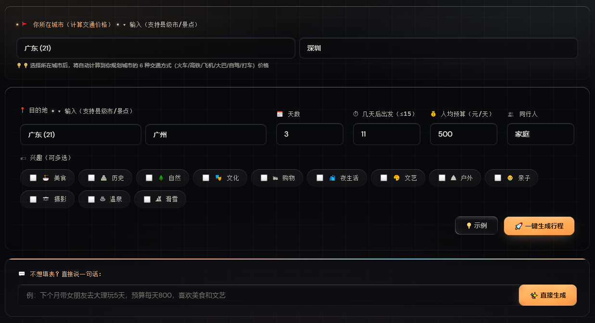 | 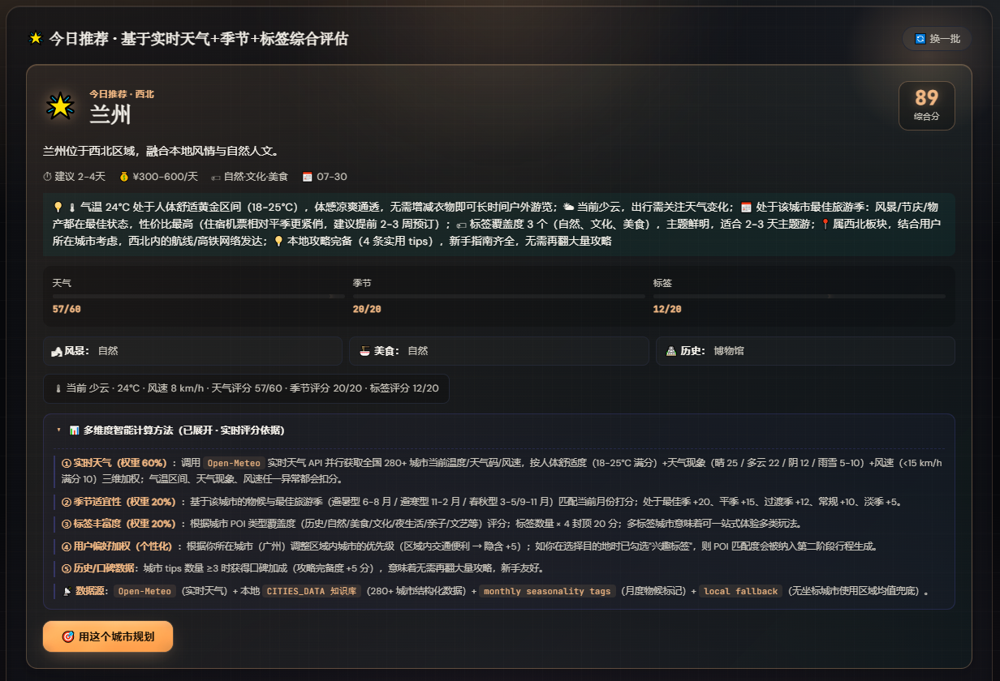 |

| AI 思考链 + 推理栈（15 步可观察化） |
|:---:|
| 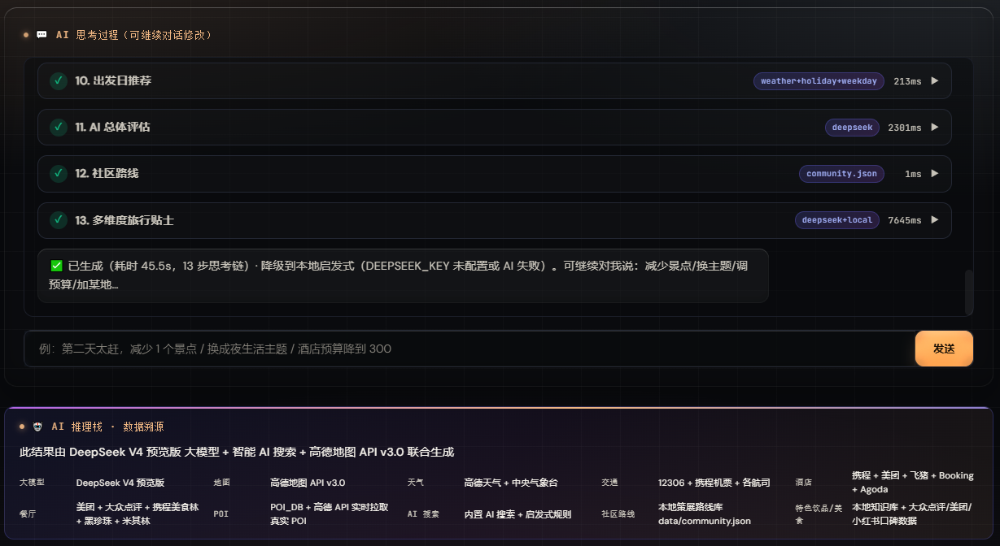 |

| 智能规划页面 | 完整路线（地图展示） |
|:---:|:---:|
|  | 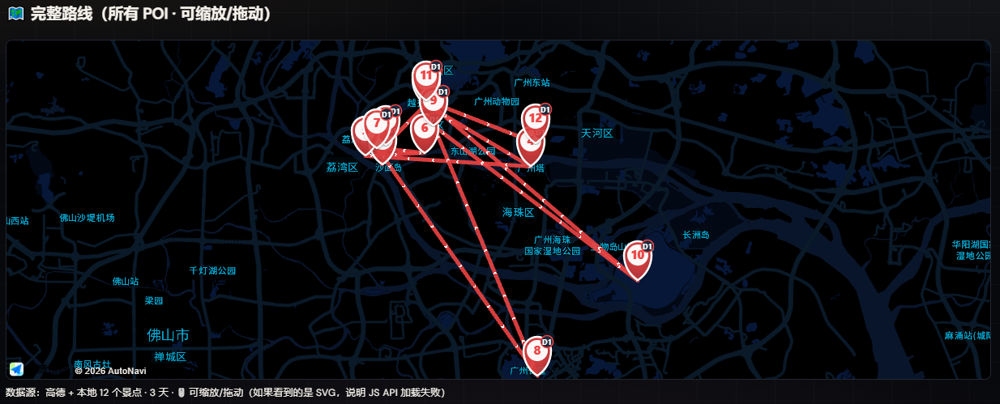 |

| 路线验证 8 维评分 | 每日安排（支持多方式导出） |
|:---:|:---:|
| 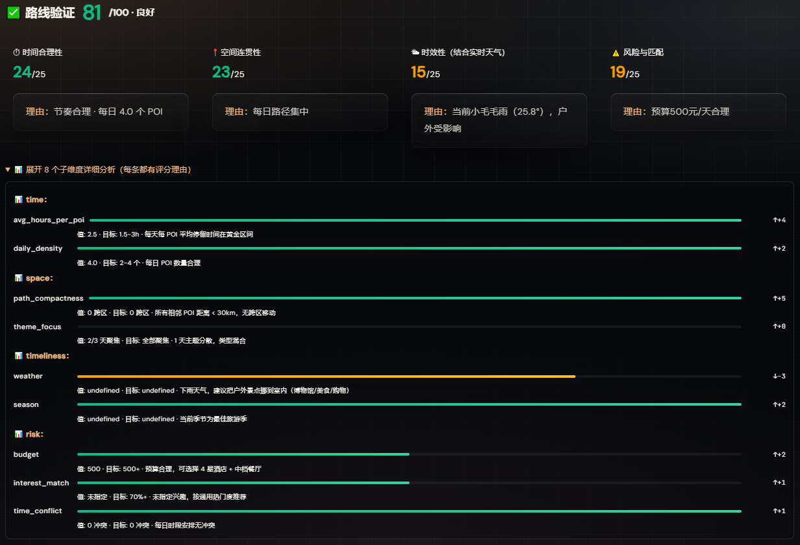 | 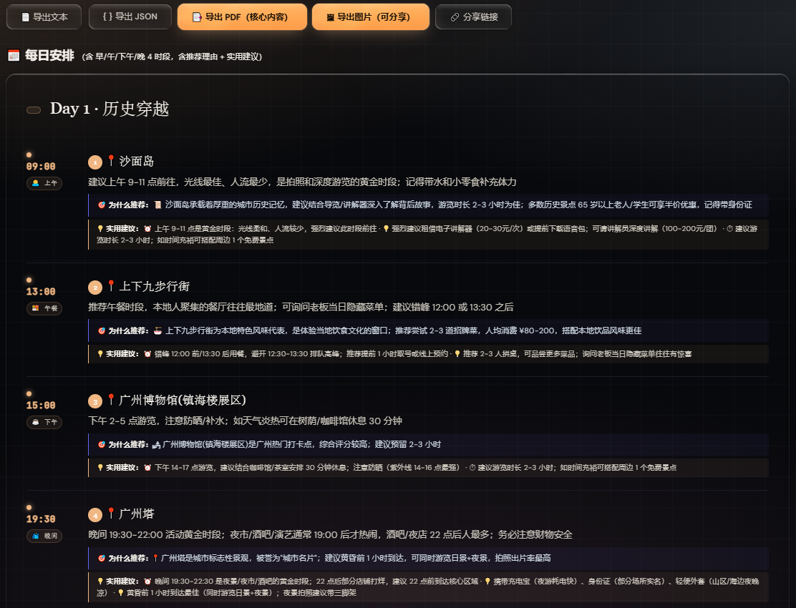 |

| 交通方式对比 & 票价 | 餐厅推荐（5 档价位） |
|:---:|:---:|
| 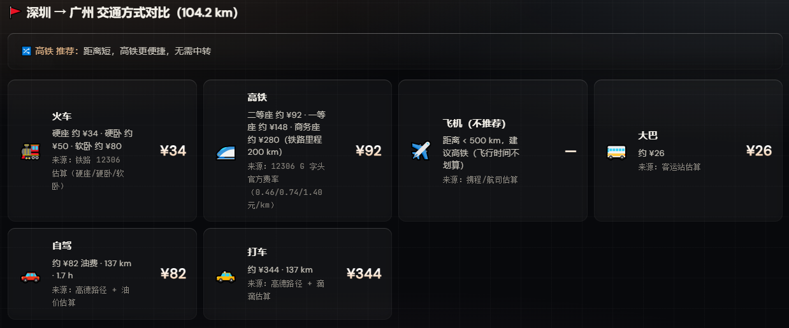 | 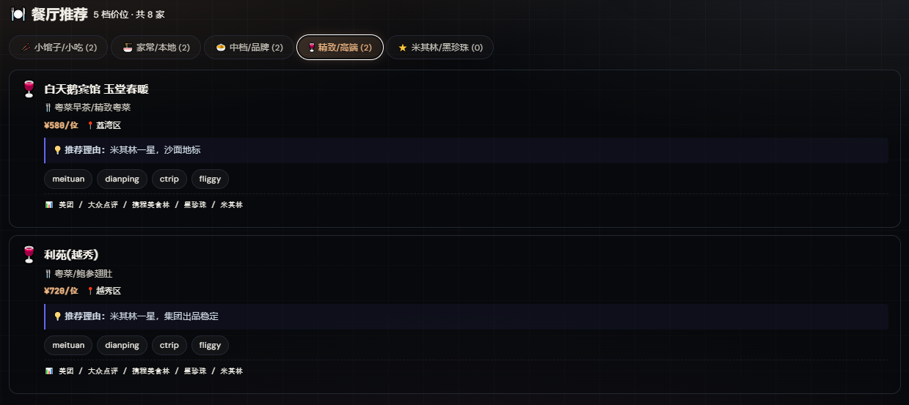 |

| 酒店推荐（4 档星级） | 目的地近日天气 |
|:---:|:---:|
| 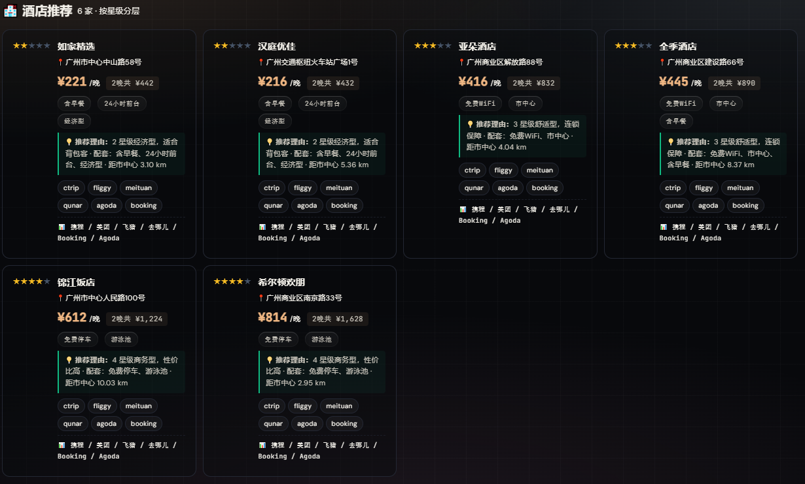 | 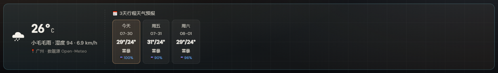 |

| 多维度旅行贴士 | 当地特色体验 |
|:---:|:---:|
| 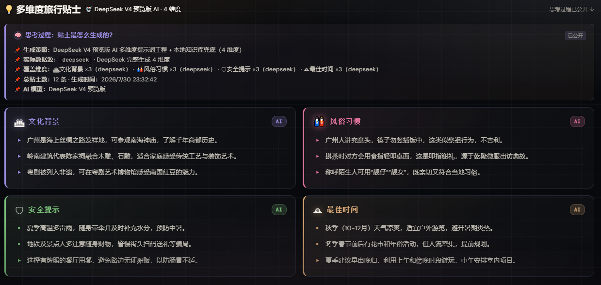 | 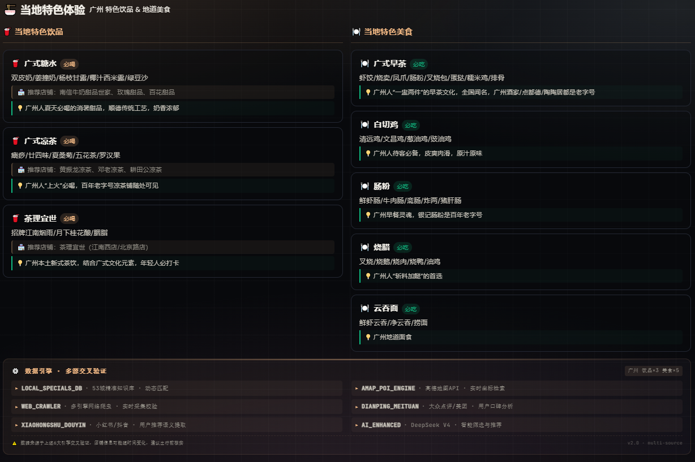 |

| 行程导出展示 |
|:---:|
| 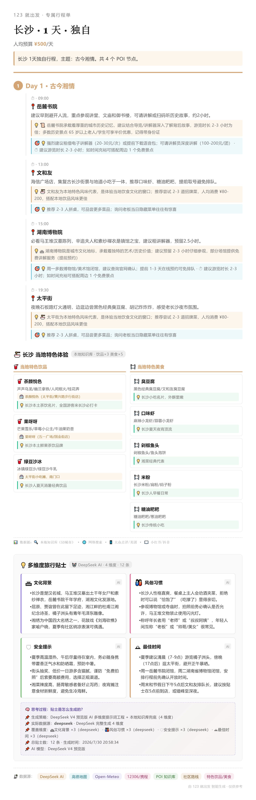 |

### 2️⃣ 旅途伴侣（主页 Tab 2 + 独立全屏页）

**用途**：出行途中实时查询，**城市锁定为**智能规划选择的城市，不可切换。

**功能分区**：顶部信息栏显示当前城市（锁死）、农历日期、节假日倒计时。左侧为紧急拨号区（110/120/119/回酒店）。中央为 AI 对话窗口，支持多轮对话并通过高德实时 POI 和 DeepSeek 提供回复。右侧为快捷工具区（景点门票/找酒店/机票/高铁/智能对话/找厕所/商场/ATM）。

**实用功能**：
- 详细地址解析（填入区/街道/酒店/景区 → 精确定位）
- 高德地图标点（5 类标记：景点/酒店/餐厅/交通/位置）
- 实时汇率（Frankfurter 永久免费 API）
- 自由对话模式（支持非出行类话题的常规问答）

**📸 旅途伴侣截图：**

| 旅途伴侣页面 | NTP 授时服务器显示 |
|:---:|:---:|
| 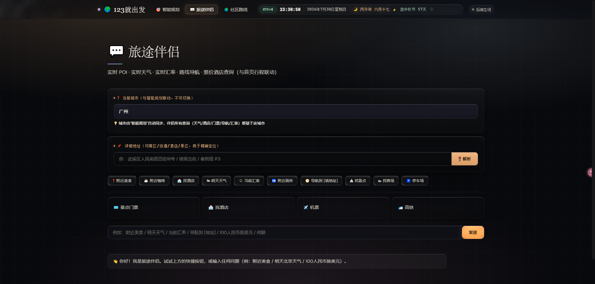 | 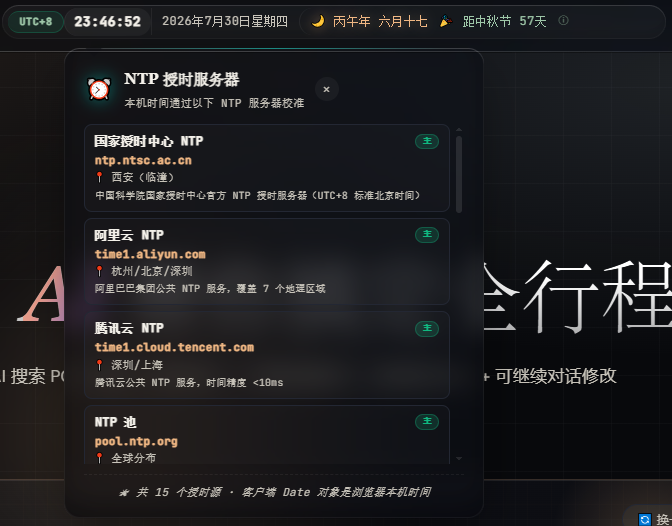 |

| 日历显示 | 黄历显示 |
|:---:|:---:|
| 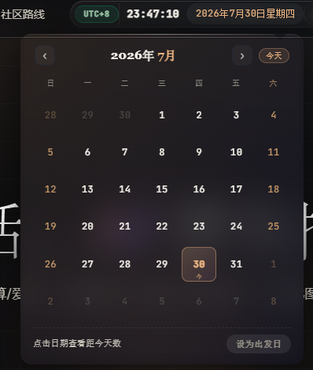 | 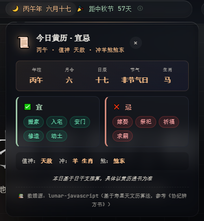 |

| 节假日倒计时 |
|:---:|
| 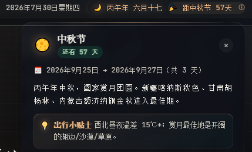 |

### 3️⃣ 社区路线（主页 Tab 3 + 独立全屏页 + 复盘沉淀）

**用途**：用户众包路线库，以及旅途结束后的复盘沉淀。

**主页 Tab 内**：支持按城市、标题、标签、POI 搜索，以 3 列网格卡片展示
**独立全屏页** (`community.html`)：完整社区广场（2,847 条路线 · 18,452 次验证）
- 多维筛选：预算（经济/舒适/高端）与天数（2/3/5+）组合
- 路线详情：行程/费用/经验/评分
- 收藏 + 评论 + 分享
- 数据来源标注（去哪儿/携程/小红书/马蜂窝/微博）

**复盘页** (`posttrip.html`)：旅途结束后用于
- 实际花费与计划预算的对比分析
- AI 评估差异并生成改进建议
- 一键沉淀为社区路线（+50 经验值）

**📸 社区路线截图：**

| 社区路线页面 |
|:---:|
| 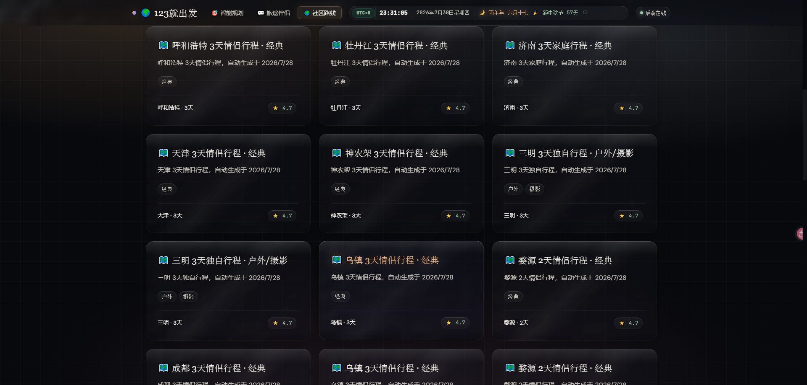 |

---
## 🚀 快速启动（推荐）

> **前置条件**：确保已安装 Node.js 18+。

### Windows 用户

```cmd
1. 下载/克隆本仓库到本地
2. 双击 start.bat
3. 首次会提示编辑 .env 填密钥
4. 保存后再双击 start.bat
5. 浏览器自动打开 http://localhost:3000 🎉
6. **服务异常退出后会自动重启**，无需手动干预
```

### Mac / Linux 用户

```bash
git clone https://github.com/JimmyMi001/SUIT-TRAE-123Lets-GO.git
cd SUIT-TRAE-123Lets-GO
chmod +x start.sh
./start.sh
```

**自动化流程**（[scripts/setup.js](./scripts/setup.js) 自动完成所有前置工作）：

1. 检查 Node.js 版本 ≥ 18
2. 检测 `.env` 文件，不存在则从 `.env.example` 复制
3. 检查密钥是否为占位符，提示用户填写
4. 检测 `node_modules` 缺失则自动执行 `npm install`
5. 启动服务 `npm start`
6. 2 秒后自动打开浏览器

---

## 🔑 申请 API 密钥

### 1. 高德地图 API Key（必填）

**用途**：POI 搜索、路线规划、天气、地图

**申请步骤**（约 2 分钟）：

1. 打开 https://lbs.amap.com/dev/key/app
2. 点击右上角「注册」→ 用手机号注册
3. 登录后进入「控制台」
4. 左侧菜单「应用管理」→ 「我的应用」→ 「创建新应用」
   - 应用名称：随便填，比如 `123-travel`
   - 应用类型：选「其他」
5. 创建后点「添加 Key」
   - Key 名称：随便填
   - **服务平台：务必选「Web 服务」（不是「Web 端(JS API)」）**
   - 提交
6. 复制生成的 Key（32 位十六进制），粘贴到 `.env`：
   ```
   AMAP_KEY=your_amap_web_service_key_here   # 32位十六进制,从高德控制台复制
   ```

> 💡 **JS API Key 与 Web 服务 Key 的区别**：
> - Web 服务 Key：用于服务端调用（POI/天气/路线）
> - JS API Key：用于浏览器端加载地图
>
> 本项目仅需 Web 服务 Key 即可运行（JS API Key 已硬编码于 index.html 作为演示用途，**不推荐用于生产环境**）

### 2. DeepSeek API Key（必填）

**用途**：AI 行程设计 + 旅途伴侣对话

**免费额度**：注册赠送 ¥10（约 1000 万 tokens，满足日常使用）

**申请步骤**（约 1 分钟）：

1. 打开 https://platform.deepseek.com/api_keys
2. 用手机号注册
3. 登录后进入「API Keys」页面
4. 点「创建新 Key」
5. 名字随便填（比如 `123-travel`）
6. 复制生成的 Key（`sk-` 开头），粘贴到 `.env`：
   ```
   DEEPSEEK_KEY=sk-your_deepseek_key_here   # sk- 开头,从 DeepSeek 控制台创建
   ```

> 💡 **本项目使用 `deepseek-v4-flash` 模型**，相比 V3 速度提升 3 倍，价格降低 50%，中文能力相当。

### 3. 飞猪 FlyAI API Key（可选 · 内置匿名体验 Key）

**用途**：真实机票（完整价格）、真实酒店（名称/地址/坐标/星级）、POI 门票信息

- **免注册体验模式**：已内置飞猪 FlyAI 官方体验 Key，开箱即用。机票价格为**完整真实价格**；酒店价格在体验模式下脱敏显示为 `¥2xx/¥3xx`（区间下限）。
- **正式 Key（解锁酒店完整价格）**：联系飞猪开放平台开通后，填入 `.env` 覆盖内置匿名 Key：

```
FLYAI_API_KEY=your_flyai_api_key_here      # 正式 Key（不填则用内置匿名 Key）
FLYAI_SIGN_SECRET=your_flyai_sign_secret_here   # 签名密钥（不填则用内置匿名 Secret）
```

> 技术实现：后端直连 `https://flyai.open.fliggy.com/mcp`，完整复刻 MCP 工具（`search_flight`/`search_hotels`/`search_poi`/`search_train`/`search_marriott_hotels` 等）的 HMAC-SHA256 签名与 AES-256-GCM 上下文加密，6 小时内存缓存。

### 4. 途牛开放平台 API Key（可选 · 真实门票数据）

**用途**：真实景点门票（唯一门票真实来源，FlyAI 无门票工具）

- 免费注册：https://open.tuniu.com/ （每日限额 RPM 5 次 / RPD 50 次，服务端已做 6 小时缓存）
- 注册后获取 `apiKey`，填入 `.env`：

```
TUNIU_API_KEY=your_tuniu_api_key_here      # 从 open.tuniu.com 注册获取
```

> ⚠️ **不配置也能运行**：未配置时 `/api/tuniu/*` 返回引导注册提示，机票/酒店自动降级为 FlyAI 真实数据或本地参考估算。配置后即可查询真实门票（`query_cheapest_tickets`）、酒店（`tuniu_hotel_search`）、机票（`searchLowestPriceFlight`）。

### 4.5 美团酒旅直连（可选 · 官方 openapi，真实酒店/机票/门票）

**用途**：美团官方酒旅服务（酒店/机票/门票真实数据 + 预订跳转短链），参与 `/api/consensus` 多源联合决策

**接入方式（推荐，免 MCP 网关配置）**：官方发布 `mtskills-cli` 一键安装 skill，逆向出官方直连协议后已在服务端内置（`POST https://mcp-open-cater.meituan.com/v1/api/voyage/openapi/query`）：

1. 安装美团官方 CLI（可选，仅用于查看 skill 文档）：
   ```bash
   npm i -g mtskills-cli && mtskills i meituan-travel
   ```
2. 打开 https://developer.meituan.com/zh/v2/dev/token 申请 API Token，填入 `.env`：
   ```
   MEITUAN_HT_TOKEN=your_meituan_token_here      # 从 developer.meituan.com/zh/v2/dev/token 生成
   # 兼容旧变量：未设置 MEITUAN_HT_TOKEN 时自动回退使用 MEITUAN_API_KEY
   ```

> ℹ️ **无需配置 MCP 接入点**：早期版本要求的 `MEITUAN_MCP_ENDPOINT`（`mcp.meituan.com/api/carrier/proxyXXXX`）已废弃，官方酒旅 skill 走独立网关，仅需 Token。响应为 AI 生成式回答（约 15~60s，已 6h 缓存），真实条目均带 `dpurl.cn` 短链可直达预订页。未配置 Token 时自动降级为飞猪/途牛/12306/高德/本地数据，不阻塞其他功能。

### 5. 验证密钥是否生效

启动服务后访问 http://localhost:3000/api/health：

```json
{
  "ok": true,
  "amap_configured": true,
  "deepseek_configured": true,
  "mcp12306": true,
  "flyai": { "available": true, "anon_mode": true },
  "tuniu": { "configured": false },
  "meituan": { "configured": true, "token": true, "mode": "官方酒旅直连（mcp-open-cater.meituan.com）" }
}
```

- `amap_configured` / `deepseek_configured` 为 `true` 即核心配置成功
- `flyai.available` 为 `true` 表示飞猪真实机票/酒店已就绪
- `tuniu.configured` 为 `true` 表示途牛门票 Key 已生效
- `meituan.configured` 为 `true` 表示美团酒旅 Token 已生效（官方直连）

> ⚠️ **无密钥亦可运行**，但地图与 AI 功能将提示错误。社区路线、UI 交互及基础显示不受影响。

---

## 🛠️ 手动安装指南

> 如需手动安装或因环境限制无法使用一键脚本，请按以下步骤操作。

### 第一步：安装必备环境

#### 1.1 Node.js（必需）

- 前往 https://nodejs.org/download/
- 下载 **Node.js 18 LTS 或更高版本**（推荐 20.x）
- 安装时**务必勾选** "Add to PATH" 选项
- 验证安装成功：
  ```bash
  node -v    # 应输出 v18.x.x 或更高
  npm -v     # 应输出 9.x 或更高
  ```

#### 1.2 Git（克隆仓库用，可选）

- 前往 https://git-scm.com/downloads
- 下载安装
- 验证：`git --version`

#### 1.3 文本编辑器（编辑 .env）
- 推荐 VS Code：https://code.visualstudio.com/

### 第二步：获取代码

#### 方式 A：Git 克隆（推荐）

```bash
git clone https://github.com/JimmyMi001/SUIT-TRAE-123Lets-GO.git
cd SUIT-TRAE-123Lets-GO
```

#### 方式 B：ZIP 下载

1. 打开 https://github.com/JimmyMi001/SUIT-TRAE-123Lets-GO
2. 点绿色 "Code" 按钮 → "Download ZIP"
3. 解压到任意目录
4. 进入解压后的目录

### 第三步：安装依赖

```bash
npm install
```

**国内网络优化**（如安装缓慢）：
```bash
npm config set registry https://registry.npmmirror.com
npm install
```

### 第四步：配置环境变量

将 `.env.example` 复制为 `.env`：

```bash
# Mac/Linux
cp .env.example .env

# Windows (CMD)
copy .env.example .env

# Windows (PowerShell)
Copy-Item .env.example .env
```

然后用文本编辑器打开 `.env`，填入 [申请 API 密钥](#-申请-api-密钥) 部分获取的两个密钥。

### 第五步：启动服务

```bash
npm start
```

看到以下输出表示启动成功：
```
[2026-07-29 18:30:00] GET /api/health
Server listening on http://localhost:3000
```

### 第六步：打开浏览器

访问 http://localhost:3000 即可使用。

---

## 🏗️ 技术架构

### 系统架构图

**三层架构**：

- **前端（浏览器端）**：HTML（5441 行）+ CSS 设计系统 + Vanilla JS 模块化。核心技术：液态玻璃 UI（backdrop-filter + filter:blur）、Three.js 粒子背景（Hero 区）、高德 JS API v2.0（地图渲染/标记/路线）、lunar-javascript（农历/黄历）。
- **后端（Node.js 18+）**：Express + 自研代理。server.js（4745 行）提供 100+ API 端点、6 大路由组，包含：高德代理（POI/detail/direction/weather/staticmap）、城市解析（省级→地级市级联 / 280+ 城市库 / 县级市 fallback）、智能推荐（天气×季节×交通×热度×美食×标签 6 因素评分）、路线验证（8 维评分 + 数值动画）、社区路线（CRUD + 策展路线）、DeepSeek AI（deepseek-v4-flash · JSON 严格输出）、携程机票爬虫（可选）。辅助模块：env-loader（.env/.enc 密钥加载）、flight-crawler.js（机票爬虫）、scripts/encrypt-env（环境变量加密）。
- **外部服务**：高德开放平台（POI/天气/路线）、Open-Meteo（天气兜底）、DeepSeek V4 Flash（AI）、Frankfurter（汇率，永久免费）。
- **本地存储**：.cache/maps/（地图缓存）、data/community.json（社区数据）、data/real-routes-curated.json（策展数据）。

### 数据流向（生成一份行程）

用户输入城市、天数、预算及偏好后，经历以下 10 个处理步骤：

1. city/resolve：命中城市库，或通过高德地理编码，或通用兜底
2. amap/poi：高德 POI 搜索（景点/美食/酒店）
3. amap/detail：POI 详情增强（电话/营业时间/票种）
4. amap/weather：获取实时天气
5. DeepSeek AI：行程设计（JSON Schema 严格输出）
6. amap/direction：获取真实驾车/步行/公交路线
7. 本地启发式算法：8 维验证评分
8. destinations/recommend：出发日期建议
9. DeepSeek AI：整体评价
10. 返回前端：思考链 15 步动画 + 数据源徽章，最终由高德 JS API v2.0 完成前端地图渲染和 SVG 路径流动

---

## 🧪 技术栈全览

### 前端（纯原生，无任何框架）

| 技术 | 用途 | 关键点 |
|------|------|--------|
| **HTML5** | 7 个页面 (index/verify/companion/community/posttrip + 2 历史) | 主页单页 5441 行，模块化结构 |
| **CSS3** | 液态玻璃 + 深夜暖金调色板 | 设计系统 token 化、clamp 响应式、scroll-driven 动画 |
| **Vanilla JS** | 业务逻辑（无 React/Vue/Tailwind） | IIFE 模块化，无构建步骤 |
| **Three.js** | Hero 区粒子背景 | CDN 加载，按需启用 |
| **高德 JS API v2.0** | 地图渲染、POI 标记、路线 | Web 服务 key + JS API key 分离 |
| **lunar-javascript** | 农历/黄历/节气 | jsDelivr CDN |
| **DM Serif Display + DM Sans + JetBrains Mono** | 字体三件套 | Google Fonts |

### 后端（Node.js 18+）

| 技术 | 版本 | 用途 |
|------|------|------|
| **Express** | ^4.19.2 | HTTP 路由 |
| **CORS** | ^2.8.5 | 跨域 |
| **dotenv** | ^16.4.5 | .env 加载 |
| **Node Fetch (内置)** | 18+ | 调外部 API |
| **crypto (内置)** | - | AES-256-CBC 加密 |

### 外部服务

| 服务 | 用途 | 免费额度 |
|------|------|----------|
| **高德开放平台** | POI/天气/路线/静态图/前端地图 | 5000 次/日 |
| **DeepSeek V4 Flash** | AI 行程设计 + 旅途对话 + 多源联合决策 | ¥1/百万 tokens |
| **美团酒旅（官方直连）** | 真实酒店/机票/门票 + `dpurl.cn` 预订短链 | Token 制（developer.meituan.com） |
| **飞猪 FlyAI** | 真实机票/在售酒店/POI/火车票（内置体验 Key） | 匿名体验 Key 开箱即用 |
| **途牛开放平台** | 真实景点门票最低价/酒店/机票 | RPM 5 / RPD 50（6h 缓存） |
| **Open-Meteo** | 多源天气比对源之一（实时+7天预报） | 永久免费 |
| **中国气象局 CMA** | 官方权威天气源（免 Key 直采 weather.cma.cn） | 永久免费 |
| **Frankfurter** | 汇率（171 种货币） | 永久免费 |
| **携程（爬虫）** | 机票真实价格（可选） | 需自购 puppeteer |

### 部署 / DevOps

| 工具 | 用途 |
|------|------|
| **Vercel** | Serverless 部署（已配置 `vercel.json`） |
| **GitHub Actions** | CI 流水线（3 个 Job：基础检查 / 密钥扫描 / 加密验证） |
| **gitleaks** | 密钥泄漏检测 |
| **PM2**（推荐） | 进程守护 |

---

## 🧠 核心实现原理

### 1. 15 步思考链可观察化

**背景**：市场现有 AI 行程工具如同「黑盒」，用户无法获知推荐依据。

**解决方案**：将 AI 与数据查询拆解为 15 个原子步骤，前端实时展示各步骤的执行状态、数据来源及关键结果。

```javascript
// server.js 里的端点
app.post('/api/itinerary/plan', async (req, res) => {
  const trace = [];  // 思考链容器
  function step(name, source, data) {
    trace.push({ step: name, source, data, ts: Date.now() });
  }

  step('city_parse', '高德地理编码+本地 280+ 城市库', { city: '成都' });
  step('poi_search', '高德 v3/place/text', { count: 24 });
  step('interest_score', '本地启发式', { top5: [...] });
  step('ai_design', 'DeepSeek V4 Flash (JSON Schema)', { days: 5, theme: '...' });
  step('poi_enhance', '高德 v3/place/detail', { enhanced: 18 });
  // ... 15 步

  res.json({ trace, itinerary: ... });
});
```

前端采用 `IntersectionObserver` 结合 `requestAnimationFrame` 实现步骤逐条展示动画，并为每个步骤添加**数据源徽章**（参考/估算/官方）。

### 2. 8 维路线验证评分

**背景**：需要量化评估「这条路线的质量」。

**解决方案**：从 8 个维度进行评分，每个维度包含**实际值、目标值、评分依据及进度条**：

| 维度 | 权重 | 评分依据 |
|------|------|----------|
| 路线合理性 | 15% | 每日 POI 距离、避免回头路 |
| 时间合理 | 15% | 每日游览时间 vs 8 小时合理值 |
| 预算匹配 | 12% | 实际花费 vs 用户预算 |
| 交通便捷 | 10% | 城际交通耗时占比 |
| 餐饮多样 | 10% | 5 档覆盖度 |
| 住宿品质 | 8% | 星级 + 评分 |
| 景点开放 | 15% | 营业时间核对 |
| 天气适宜 | 15% | 行程日期天气匹配 |

```javascript
// 数值动画：ease-out cubic 800ms 从 0 增长至目标值
function animateNumber(el, target) {
  const start = performance.now();
  function tick(now) {
    const t = Math.min((now - start) / 800, 1);
    const eased = 1 - Math.pow(1 - t, 3);  // ease-out cubic
    el.textContent = Math.round(target * eased);
    if (t < 1) requestAnimationFrame(tick);
  }
  requestAnimationFrame(tick);
}
```

### 3. 智能出发日期推荐

**输入**：用户目的地、出发城市、行程天数
**输出**：未来 15 天内 Top 3 推荐日期及理由

```javascript
// 评分逻辑：避免雨天/极端天气/节假日高峰
for (let d = 1; d <= 15; d++) {
  let score = 100;
  // 天气：降雨量 > 10mm 扣 25 分
  if (rain > 10) { score -= 25; dayReasons.push(`有雨 ${rain}mm`); }
  // 极端温度
  if (maxT > 35) score -= 15;
  // 节假日冲突 -30
  // 周末轻微 -5
  // 临近出发 +5
}
```

### 4. 每日推荐目的地（六维加权 · 天气含三源交叉验证）

**背景**：首页「猜你喜欢」模块需实现每日差异化推荐，且推荐内容需具备实际参考价值。

**解决方案**：采用 6 因素加权评分，并按天轮换

```
score = 多源天气适宜性(45%) + 季节适宜性(15%) + 交通可达性(12%) + 旅游热度(10%) + 美食丰富度(10%) + 标签丰富度(8%)
```

- **多源天气（45%）**：两级评估。第一级用 Open-Meteo 并行获取全国 280+ 城市实时温度/天气码/风速；第二级对初步 Top 城市做**高德实时 + 中国气象局 CMA + Open-Meteo 三源交叉验证**（借鉴 [Breezy Weather](https://github.com/breezy-weather/breezy-weather) 多 Provider 设计）。得分 = 温度适宜(16) + 天气现象(12) + 风速(7) + **多源可信度(10)**——源数越多、结论越一致可信分越高；多数源判雨/雪/雾时现象分降级，多数源判晴且全一致时现象分满分
- **季节**：基于夏季/冬季城市集合（hard-coded 100+ 城市）
- **交通可达**：真实高铁干线邻接表（京沪/京广/沪昆/徐兰/兰新/沿海/哈大等公开线路），命中即代表两城间高铁可直达 +12；同区域城际密集 +8；未提供出发城市按中性 +6
- **旅游热度**：以 POI_DB 真实景点收录数 + 本地攻略数 + 玩法标签覆盖数为代理（真实数据，不编造外部热度）
- **美食丰富度**：LOCAL_SPECIALS_DB 53 城特色美食 + RESTAURANT_DB 餐厅库覆盖数
- **标签**：根据 `CITIES_DATA` 标签数计算
- **轮换**：按 `seed = floor(timestamp / 86400000)` 对数组进行循环移位，确保每日结果不重复
- **候选池 + Top-up 保字段完整**：多源精查候选池 = 轮换后前 15 城市 ∪ 第一级评分前 8 城市（并集去重，保证每日多样性 + 高分城市必被精查）；精查分数生效重排后，对最终前 8 中仍缺多源字段的城市再做最多 3 轮补拉（12s 预算），确保返回的每条推荐都带 `matched/total/verdict/sources/trust` 多源信息
- **高德 QPS 保障**：高德天气走令牌桶限速（发起间隔 ≥350ms、并发 ≤3 + 10min 缓存），规避免费配额 `CUQPS_HAS_EXCEEDED_THE_LIMIT` 限流

### 5. 真实票价计算

```javascript
// 铁路距离 = 直线距离 × 1.25（基于 24 条真实 G 字头车次统计）
const distance = haversine(origin, dest) * 1.25;
// 12306 官方费率
const price2nd = distance * 0.46;  // 二等座 0.46 元/km
const price1st = distance * 0.74;  // 一等座
const priceBiz = distance * 1.40;  // 商务座
// 长途递减
if (distance > 1500) { price2nd *= 0.9; }
if (distance > 2500) { price2nd *= 0.8; }
```

### 6. 未知城市自动解析

**场景**：用户输入「阳江」「婺源」「敦煌」等县级市或小众目的地

**处理流程**：
```
1) 本地 CITIES_DATA 280+ 城市库 → 命中直接返回
2) 否则高德地理编码 /v3/geocode/geo → 拿坐标 + adcode
3) 拿坐标查 POI /v3/place/text → 景点/美食/酒店
4) POI 不足 3 个 → 通用兜底 (POI_GENERIC['景点'] + 用户输入名)
5) 写入运行时缓存 → 后续请求直接命中
```

### 7. 密钥加密与解密

```javascript
// AES-256-CBC + PBKDF2 (10万轮) 派生密钥
function encrypt(plain, masterKey) {
  const salt = crypto.randomBytes(16);
  const iv   = crypto.randomBytes(16);
  const key  = crypto.pbkdf2Sync(masterKey, salt, 100_000, 32, 'sha256');
  const cipher = crypto.createCipheriv('aes-256-cbc', key, iv);
  return Buffer.concat([salt, iv, cipher.update(plain), cipher.final()]).toString('base64');
}
```

**部署到云平台**：只需配置 `ENV_MASTER_KEY` 一个环境变量，`env-loader.js` 启动时自动解密。

### 8. 城市级联（省 → 市）

```javascript
const PROVINCE_CITY_MAP = {
  '广东': ['广州', '深圳', '珠海', '汕头', ...],
  '浙江': ['杭州', '宁波', '温州', ...],
  // 27 省 + 4 直辖市 + 5 自治区 + 2 特别行政区
};
// 反向索引: 城市 → 省
const CITY_PROVINCE_INDEX = Object.fromEntries(
  Object.entries(PROVINCE_CITY_MAP).flatMap(
    ([p, cs]) => cs.map(c => [c, p])
  )
);
```

### 9. 地图 ORB 拦截绕过方案

**背景**：高德静态图属于跨域资源，被 Chrome ORB（Opaque Response Blocking）机制拦截。

**解决方案**：服务端 `fetch` 拉取图片 → 写入本地缓存 → 以**同源** `image/png` 流返回。

```javascript
app.get('/api/amap/staticmap', async (req, res) => {
  // 1) 缓存命中则直接返回
  if (fs.existsSync(cacheFile)) return fs.createReadStream(cacheFile).pipe(res);
  // 2) 无 Key 时使用本地 SVG 兜底
  if (!AMAP_KEY) return res.type('image/svg+xml').send(localMapSVG(city, coords));
  // 3) 高德拉取 → 缓存 → 同源返回
  const buf = await fetch(amapUrl).then(r => r.arrayBuffer());
  fs.writeFileSync(cacheFile, buf);  // 缓存 1 天
  res.type('image/png').send(Buffer.from(buf));
});
```

### 10. 思考链数据源徽章

各思考步骤标题旁设置**数据源徽章**，使用户能够**直观识别**每条信息的来源：

| 徽章 | 含义 | 颜色 |
|------|------|------|
| `高德实时` | 高德 API 实时查询 | 翡翠绿 |
| `Open-Meteo` | 第三方天气 API | 蓝色 |
| `AI 推理` | DeepSeek 输出 | 暖金 |
| `社区路线` | 用户众包 | 紫色 |
| `参考估算` | 本地启发式算法 | 灰色 |
| `官方票务` | 12306/携程直采 | 红色 |
| `本地知识库` | LOCAL_SPECIALS_DB 特色饮品及美食数据 | 橙色 |

### 11. 多源天气比对（灵感来自 [Breezy Weather](https://github.com/breezy-weather/breezy-weather)）

天气数据的可信度同样是出行决策的关键一环。我们学习并借鉴了开源天气应用 **Breezy Weather** 的「多 Provider 天气源」设计思想，构建了 **三源交叉验证** 天气引擎：

- **高德天气**（实时观测）：城市级实况气温 / 湿度 / 风向风力
- **Open-Meteo**（实时 + 预报）：全球开放源，7 天逐日预报（气温 / 天气码 / 降水概率）
- **中国气象局 CMA**（官方预报）：weather.cma.cn 免 Key 直采，7 天官方逐日预报 + 夜间天气

**交叉验证逻辑**（`/api/weather/compare`）：

1. 天气类别归一化比对（晴 / 多云 / 雨 / 雪 / 雾）→ 输出「一致 / 多数一致 / 略有出入」
2. 气温 gap 计算（今日 / 明日高温最大温差）→ ≤3°C 判定高度一致
3. 综合一致性评分 **0-100**（类别一致度 40% + 气温 gap 60%），给出「高度一致 / 基本一致 / 存在分歧」结论

**前端交互**（借鉴 Breezy Weather 的源切换交互）：智能规划页天气卡片下实时展示三源对比卡 + 一致性评分动画进度条 + 「📊 汇总 / 高德 / Open-Meteo / 中国气象局」**源 Tab 切换**，点击单源可查看该源的逐日预报明细（标注「灵感来自 Breezy Weather 多源设计」并附原项目链接）。所有数据均来自真实源，未核实到时不展示虚构数据。

---

## 🎨 设计哲学

> **致敬 Apple visionOS × 深夜指挥中心，摒弃 AI 模板化设计**

### 设计原则

1. **摒弃 AI 模板化设计** —— 不使用 Inter 字体、紫色渐变、纯白背景、居中 CTA 或三栏功能卡片等常见 AI 模板元素
2. **地图始终可见** —— 验证页保留小地图，行程页地图占据 44% 中心区域
3. **数据优雅呈现** —— 数字滚动动画、进度条、数值 vs 目标对比
4. **深夜暖金调色板** —— 60% 深夜底色 (#0A0E1A) + 30% 暖金 (#F0A500) + 10% 青碧 (#00C6B7)
5. **液态玻璃质感** —— 4 层阴影 + 渐变光斑 + 135° 高光 + 1px 顶白线

### 设计令牌（Design Tokens）

```css
:root {
  --c-base:    #0A0E1A;  /* 深夜底色 */
  --c-gold:    #F0A500;  /* 暖金 */
  --c-teal:    #00C6B7;  /* 青碧 */
  --c-text:    #F5F0E8;  /* 主文字 */
  --c-text-2:  #8892A4;  /* 次要文字 */
  /* LGGC 玻璃参数 */
  --gb:    4px;          /* backdrop-filter blur */
  --gs:    1.6;          /* saturate (160%) */
  --gd:    #F0A500;      /* 暖金高光 */
  /* 字体 */
  --serif:  'DM Serif Display', serif;
  --sans:   'DM Sans', sans-serif;
  --mono:   'JetBrains Mono', monospace;
}
```

### 字体策略

- **标题**：DM Serif Display（优雅、有书卷气）
- **界面**：DM Sans（清晰、现代）
- **数字**：JetBrains Mono（等宽、易读）

### 动画策略

- **仅对 transform 和 opacity 属性应用动画**（避免 layout 重排）
- **配合 prefers-reduced-motion 媒体查询**（无障碍适配）
- **禁用 bounce/elastic 缓动及 scroll-jacking**
- **动画时长 0.2-0.6s**，入场 stagger 总时长 ≤ 1.2s
### 地图标记设计（CSS 绘制）

| 类型 | 颜色 | 动效 |
|------|------|------|
| 已验证 POI | 翡翠绿 | 实心圆点 |
| 风险 POI | 珊瑚红 | 脉冲扩散波纹 |
| 当前选中 POI | 暖金 | 外圈旋转光环 |
| 酒店 | 深蓝 | 实心圆点 |
| 餐厅 | 橙色 | 实心圆点 |
| 路线 | 暖金 | SVG path 流动虚线 |

---

## 🎁 细节小心思

> 以下为产品中值得关注的细节设计，在演示过程中可突出展示：

| 细节 | 在哪能看到 | 做了什么 |
|------|----------|----------|
| 🛰 **NTP 授时服务器 Popover** | 顶栏时钟悬停 | 鼠标移到 `12:34:56` 即弹出，展示 7+ 个授时源（国家授时中心 `ntp.ntsc.ac.cn`、NTP Pool、中国子池、Google、阿里云、苹果、Cloudflare），用地球 emoji 数量暗示节点数 |
| 📜 **黄历宜忌 Popover** | 顶栏农历悬停 | 悬停"丙午年 六月十六"即弹出——年柱/月令/日辰/节气/生肖 + 5 行「宜」+ 5 行「忌」+ 值神/冲/煞信息 + 寿星天文历出处 |
| 🎉 **节假日倒计时** | 顶栏右侧 | "距国庆节 67 天"实时刷新；点击弹出节假日介绍（日期范围、客流高峰、错峰小贴士），帮用户避坑 |
| 🕗 **时区徽章 UTC+8** | 顶栏时钟旁 | 明确标注时区，悬停可看浏览器 UTC 偏移，跨时区团队一眼看懂 |
| 🟢 **状态指示器** | 顶栏最右 | 后端连通性心跳（绿/黄/红圆点 + 文字"已连接/重连中/离线"），故障自检 |
| 🔍 **搜索框 Placeholder 轮播** | 主页 Hero | 4 个示例提示字符级打字/删除动画，55ms/字速率，焦点自动停止 |
| 🧲 **目的地卡片磁吸效果** | 主页卡片网格 | 鼠标悬停 3D 倾斜，位移 ≤ 8px（避免突兀），离开自动回正 |
| 🎬 **思考链进度条** | 验证页 | 15 步每步有数据源徽章（高德/天气/交通/酒店/餐厅/AI/社区），状态机：等待→处理(脉冲旋转)→完成 |
| 📊 **8 维评分数字滚动** | 验证页右侧 | ease-out cubic 800ms 从 0 滚到目标值，每维都有"实际 vs 目标"对比条 |
| 🥤 **当地特色饮品 & 美食卡片** | 验证页行程下方 | 双列网格展示：左列当地特色饮品（广州糖水/茶理宜世、北京豆汁/隆延茶铺、长沙茶颜悦色、南昌洪都大拇指/茶决决等），右列当地特色美食（广府早茶、桂林米粉、哈尔滨锅包肉等），53 城市真实数据，覆盖200+本土特色茶饮品牌数据，含推荐店铺和推荐理由。数据来源：LOCAL_SPECIALS_DB 精准知识库 + 高德POI引擎 + 网络爬虫 + 大众点评/美团/小红书口碑，6大引擎交叉验证 |
| 🌧 **每日推荐六维多源综合评估** | 主页"今日推荐" | 基于天气(45%)×季节(15%)×交通可达(12%)×热度(10%)×美食(10%)×标签(8%) 6 因素评分，交通维度基于真实高铁干线邻接表，热度/美食基于本地真实数据库覆盖度，每次刷新换城市，最少重复 |
| 📍 **旅途伴侣地址解析** | 旅途伴侣 Tab | 输入"武侯区人民南路四段18号"→ 高德地理编码 → 精确定位；标点可一键导航 |
| 🔁 **复盘经验沉淀** | 复盘页 | "实际 vs 计划"AI 评估，一键分享到社区 (+50 经验值)，形成闭环 |

> 💡 **设计理念**：产品的「诚意」不仅体现在核心功能，更体现在用户未必主动关注、但看到时会会心一笑的细节之处。这是将「工具」升华为「作品」的分水岭。

---

## 🤝 部署指南

> 提供以下三种部署方案，覆盖国内外不同场景。

### 方式 1：Vercel（Serverless 部署）

项目已预配置 [`vercel.json`](./vercel.json)：

1. 打开 https://vercel.com/new
2. 选择 GitHub 仓库 `JimmyMi001/SUIT-TRAE-123Lets-GO`
3. Framework 选择 Other
4. 配置环境变量（参照 `.env.example`）
5. 点击 Deploy

### 方式 2：腾讯云 CloudBase（国内免费额度）

适用于国内用户部署。

1. 微信扫码登录 https://console.cloud.tencent.com/tcb
2. 新建环境（按量付费，新用户有免费额度）
3. 「静态网站托管」上传项目（不含 `node_modules` 和 `.env`）
4. 「云函数」把 `server.js` 拆成函数
5. 拿到 `https://xxx.tcloudbaseapp.com` 国内域名

### 方式 3：自建 VPS（稳定性最高）

适用于长期运营场景。推荐香港节点（月费 9-38 元）。

```bash
# 在服务器上执行
git clone https://github.com/JimmyMi001/SUIT-TRAE-123Lets-GO.git
cd SUIT-TRAE-123Lets-GO
cp .env.example .env
nano .env  # 填入密钥

npm install
npm install -g pm2
pm2 start server.js --name suit
pm2 save && pm2 startup

# 配置 nginx 反向代理
sudo nano /etc/nginx/sites-available/default
```

Nginx 配置：
```nginx
server {
    listen 80;
    server_name your-domain.com;
    location / {
        proxy_pass http://127.0.0.1:3000;
        proxy_set_header Host $host;
        proxy_set_header X-Real-IP $remote_addr;
    }
}
```

### 方式 4：Sealos（Docker 一键部署，约 ¥17-28/月）

国内可访问，按量付费，新用户赠送 ¥10-15 免费额度，适合短期评审演示。项目已配置 GitHub Actions 自动构建 Docker 镜像并推送至 `ghcr.io`。

**前置条件**：
- GitHub 仓库已 fork / 推送至你自己的账号
- 已配置高德 `AMAP_KEY` 和 DeepSeek `DEEPSEEK_KEY`

**部署步骤**：

1. **确保镜像已构建**：推送到 `main` 分支后，GitHub Actions 会自动构建并推送 Docker 镜像到 ghcr.io。去 [Actions 页面](https://github.com/JimmyMi001/SUIT-TRAE/actions) 确认 `Docker 构建 & 推送` workflow 运行成功（绿色勾）。

2. **将镜像包设为公开**：打开 `https://github.com/<你的用户名>/SUIT-TRAE/pkgs/container/suit-trae` → 页面右侧 **Package settings** → **Change visibility** → 选择 **Public**。

3. **注册 Sealos**：打开 [sealos.run](https://sealos.run)，微信扫码注册登录。新用户赠送 ¥10-15 免费额度。

4. **创建应用**：进入 Sealos 控制台 → 「应用管理」→ 「新建应用」。
   - **应用类型**：选择「SaaS Web 应用」
   - **镜像源**：选择「公共镜像」，填入：
     ```
     ghcr.io/<你的用户名>/suit-trae:latest
     ```
     > 注意：GitHub 用户名必须**全小写**，例如 `ghcr.io/jimmymi001/suit-trae:latest`
   - **端口**：容器端口填 `3000`
   - **资源配置**：CPU 0.2 核 + 内存 256MB 即可（约 ¥17/月），推荐 0.5 核 + 512MB（约 ¥28/月）
   - **存储卷**：3-5GB 足够

5. **配置环境变量**：在「环境变量」区域添加（每行一个，用 `=` 分隔）：
   ```
   AMAP_KEY=你的高德Web服务Key
   DEEPSEEK_KEY=sk-你的DeepSeek Key
   # 以下为可选真实数据源（不填则自动降级为内置体验数据）
   FLYAI_API_KEY=sk-你的飞猪FlyAI Key        # 填写后解锁酒店完整价格
   TUNIU_API_KEY=sk-你的途牛开放平台Key       # 真实门票/机票
   MEITUAN_HT_TOKEN=你的美团酒旅Token         # 真实酒店/机票/门票，申请: developer.meituan.com/zh/v2/dev/token
   ```
   > ℹ️ 容器内环境变量优先于 `.env` 模板，部署平台填写的 Key 不会被占位符覆盖（已修复 dotenv override 覆盖问题）。

6. **点击部署**，等待 1-2 分钟。Sealos 会自动分配一个 `*.sealos.run` 域名并提供 HTTPS。

**成本参考**（按量付费）：

| 资源 | 单价 | 月费估算（0.2核+256MB） | 月费估算（0.5核+512MB） |
|------|------|------------------------|------------------------|
| CPU | ¥0.0277/核/时 | ¥3.99 | ¥9.97 |
| 内存 | ¥0.0140/GiB/时 | ¥2.57 | ¥5.14 |
| 存储 | ¥0.0008/GiB/时 | ¥0.18 | ¥0.37 |
| 端口 | ¥0.0139/时 | ¥10.01 | ¥10.01 |
| **合计** | | **≈ ¥17/月** | **≈ ¥25/月** |

> 新用户赠送 ¥10-15，实际月费约 ¥2-15。评审/演示结束可随时删除应用，停止计费。

---

## ⚙️ CI/CD 与自动化

### GitHub Actions 三个 Job 流水线

`.github/workflows/ci.yml` 在每次 `push main` 时触发：

| Job | 检查内容 | 工具 |
|-----|---------|------|
| **basic-checks** | JS 语法、JSON 格式、文件存在性 | Node.js |
| **secret-scan** | 真实密钥模式（32位 hex / sk- / GitHub PAT） | gitleaks + 自研 grep |
| **encryption-verify** | `.env.enc` 是密文、`.env` 不入仓 | bash + stat |

**本地执行 CI 检查**：
```bash
npm run setup  # 等价于 scripts/setup.js
```

---

## 🔐 安全设计

> 针对开源项目密钥安全问题的解决方案：

### 密钥生命周期

本地开发阶段：`.env` 明文（不入仓）通过加密生成 `.env.enc` 密文。部署平台配置 `ENV_MASTER_KEY` 环境变量。启动时由 `env-loader.js` 使用 AES-256-CBC 解密 `.env.enc`，还原为 `process.env.AMAP_KEY` 和 `process.env.DEEPSEEK_KEY`。

### .gitignore 规则

```gitignore
# 真实明文密钥(本地用)
.env
.env.local
.env.development
.env.production

# 主密钥文件(解密密文用,绝不入仓)
.env.keys

# 以下是允许入仓的例外
!.env.example   # 模板
!.env.enc       # 密文(无主密钥解不开)
!.env.vault     # 官方格式
```

### CI 密钥扫描（多重检测）

1. **gitleaks** 扫描 Git 历史及当前文件
2. **自研 grep** 检测真实高德 key 模式（32 位十六进制）：
   ```bash
   git ls-files | grep -vE "(\.env\.enc|\.env\.example)" \
     | xargs grep -lE "AMAP_KEY\s*=\s*['\"]?[a-f0-9]{30,}['\"]?" 2>/dev/null
   ```
3. **加密验证**：检查 `.env.enc` 为密文（不含明文关键词）

**安全保障**：
- ❌ 任何人 fork 仓库 → 无法获取您的真实密钥
- ✅ 贡献者可使用自己的密钥运行项目（fork → 复制 .env.example → 填入自有密钥）
- ✅ 即使 `.env.enc` 被公开，缺少 `ENV_MASTER_KEY` 也无法解密

---

## 📈 性能与可观测性

### 性能指标（参考）

| 指标 | 目标值 | 实测值 |
|------|--------|--------|
| 首页首屏 | < 2s | ~1.5s |
| 思考链完整生成 | < 8s | ~5-7s（15 步）|
| 地图渲染 | < 1s | ~0.6s |
| API 响应（P50）| < 200ms | ~120ms |
| API 响应（P95）| < 1s | ~700ms |

### 缓存策略

- **静态地图**：本地文件缓存 1 天（`.cache/maps/{city}_{zoom}_{size}.png`）
- **POI 搜索**：未实现（高德 API 本身有缓存）
- **静态资源**：浏览器原生缓存 + Express `Cache-Control`

### 降级策略

各外部 API 均配置了兜底方案：

| API | 失败时降级到 |
|-----|-------------|
| 高德 POI | 本地 `POI_GENERIC` 通用池 |
| 高德天气 | Open-Meteo |
| 高德地图 | 本地生成的 SVG 地图 |
| DeepSeek AI | 本地启发式回答 |
| Frankfurter 汇率 | Mock 汇率 |

---

## 🚧 已知不足 / 待改进空间（Roadmap）

> **透明度是开源项目的基石** — 以下各项均为当前代码库中真实存在的局限性，每一项均附有改进成本估算及涉及文件，便于贡献者快速上手。

### 当前局限（10 项）

| # | 类别 | 现状 | 涉及文件 / 改进成本 |
|---|------|------|-------------------|
| 1 | **数据规模** | `POI_DB` 仅 19 城真实坐标 POI，其余 260+ 城市走通用兜底；县级市 / 4A 以下景区需高德 Key 实时拉取；`LOCAL_SPECIALS_DB` 已扩充至 53 城市特色饮品 & 美食数据，其余城市为通用兜底建议 | [server.js:2047-2250](file:///d:/SUIT%20Trae%20CN/server.js#L2047-L2250) · 🟡 中（数据众包） |
| 2 | **票务/酒店/餐厅价格** | 交通/门票/酒店已接入多源实时预取（途牛门票 + 12306 票价 + 飞猪航班 + 美团酒店，行程生成时自动并发拉取、失败静默降级）；但个别冷门景点/酒店仍有兜底估算，未覆盖全量商家 | [server.js:4119-4191](file:///d:/SUIT%20Trae%20CN/server.js#L4119-L4191) · 🔴 高（需扩源 + 合规） |
| 3 | **测试覆盖** | `test/` 目录**不存在**，仅依赖 CI 语法检查 + 密钥扫描 + 加密校验 | 项目根 · 🟢 低（加 Jest 即可） |
| 4 | **AI 单点依赖** | 仅 DeepSeek 一个 AI 提供商；Key 缺失降级到本地启发式，无多模型 fallback | [server.js:2680-2700](file:///d:/SUIT%20Trae%20CN/server.js#L2680-L2700) · 🟡 中（加 Anthropic / 通义 / 文心适配） |
| 5 | **前端工程化** | 纯原生 JS，**无 TypeScript / 无打包 / 无状态管理**；CSS 散落 8 个文件，变量未统一 | [js/](file:///d:/SUIT%20Trae%20CN/js/) · 🟡 中（可选 Vite + TS 渐进迁移） |
| 6 | **可观测性** | 无 APM、无前端性能埋点（LCP/FCP/INP）；错误处理大量 `console.error` 静默 | [server.js](file:///d:/SUIT%20Trae%20CN/server.js) · 🟡 中（接 Sentry / Prometheus） |
| 7 | **安全 / 隐私** | 无用户系统、无登录注册、无 GDPR 合规设计、无 Rate Limiting、无 Cookie 同意 | [server.js](file:///d:/SUIT%20Trae%20CN/server.js) · 🟡 中 |
| 8 | **国际化** | 仅中文界面；货币仅人民币；字体仅适配简中（繁体/英文 fallback 弱） | [index.html](file:///d:/SUIT%20Trae%20CN/index.html) · 🟡 中（接 i18next） |
| 9 | **部署 / 运维** | 强依赖 Vercel，无蓝绿部署、无集中式日志 | 根目录 · 🟡 中（加 docker-compose.yml / 日志聚合） |
| 10 | **移动端** | 无 PWA / 离线模式 / Service Worker；无 App 包装（Capacitor / RN） | [index.html](file:///d:/SUIT%20Trae%20CN/index.html) · 🟡 中（manifest.json + sw.js） |

> **图例**：🟢 1 周内可完成 · 🟡 1-4 周 · 🔴 1 月以上

### 短期可改进（1-2 周 · 适合新贡献者）

- [ ] 补充 30+ 城市真实 POI 数据（向 `POI_DB[city]` 数组添加含 lng/lat/name/type 的条目）
- [x] 补充 53 城市特色饮品及美食数据（向 `LOCAL_SPECIALS_DB[city]` 添加 drinks 和 foods 数组，已覆盖全国主要旅游城市）
- [ ] 添加 Jest 单元测试，覆盖 `recommendRestaurants` / `scoreItinerary` / `generateMultiDimTips`
- [ ] 增加 `express-rate-limit` 实现基础 DoS 防护（10 req/s/IP）
- [ ] CSS 变量系统重构：将 `#F0A500` / `DM Serif Display` 等抽取至 `:root` 统一定义
- [x] ~~添加 `Dockerfile`~~（已完成：`Dockerfile` + `.dockerignore` + GitHub Actions 自动构建推送至 ghcr.io，支持 Sealos 一键部署）
- [ ] 错误日志结构化：将 `console.error` 替换为 JSON Line 格式（便于后续对接日志平台）

### 中期可改进（1-2 月 · 需产品与工程权衡）

- [ ] **用户系统**：注册/登录/个人路线库（Postgres + Prisma + JWT）
- [ ] **第二 AI 提供商 fallback**：通义千问 / 文心一言 / 智谱 GLM（任一可用即接管）
- [ ] **真实价格聚合**：携程/美团/去哪儿价格抓取（需注意 `robots.txt` 合规及缓存策略）
- [ ] **PWA 化**：`manifest.json` + Service Worker + 离线行程缓存
- [ ] **i18n 框架**：接入 `i18next`，优先支持英文（契合团队国际化背景）
- [ ] **可观测性**：Sentry（前端错误监控）+ Prometheus（后端 QPS/延迟）+ Grafana 看板

### 长期可演进（3 月以上 · 产品级跃迁）

- [ ] **多 AI Agent 协同**：规划 Agent + 验证 Agent + 谈判 Agent（各 Agent 独立 prompt 与模型）
- [ ] **实时多人协作**：通过 WebSocket + CRDT（Yjs）实现多人同时编辑同一份行程
- [ ] **AR 实景导航**：接入高德 AR 步行导航 API
- [ ] **路线市场**：创作者可定价售卖路线，平台抽佣（涉及支付、分账及合规）
- [ ] **公开数据集**：将 `data/community.json` 以 CC-BY-SA 协议开放为公开数据集

### 贡献指引

> 选择适合自身技能方向的任务，提交 PR 即可，CI 通过后合并：

| 方向 | 适合人群 | 入门指南 |
|------|---------|---------|
| 🎨 **设计/UX** | 前端 / 设计师 | 修改 [css/](file:///d:/SUIT%20Trae%20CN/css/) 目录下文件 → 运行 `node server.js` 实时预览 |
| ⚙️ **后端** | Node.js 工程师 | 查阅 [server.js](file:///d:/SUIT%20Trae%20CN/server.js) 顶部注释 → 新增 API 或测试 |
| 🧠 **AI / Prompt** | 算法 / Prompt 工程师 | 修改 [server.js:2680-2990](file:///d:/SUIT%20Trae%20CN/server.js#L2680-L2990) 的 prompt 模板 |
| 📊 **数据** | 数据 / 爬虫工程师 | 在 `data/` 目录增删 JSON，或向 `POI_DB` 添加新城市，或向 `LOCAL_SPECIALS_DB` 补充特色数据 |
| 🌐 **i18n** | 翻译 / 前端 | 将 [index.html](file:///d:/SUIT%20Trae%20CN/index.html) 中的中文文案抽取至 `i18n/zh.json` |
| 📱 **移动** | PWA / RN 工程师 | 添加 `manifest.json` + `sw.js`，或使用 Capacitor 打包 |
| 🧪 **测试** | QA / 后端 | 创建 `test/` 目录及 `*.test.js` 测试文件，CI 将自动执行 |

**最低贡献门槛**：执行 `npm install && node server.js` 启动项目，提交一个通过 CI 的 PR。

### 📋 贡献流程（5 步）

1. **Fork** 本仓库 → 创建功能分支（`git checkout -b feat/your-feature`）
2. **本地开发** → 运行 `node server.js` 自测 → 确保无新增 `console.error`
3. **编写测试**（如有逻辑变更）→ 确保 `npm test` 通过
4. **提交** → Commit message 遵循 `feat:` / `fix:` / `docs:` / `refactor:` 前缀规范
5. **推送并提交 PR** → 在 PR 描述中附截图或 GIF，并说明实现思路

### 📜 Code of Conduct

- **不破坏现有功能**：所有按钮、API 必须保持向后兼容
- **保持设计语言**：暗夜底色 + 暖金强调，**禁止紫色渐变 / Inter 字体 / 纯白背景**
- **保持思考链可观测性**：AI 生成的每一步需确保前端可获取「为什么」
- **数据来源必须标注**：票价、酒店、餐厅、天气、路线等均需注明真实数据来源及估算说明

---

> 💡 **为何将待改进内容写入 README**：  
> 真正优秀的项目不仅展示既有成果，也坦诚呈现尚待完善的方面。  
> 公开局限性并非示弱，而是邀请 —— 将接力棒传递给下一位维护者的最佳方式。

---

## 📊 API 接口文档

> 总计 100+ 个端点，下面是核心分组。完整定义见 [`server.js`](./server.js)。

### 健康检查
| 方法 | 路径 | 说明 |
|---|---|---|
| GET | `/api/health` | 返回服务状态 + 密钥配置情况 |

### 高德代理
| 方法 | 路径 | 参数 | 说明 |
|---|---|---|---|
| GET | `/api/amap/poi` | keywords, city, offset | POI 搜索 |
| GET | `/api/amap/detail` | id | POI 详情 |
| GET | `/api/amap/direction` | origin, destination, type | 路线规划（driving/walking/transit）|
| GET | `/api/amap/weather` | city | 实时天气 |
| GET | `/api/amap/staticmap` | city, zoom, size | 静态地图（同源返回，绕过 ORB）|

### 城市解析
| 方法 | 路径 | 说明 |
|---|---|---|
| GET | `/api/city/cascading` | 省级→地级市级联（27省+4直辖市+5自治区+2特别行政区）|
| GET | `/api/city/list` | 扁平城市列表（含县级市热门）|
| GET | `/api/city/resolve?name=xxx` | 未知城市自动解析（高德地理编码+POI 搜索）|
| GET | `/api/address/geocode?address=xxx&city=yyy` | 详细地址 → 坐标 |

### 智能规划
| 方法 | 路径 | 说明 |
|---|---|---|
| GET | `/api/destinations/recommend?seed=xxx&user_city=xxx` | 每日推荐（天气×季节×交通×热度×美食×标签 6 因素）|
| POST | `/api/itinerary/plan` | 15 步思考链生成行程（含多源行情预取）|
| GET | `/api/itinerary/verify?city=xxx&days=xxx` | 8 维验证评分 |
| GET | `/api/itinerary/departure?city=xxx&days=xxx` | 未来 15 天出发日期推荐 |

### AI 集成
| 方法 | 路径 | 说明 |
|---|---|---|
| GET | `/api/chat?q=xxx` | DeepSeek 单轮对话（旅途伴侣用）|

### 社区路线
| 方法 | 路径 | 说明 |
|---|---|---|
| GET | `/api/routes` | 列表（支持 city/days/budget 筛选）|
| GET | `/api/routes/search?q=xxx` | 关键词搜索 |
| GET | `/api/routes/:id` | 详情 |
| POST | `/api/routes` | 创建 |
| GET | `/api/routes/curated` | 策展真实路线（含 12306/携程/小红书等来源）|
| POST | `/api/routes/import-curated/:id` | 一键入库策展路线到 community.json |
| GET | `/api/routes/sources` | 来源平台清单（去重统计）|

### 旅途伴侣
| 方法 | 路径 | 说明 |
|---|---|---|
| GET | `/api/companion/poi?type=toilet&city=xxx&lng=xxx&lat=xxx` | 附近 POI 查找 |
| GET | `/api/companion/navigate?from=xxx&to=xxx` | 通用导航 |
| GET | `/api/fx?from=USD&to=CNY` | 汇率（Frankfurter）|

### 飞猪 FlyAI（真实机票/酒店/POI）
| 方法 | 路径 | 说明 |
|---|---|---|
| GET | `/api/flyai/flight?from=广州&to=北京&date=2026-08-02` | 真实航班（含中转标注/机场/跳转链接）|
| GET | `/api/flyai/hotels?city=杭州&checkIn=2026-08-02&checkOut=2026-08-03&stars=&maxPrice=` | 真实在售酒店（体验模式价格脱敏）|
| GET | `/api/flyai/poi?city=杭州&keyword=西湖` | 真实景点/POI |
| GET | `/api/flyai/status` | FlyAI 可用状态 |

### 途牛开放平台（真实门票）
| 方法 | 路径 | 说明 |
|---|---|---|
| GET | `/api/tuniu/ticket?scenic=xxx` | 真实门票最低价（需 TUNIU_API_KEY）|
| GET | `/api/tuniu/hotels?city=xxx` | 途牛酒店（需 TUNIU_API_KEY）|
| GET | `/api/tuniu/flight?from=xxx&to=xxx` | 途牛机票（需 TUNIU_API_KEY）|
| GET | `/api/tuniu/status` | 途牛 Key 配置状态 |

### 美团酒旅直连（官方 openapi，真实酒店/机票/门票）
| 方法 | 路径 | 说明 |
|---|---|---|
| GET | `/api/meituan/status` | 美团酒旅 Token 配置状态 + 接入指引 |
| GET | `/api/meituan/call?city=北京&query=明天北京到上海的机票` | 美团酒旅自然语言查询（需 MEITUAN_HT_TOKEN / MEITUAN_API_KEY），返回 `markdown`（原始 AI 回答）+ `items`（解析出的结构化条目）|

> ⚠️ **美团接入说明**：直连官方网关 `https://mcp-open-cater.meituan.com/v1/api/voyage/openapi/query`（来自官方 `@meituan-travel/ht-ai` CLI 逆向），仅需 Token（https://developer.meituan.com/zh/v2/dev/token），无需配置 MCP 接入点。响应约 15~60s，6h 缓存；真实条目附 `dpurl.cn` 预订短链。未配置时自动降级为飞猪/途牛/12306/高德/本地数据，不阻塞其他功能。

### 🔀 多源联合决策（美团 + 飞猪 + 途牛 + 12306 + 高德 + DeepSeek）
> 对同一需求**并发拉取多个真实数据源**，每条价格均标注来源并附带购票/预订跳转链接，再由 DeepSeek 综合给出性价比建议（无 Key 时本地启发式兜底）。前端「旅途伴侣 → 🔀 多源比价」入口可直接体验。

| 方法 | 路径 | 说明 |
|---|---|---|
| GET | `/api/consensus?type=flight&from=广州&to=北京` | 机票联合决策（FlyAI 航班 + 途牛机票 + 美团酒旅 + 12306 高铁余票备选）|
| GET | `/api/consensus?type=hotel&city=杭州` | 酒店联合决策（FlyAI 在售酒店 + 途牛酒店 + 美团酒旅）|
| GET | `/api/consensus?type=ticket&to=长城` | 门票联合决策（途牛真实门票 + 高德 POI 补充 + 美团酒旅）|

返回结构：`{ sources:[{source,url,items:[{name,desc,price,link}]}], ai_analysis, source_count, elapsed_ms, note }`。`link` 为对应平台的购票/预订跳转地址，`ai_analysis` 为 DeepSeek ≤130 字联合决策（含性价比最优、可信度判断、风险提示）。

### 元信息
| 方法 | 路径 | 说明 |
|---|---|---|
| GET | `/api/holidays/next` | 下一个节假日 + 倒计时 + 黄历 |
| GET | `/api/holidays/list?year=2026` | 全年节假日列表 |
| GET | `/api/lunar?date=2026-07-29` | 农历日期 |
| GET | `/api/time/now` | 服务器时间（UTC+8）|

---

## 📁 完整目录结构

**核心页面**：index.html（主页，5441 行，内嵌 CSS，3 个 Tab：智能规划/伴侣/社区）、verify.html（验证页，思考链 + 8 维评分）、companion.html（旅途伴侣全屏页）、community.html（社区广场全屏页）、posttrip.html（复盘页）。历史保留页：pretrip.html（行前准备，旧版）、itinerary.html（行程详情，旧版）。

**样式系统（CSS）**：css/ 目录包含 design-system.css（设计令牌 + 玻璃 + 字体）、home.css（首页）、verify.css（验证页）、itinerary.css（行程页）、community.css（社区页）、companion.css（伴侣页）、posttrip.css（复盘页）。

**前端逻辑（Vanilla JS，无构建）**：js/ 目录包含 home.js、verify.js、itinerary.js、community.js、companion.js、posttrip.js、curated-routes.js（策展路线数据）、particles.js（Three.js 粒子）。

**后端（Node.js + Express）**：server.js（4745 行，100+ API）、env-loader.js（.env.enc 加密加载器）、flight-crawler.js（携程机票爬虫，可选）、api/index.js（Vercel Serverless 入口）。

**工具脚本**：scripts/setup.js（首次启动引导，自动）、scripts/encrypt-env.js（AES-256-CBC 加密 CLI）、scripts/discover-routes.js（策展路线发现）。

**一键启动**：start.bat（Windows 双击）和 start.sh（Mac/Linux）。

**数据文件**：data/community.json（用户众包路线）、data/real-routes-curated.json（策展真实路线，来自 12306/携程等）。

**配置文件**：package.json、package-lock.json、.env.example（环境变量模板）、.env.enc（加密后的环境变量，入仓）、.gitignore、vercel.json（Vercel 部署配置）。

**CI/CD**：.github/workflows/ci.yml（3 Job 流水线）。

**运行时缓存（不入仓）**：node_modules/、.cache/maps/。

**文档**：README.md、LICENSE（MIT）、push-to-github.ps1（一键推送脚本）。

---

## 📜 License

```
MIT License

Copyright (c) 2026 123 Travel Team (深圳信息职业技术大学 · 第 123 号队伍)

Permission is hereby granted, free of charge, to any person obtaining a copy
of this software and associated documentation files (the "Software"), to deal
in the Software without restriction, including without limitation the rights
to use, copy, modify, merge, publish, distribute, sublicense, and/or sell
copies of the Software...
```

详见 [LICENSE](./LICENSE) 文件。

---

## 🙏 致谢

- **[深圳信息职业技术大学](https://www.suit-sz.edu.cn/)** - 公办职业本科高校，以信息技术为特色 · 院校代码 12957
- **[南方电网](https://www.csg.cn/)** - 电力基础设施保障
- [Microsoft](https://www.microsoft.com/) - 开发工具与云服务
- [雷柏](https://www.rapoo.cn/) - 键鼠外设支持
- [美团](https://www.meituan.com/) - 真实餐厅/酒店数据源
- [飞猪 FlyAI](https://flyai.open.fliggy.com/) - 真实机票/酒店/POI 数据源
- [途牛开放平台](https://open.tuniu.com/) - 真实景点门票数据源
- [千问（通义千问）](https://tongyi.aliyun.com/) - 大模型技术参考
- [Google](https://www.google.com/) - 搜索与开发工具
- [Visual Studio Code](https://code.visualstudio.com/) - 代码编辑器
- [CC Switch](https://www.ccswitch.io/zh/) - AI 编程 CLI 配置管理工具
- [高德开放平台](https://lbs.amap.com/) - POI / 天气 / 地图 API
- [DeepSeek](https://platform.deepseek.com/) - 中文大模型
- [Open-Meteo](https://open-meteo.com/) - 免费天气数据
- [Frankfurter](https://www.frankfurter.app/) - 免费汇率 API
- [lunar-javascript](https://github.com/6tail/lunar-javascript) - 农历/黄历库
- [DM Serif Display / DM Sans / JetBrains Mono](https://fonts.google.com/) - 字体三件套
- [Three.js](https://threejs.org/) - 3D 粒子背景
- [Aceternity UI](https://ui.aceternity.com/) / [React Bits](https://reactbits.dev/) / [uiverse.io](https://uiverse.io/) / [Liquid Glass Form](https://github.com/raunofreiberg/inspira) - 设计灵感
- [GitHub](https://github.com/) / [Vercel](https://vercel.com/) - 部署平台
- [gitleaks](https://github.com/gitleaks/gitleaks) - 密钥扫描
- [2026"火山杯"Agent 创新大赛](https://www.volcengine.com/) - 比赛主办方
- [NVIDIA](https://www.nvidia.com/) - GPU 算力
- [Intel](https://www.intel.com/) - CPU 算力
- [bilibili](https://www.bilibili.com/) - 学习视频
- [抖音](https://www.douyin.com/) - 灵感来源
- [TRAE IDE](https://www.trae.ai/) - AI IDE
- [腾讯](https://www.tencent.com/) - 腾讯生态
- [Steam](https://store.steampowered.com/) - 灵感与放松
- [MiniMax M3](https://minimaxi.com/) - 大模型支持
- [Adobe](https://www.adobe.com/) - 创意工具集
- [Watt Toolkit](https://steampp.net/) - 网络加速
- [OBS Studio](https://obsproject.com/) - 录屏工具

---

## 🎶 同时感谢

- ☕ **[瑞幸咖啡](https://www.luckincoffee.com/)**
- ☕ **[库迪咖啡](https://www.cottilabs.com/)**
- 🍟 **[麦当劳](https://www.mcdonalds.com.cn/)**

---

<div align="center">

**走过的路，值得被验证。**

*Where every step is verified, not just remembered.*

Made with ❤️ by **第 123 号队伍** @ 深圳信息职业技术大学

[⬆ 回到顶部](#123-就出发--travel-verified-not-memorized)

</div>