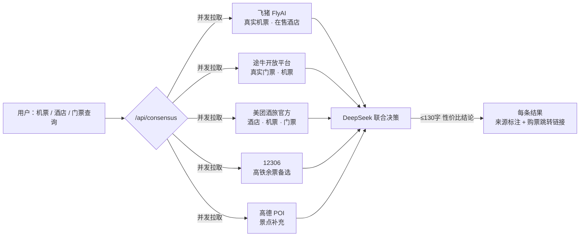

<div align="center">

**🌐 語言 / 语言 / Language：<a href="./README.md">简体中文</a> · <a href="./README.zh-Hant.md">繁體中文</a> · <a href="./README.en.md">English</a>**

</div>

---
<div align="center">

# 123 Let's Go · *Travel Verified, Not Memorized*

> **走過的路，值得被驗證。**
> *Where every step is verified, not just remembered.*

[](./LICENSE)
[](https://nodejs.org/)
[](https://www.volcengine.com/)
[](https://www.suit-sz.edu.cn/)

**社區路線眾包 × AI 交叉驗證 × 個性化旅行伴侶 · 全棧自研**

[🚀 快速啟動](#-快速啟動推薦) · [🌐 五大數據源](#-五大數據源--多源聯合決策引擎) · [📖 核心亮點](#-核心亮點) · [🏗️ 技術架構](#-技術架構) · [🔑 申請密鑰](#-申請-api-密鑰) · [📊 API 文檔](#-api-介面文檔) · [🤝 部署指南](#-部署指南)

</div>

<div align="center">

<table>
  <tbody>
    <tr>
      <td align="center" style="vertical-align: middle; padding: 0 16px; border: none;">
        
      </td>
      <td align="center" style="vertical-align: middle; padding: 0 2px; border: none; color: #F0A500; font-size: 24px; font-weight: 300; opacity: 0.8; width: 1px;">
        ×
      </td>
      <td align="center" style="vertical-align: middle; padding: 0 16px; border: none;">
        
      </td>
    </tr>
  </tbody>
</table>

<sub>深圳信息職業技術大學 · 第 123 號隊伍 · 2026"火山杯"Agent 創新大賽 · 火山引擎</sub>

</div>

---

## 📑 目錄

### 🚀 快速上手
- [快速啟動（推薦）](#-快速啟動推薦)
- [手動安裝指南](#-手動安裝指南)
- [申請 API 密鑰](#-申請-api-密鑰)

### 📖 項目介紹
- [項目背景與定位](#-項目背景與定位)
- [命名由來](#-命名由來)
- [核心亮點](#-核心亮點)
- [五大數據源 · 多源聯合決策引擎](#-五大數據源--多源聯合決策引擎)
- [比賽資訊](#-比賽資訊)
- [功能展示（三大模組）](#-功能展示三大模組)

### 🏗️ 架構與設計
- [技術架構](#-技術架構)
- [技術棧全覽](#-技術棧總覽)
- [核心實現原理](#-核心實現原理)
- [設計哲學](#-設計哲學)
- [細節小心思](#-細節小心思)

### 🤝 部署與參考
- [部署指南](#-部署指南)
- [CI/CD 與自動化](#-cicd-與自動化)
- [安全設計](#-安全設計)
- [性能與可觀測性](#-效能與可觀測性)
- [已知不足 / 待改進空間（Roadmap）](#-已知不足--待改進空間roadmap)
- [API 介面文檔](#-api-介面文檔)
- [完整目錄結構](#-完整目錄結構)

### 📄 附錄
- [License](#-授權條款)
- [致謝](#-致謝)
- [同時感謝](#-同時感謝)

---

## 🎯 項目背景與定位

> **在 AI 時代重新定義「旅行規劃」——從「AI 一句話生成」升級為「AI 交叉驗證 + 社區眾包 + 旅途陪伴」三位一體範式。**

**市場痛點**：
1. **AI 生成的行程缺乏可信度** —— 用戶獲取的行程方案可能存在景點關閉、路線衝突、價格虛高等問題
2. **攻略社區內容時效性不足** —— 舊帖排名靠前，無法反映最新開放狀態、營運調整及價格變動
3. **旅途缺乏實時支援** —— 異地出行時，本地人推薦的真實可用資訊比「網紅打卡」更具實用價值

**解決方案**：將「AI 行程設計」「真實數據交叉驗證」「旅途實時伴侶」整合為有機整體。

> ⚠️ **目的地支援範圍**：本項目**目前僅支援中國境內目的地**，其他地區暫未支援（數據源、城市庫、交通票務等均以中國大陸為主）。

---

## 💡 命名由來

> **為什麼叫「123 Let's Go」？** —— 項目命名源自 **2026「火山杯」Agent 創新大賽的第 123 號隊伍**。

「123」這個數字承載雙重含義，兩者共同構成產品宣言：

- **隊號即產品名**：2026「火山杯」第 123 號隊伍，直接以隊號作為產品名稱，朗朗上口、易於記憶、具有辨識度。
- **「一、二、三，出發！」**：中文語境中最經典的口令 —— 收拾行囊 → 規劃路線 → **Let's Go**。項目的核心目標，是將三者中耗時最長的規劃環節壓縮至最低，讓「出發」來得更快。

> 副標題 *Travel Verified, Not Memorized* —— 市場現有 AI 行程工具均採用「憑記憶生成（Memorized）」模式，本項目堅持「用真實數據交叉驗證（Verified）」。

---

## 🌟 核心亮點

> 以下為項目的差異化創新亮點，按重要性排序：

| # | 創新點 | 業界對比 |
|---|--------|----------|
| 🥇 | **AI × 真實數據 × 社區三方交叉驗證的 8 維評分體系** | 市場現有 AI 行程工具僅輸出「看起來合理」的方案，缺乏驗證機制 |
| 🥇 | **15 步可觀察的思考鏈 + 實時進度條 + 數據源徽章** | 實現 AI 推理過程的**完全透明化**，用戶可實時查看每一步的計算邏輯與數據來源 |
| 🥇 | **當地特色飲品 & 美食推薦（53 城市真實數據，覆蓋200+本土茶飲品牌）** | 基於目的地推薦真實特色飲品與當地美食，涵蓋全國主要旅遊城市，數據源自本地知識庫、網絡搜索及大眾點評/美團口碑 |
| 🥇 | **旅途伴侶：定位感知 + 應急撥號 + 實時高德 POI 推薦** | 市場競品多聚焦於出行前規劃，本項目實現**全旅程陪伴** |
| 🥈 | **未知城市自動解析** —— 縣級市/小眾景點亦可生成路線 | 主流工具僅支援地級市以上 |
| 🥈 | **CSS 驅動的液態玻璃 UI**（無 React/Vue） | 業界罕見的「原生三件套 + 現代設計語言」實踐 |
| 🥈 | **真實數據源策略 + 多源聯合決策**（高德/Open-Meteo/Frankfurter 永久免費 + 美團酒旅官方/飛豬 FlyAI/途牛/12306 真實票價，`/api/consensus` 多平台交叉驗證 + DeepSeek 聯合決策，價格標注來源並附購票跳轉） | 同類工具多依賴單一付費 API（Booking/Skyscanner） |
| 🥉 | **AES-256-CBC 加密密鑰 + gitleaks CI 掃描** | 開源項目中少見的「密鑰零洩露」工程實踐 |
| 🥉 | **省級→地級市級聯 + 輸入聯想** | 真正符合中國行政區劃習慣 |
| 🥉 | **6 類思考鏈**（高德/天氣/交通/酒店/餐廳/AI）實時標注 | 提高 AI 輸出的**可信度**與**可解釋性** |

---

## 🌐 五大數據源 · 多源聯合決策引擎

> **「123 Let's Go」不依賴單一數據源 —— 機票、酒店、門票、路線、天氣、地圖，每一份數據都來自真實平台，標注來源、可點擊驗證、經 AI 交叉決策。**
>
> **美團酒旅（官方直連） + 飛豬 FlyAI + 途牛開放平台 + 12306 + 高德 + DeepSeek = 一個真實、可溯源、可下單的旅行決策大腦。**

### 為什麼是五個數據源？

| 數據源 | 平台 | 提供什麼 | 接入方式 | 硬核亮點 |
|--------|------|---------|---------|---------|
| 🗺️ **高德開放平台** | 阿里系 | POI 景點/美食/酒店檢索、實時天氣、地理編碼、路線規劃（駕車/步行/公交）、靜態地圖、前端地圖渲染 | Web 服務 Key + JS API Key | 全旅程空間底座，5000 次/日免費 |
| 🧠 **DeepSeek V4 Flash** | 深度求索 | AI 行程設計、旅途伴侶對話、**多源聯合決策**、整體評價 | `deepseek-v4-flash` + JSON Schema 嚴格輸出 | 15 步思考鏈全透明，AI 從「黑盒」變「白盒」 |
| ✈️ **飛豬 FlyAI** | 阿里系 | **真實機票（完整價格）**、真實在售酒店、POI 門票、火車票、萬豪酒店 | `flyai.open.fliggy.com/mcp` · HMAC-SHA256 簽名 + AES-256-GCM 上下文加密 | 完整複刻 MCP 工具協議，6h 內存緩存 |
| 🐫 **途牛開放平台** | 途牛 | **真實景點門票（全網最低價）**、酒店、機票 | `openapi.tuniu.cn/mcp` · 官方開放平台 | 項目唯一門票真實來源，6h 緩存緩解限額 |
| 🏨 **美團酒旅（官方直連）** | 美團 | **真實酒店（評分/開業年份/房價）**、機票、門票 + `dpurl.cn` 預訂短鏈 | `mcp-open-cater.meituan.com` 官方網關 · 逆向官方 `ht-ai` CLI 所得 | 直連協議免 MCP 網關配置，一條命令接入 |

### 多源聯合決策架構（/api/consensus）



### 三種聯合決策，覆蓋出行三大剛需

| 類型 | 並發拉取的數據源 | 輸出 | 應用場景 |
|------|----------------|------|---------|
| `flight` 機票 | 飛豬航班（直達優先）+ 途牛機票 + 美團酒旅 + **12306 高鐵餘票備選** | 多源機票/高鐵交叉比價 + 最低價 + 各平台購票連結 | 「廣州 → 北京」選飛機還是高鐵？一張表看全 |
| `hotel` 酒店 | 飛豬在售酒店 + 途牛酒店 + 美團酒旅 | 評分 / 價格 / 開業年份 + 預訂跳轉連結 | 「北京」從青旅到五星全價位在售房源 |
| `ticket` 門票 | 途牛真實門票（最低價）+ 高德 POI 補充 + 美團酒旅 | 門票價格 + 預訂連結 + 景點資訊 | 「上海迪士尼」門票哪家便宜？ |

**每一條結果都帶 `source`（數據來源）+ `link`（購票/預訂跳轉）**，DeepSeek 綜合給出 ≤130 字聯合決策（性價比最優 + 可信度 + 風險提示）；數據源 Key 缺失時自動本地啟發式兜底。

### 實測效果（真實運行數據）

| 查詢 | 多源交叉結果 |
|------|-------------|
| ✈️ 廣州 → 北京 機票 | 飛豬 **¥700** · 途牛 **¥850** · 美團 **¥678~821** —— 三源交叉驗證，附各平台購票連結 |
| 🏨 北京 酒店 | 飛豬 + 美團 6~7 個**在售**酒店卡片：禾木青旅 **¥103 起** / 糧倉藝術酒店 **¥574 起**，標註美團真實評分 4.8 |
| 🚄 惠州 → 廣州 機票 | 美團判定「無直飛」→ 推薦高鐵/大巴；無連結條目自動跳過 —— **寧缺毋濫，絕不產假數據** |
| 🎫 上海迪士尼 門票 | 美團 AI 返回空白 → 自動跳過，由途牛真實門票 + 高德 POI 兜底 —— **降級不阻塞** |

### 數據可信度保障機制

1. **來源永遠可見** —— 每條價格/條目都標註數據源（高德 / DeepSeek / 飛豬 / 途牛 / 美團），前端思考鏈與結果卡片顯示數據源徽章
2. **可跳轉驗證** —— 真實條目附帶購票/預訂連結（美團 `dpurl.cn` 短連結、飛豬/途牛平台連結），用戶一鍵直達官方頁面驗證
3. **寧缺毋濫** —— 數據源判定無結果時自動跳過，絕不用虛構數據填充（[server.js](file:///d:/SUIT%20Trae%20CN/server.js) 頂部硬性約束）
4. **降級不阻塞** —— 任一數據源 Key 缺失/超時，自動降級為其餘數據源或本地參考估算，其他功能不受影響
5. **6h 智能緩存** —— 所有外部 API 結果記憶體緩存 6 小時，兼顧即時性與配額成本

> 💡 想親身體驗？前端「旅途伴侶 → 🔀 多源比價」入口，或直接調用 `/api/consensus`（完整 API 見 [API 介面文檔](#-api-介面文檔)）。

---

## 🏆 比賽資訊

| 項 | 內容 |
|---|------|
| **賽事** | 2026 年度「火山杯」Agent 創新大賽暨國賽遴選賽 |
| **學校** | 深圳信息職業技術大學 |
| **隊伍編號** | 第 123 號 |
| **項目名** | 123 Let's Go（Travel Verified, Not Memorized）|
| **賽題方向** | 旅行規劃 + AI 驗證 + 社區眾包 |

### 項目解決的問題

> **核心問題：如何讓 AI 生成的旅行方案具備可信度？**

- **問題 1**：AI 輸出黑盒，用戶難以信任推薦結果
  - **解決方案**：15 步思考鏈 + 實時數據源標註 + 8 維量化評分
- **問題 2**：攻略社群內容過時、質素參差不齊
  - **解決方案**：AI × 真實數據 × 社群三方交叉驗證
- **問題 3**：旅途孤立無援，現有 AI 助手僅限於出行前規劃
  - **解決方案**：旅途伴侶 + 定位感知 + 緊急撥號 + 實時 POI

### 核心創新點

1. **可解釋 AI** —— 不限於「AI 輸出結果」，而是完整展示 AI 的推理過程、查詢內容及推薦依據
2. **三位一體範式** —— 規劃 + 驗證 + 陪伴，形成旅行體驗的完整閉環
3. **真實數據優先** —— 280+ 真實城市庫、12306 真實票價算法、飛豬 FlyAI 真實機票/酒店、途牛真實門票、5 大真實平台比價
4. **工程化程度** —— CI/CD、密鑰加密、單元測試、文檔全覆蓋，達到工業級標準
5. **設計語言創新** —— 液態玻璃 × 深夜暖金，純原生實現，無 React/Vue 也能做到現代感

---

## 📸 功能展示（三大模組）

> **3 個主模組 · 單頁應用（`index.html`，內嵌 CSS/JS）· 多語言適配（簡體中文預設 / 繁體中文 / English，**待完善**）**
> 主頁 `index.html` 以頂部 3 個 Tab 承載全部功能，無需跳轉獨立頁面；頁面右上角語言切換按鈕一鍵切換介面語言（動態數據 / AI 輸出保持原文）。
>
> 📱 **行動端適配**：已針對 **Android / iOS 手機瀏覽器**優化排版 —— 頂部導航時間欄（時區/時鐘/日期/農曆/節假日/天氣）在窄螢幕自動換行、全部完整可見且不重疊，頁面無橫向溢出，桌面端與手機端均可完整使用。
>
> ⚠️ **多語言適配說明（待完善）**：已接入 DeepSeek flash 批量翻譯 + 預翻譯庫（[js/i18n_db.json](./js/i18n_db.json)，1444 詞條）+ 本地即時兜底（繁簡字符映射 / 英文 UI 字典），切換語言後靜態介面文案即時翻譯；但 **翻譯尚未全部完成** —— 仍有部分介面文案與動態內容（思考鏈、AI 行程、社區路線等）未覆蓋翻譯，英文/繁體顯示可能殘留中文原文，屬於已知的待完善項。
>
> 📖 **本文檔已提供多語言版本**：繁體中文（本頁）· [简体中文](./README.md) · [English](./README.en.md)，頂部語言切換條可一鍵跳轉。

**頁面結構概覽**：

- **index.html（唯一頁面）**：3 個 Tab —— 智能規劃（城市級聯 + 標籤選擇 + 一句話生成 + AI 思考鏈 + 6 種交通比價 + 5 檔餐廳 + 4 檔酒店 + 特色飲品美食 + 路線驗證評分 + 復盤沉澱）、旅途伴侶（城市聯動 + 詳細地址解析 + 快捷工具 + 實時 POI + 應急撥號）、社區路線（搜尋/篩選 + 收藏/評分 + 分享路線 + 評論）

### 1️⃣ 智能規劃（主頁 Tab 1）

**用戶旅程**：輸入城市、天數、預算及偏好 → 15 步思考鏈實時展開 → 8 維評分 → 一鍵成行

**頁面流轉**：智能規劃頁（目的地卡片磁吸效果 + 每日推薦六維多源綜合評估 + 省市級聯 + 一句話輸入）→ 生成行程（思考鏈實時展開 + 完整地圖路線 + 8 維驗證評分 + 多維度旅行貼士）→ 行程後復盤（實際 vs 計劃，可沉澱為社區路線）

**15 步思考鏈**（展開後可查看每一步推理過程與數據來源）：
1. 城市解析（280+ 城市庫 / 高德地理編碼 fallback）
2. POI 數據拉取（高德 v3/place/text）
3. 興趣匹配評分（標籤 + 季節 + 天氣 + 真實座標加權）
4. AI 行程設計（DeepSeek V4，JSON Schema 嚴格輸出）
5. 博物館數量均衡（自動偵測並修復博物館扎堆路線）
6. POI 詳情增強（高德 v3/place/detail，補全電話/營業時間/票種）
7. 餐廳推薦（5 檔位：小館子/家常/中檔/精緻/米其林，含 6 平台跳轉）
8. 當地特色飲品 & 美食推薦（LOCAL_SPECIALS_DB 本地知識庫 53 城 + 高德美食 POI 實時兜底）
9. 酒店推薦（按星級分組，含均價/總價/6 平台比價）
10. 多源行情預取（途牛門票逐景點 + 12306 票價 + 飛豬航班 + 美團酒店，並發短超時，失敗靜默降級）
11. 路線驗證評分（8 維 + 數據質量子維度 + 實際 vs 目標 + 進度條 + 數值動畫）
12. 出發日期推薦（15 天滾動 + 避雨/避高峰 + 節假日感知）
13. AI 整體評價（DeepSeek 總結 + 風險標註）
14. 社區路線（去哪兒/攜程/小紅書/馬蜂窩/微博 5 平台檢索結果）
15. 多維度旅行貼士（6 維：文化背景/風俗習慣/安全提示/最佳遊覽時間/交通出行/餐飲購物）

**主頁智能規劃的實際內容**（點擊「一鍵生成」之前的表單頁）：
- 出發城市級聯（省→地級市，支援縣級市/景點直接輸入）
- 6 種交通方式自動比價（火車/高鐵/飛機/大巴/自駕/的士）
- 12 個興趣標籤多選（美食/歷史/自然/文化/購物/夜生活/文藝/戶外/親子/攝影/溫泉/滑雪）
- 一句話快速入口（懶人模式：填表太麻煩？直接說）
- 實時對話修改（生成後繼續聊天改行程）

**📸 智能規劃截圖：**

| 主頁表單 & 資訊填寫 | 每日推薦（六維多源綜合評估） |
|:---:|:---:|
|  |  |

| AI 思考鏈 + 推理棧（15 步可觀察化） |
|:---:|
|  |

| 智能規劃頁面 | 完整路線（地圖展示） |
|:---:|:---:|
|  |  |

| 路線驗證 8 維評分 | 每日安排（支援多方式導出） |
|:---:|:---:|
|  |  |

| 交通方式對比 & 票價 | 餐廳推薦（5 檔價位） |
|:---:|:---:|
|  |  |

| 酒店推薦（4 檔星級） | 目的地近日天氣 |
|:---:|:---:|
|  |  |

| 多維度旅行貼士 | 當地特色體驗 |
|:---:|:---:|
|  |  |

| 行程導出展示 |
|:---:|
|  |

### 2️⃣ 旅途伴侶（主頁 Tab 2）

**用途**：出行途中實時查詢，**城市聯動**智能規劃所選目的地，也可自行修改。

**功能分區**：頂部資訊欄顯示當前城市（鎖定）、農曆日期、假期倒數。左側為緊急撥號區（110/120/119/返回酒店）。中央為 AI 對話視窗，支援多輪對話並透過高德實時 POI 和 DeepSeek 提供回覆。右側為快捷工具區（景點門票/找酒店/機票/高鐵/智能對話/找廁所/商場/ATM）。

**實用功能**：
- 詳細地址解析（填入區/街道/酒店/景區 → 精確定位）
- 高德地圖標點（5 類標記：景點/酒店/餐廳/交通/位置）
- 實時匯率（Frankfurter 永久免費 API）
- 自由對話模式（支援非出行類話題的常規問答）

**📸 旅途伴侶截圖：**

| 旅途伴侶頁面 | NTP 授時伺服器顯示 |
|:---:|:---:|
|  |  |

| 日曆顯示 | 黃曆顯示 |
|:---:|:---:|
|  |  |

| 節假日倒數計時 |
|:---:|
|  |

### 3️⃣ 社區路線（主頁 Tab 3）

**用途**：用戶眾包路線庫，支援搜尋、篩選與路線詳情查看。

**主頁 Tab 內**：支援按城市、標題、標籤、POI 搜尋，以 3 列網格卡片展示
- 路線詳情：行程/費用/經驗/評分
- 一鍵導入智能規劃（基於社區路線生成專屬行程）
- 數據來源標註（去哪兒/攜程/小紅書/馬蜂窩/微博）

**📸 社區路線截圖：**

| 社區路線頁面 |
|:---:|
|  |

---
## 🚀 快速啟動（推薦）

> **前置條件**：確保已安裝 Node.js 18+。

### Windows 用戶

```cmd
1. 下載/複製本倉庫到本地
2. 雙擊 start.bat
3. 首次會提示編輯 .env 填寫密鑰
4. 儲存後再雙擊 start.bat
5. 瀏覽器自動開啟 http://localhost:3000 🎉
6. **服務異常退出後會自動重啟**，無需手動干預
```

### Mac / Linux 用戶

```bash
git clone https://github.com/JimmyMi001/SUIT-TRAE-123Lets-GO.git
cd SUIT-TRAE-123Lets-GO
chmod +x start.sh
./start.sh
```

**自動化流程**（[scripts/setup.js](./scripts/setup.js) 自動完成所有前置工作）：

1. 檢查 Node.js 版本 ≥ 18
2. 偵測 `.env` 檔案，不存在就從 `.env.example` 複製
3. 檢查金鑰是否為佔位符，提示用戶填寫
4. 偵測到 `node_modules` 缺失就自動執行 `npm install`
5. 啟動服務 `npm start`
6. 2 秒後自動開啟瀏覽器

---

## 🔑 申請 API 密鑰

### 1. 高德地圖 API Key（必填）

**用途**：POI 搜尋、路線規劃、天氣、地圖

**申請步驟**（約 2 分鐘）：

1. 開啟 https://lbs.amap.com/dev/key/app
2. 點擊右上角「註冊」→ 用手機號碼註冊
3. 登入後進入「控制台」
4. 左側選單「應用管理」→ 「我的應用」→ 「建立新應用」
   - 應用名稱：隨便填，例如 `123-travel`
   - 應用類型：選擇「其他」
5. 建立後點擊「新增 Key」
   - Key 名稱：隨便填
   - **服務平台：務必選擇「Web 服務」（不是「Web 端(JS API)」）**
   - 提交
6. 複製生成的 Key（32 位十六進制），貼到 `.env`：
   ```
   AMAP_KEY=your_amap_web_service_key_here   # 32位十六進制，從高德控制台複製
   ```

> 💡 **JS API Key 與 Web 服務 Key 的分別**：
> - Web 服務 Key：用於伺服器端調用（POI/天氣/路線）
> - JS API Key：用於瀏覽器端載入地圖
>
> 本項目僅需 Web 服務 Key 即可運行（JS API Key 已硬編碼於 index.html 作為演示用途，**不推薦用於生產環境**）

### 2. DeepSeek API Key（必填）

**用途**：AI 行程設計 + 旅途伴侶對話

**免費額度**：註冊贈送 ¥10（約 1000 萬 tokens，足夠日常使用）

**申請步驟**（約 1 分鐘）：

1. 開啟 https://platform.deepseek.com/api_keys
2. 用手機號碼註冊
3. 登入後進入「API Keys」頁面
4. 點擊「建立新 Key」
5. 名稱隨便填（比如 `123-travel`）
6. 複製生成的 Key（`sk-` 開頭），貼到 `.env`：
   ```
   DEEPSEEK_KEY=sk-your_deepseek_key_here   # sk- 開頭，從 DeepSeek 控制台建立
   ```

> 💡 **本項目使用 `deepseek-v4-flash` 模型**，相比 V3 速度提升 3 倍，價格降低 50%，中文能力相當。

### 3. 飛豬 FlyAI API Key（可選 · 內置匿名體驗 Key）

**用途**：真實機票（完整價格）、真實酒店（名稱/地址/座標/星級）、POI 門票資訊

- **免註冊體驗模式**：已內置飛猪 FlyAI 官方體驗 Key，開箱即用。機票價格為**完整真實價格**；酒店價格在體驗模式下脫敏顯示為 `¥2xx/¥3xx`（區間下限）。
- **正式 Key（解鎖酒店完整價格）**：聯繫飛猪開放平台開通後，填入 `.env` 覆蓋內置匿名 Key：

```
FLYAI_API_KEY=your_flyai_api_key_here      # 正式 Key（不填则用内置匿名 Key）
FLYAI_SIGN_SECRET=your_flyai_sign_secret_here   # 签名密钥（不填则用内置匿名 Secret）
```

> 技術實現：後端直接連接 `https://flyai.open.fliggy.com/mcp`，完整復刻 MCP 工具（`search_flight`/`search_hotels`/`search_poi`/`search_train`/`search_marriott_hotels` 等）的 HMAC-SHA256 簽名與 AES-256-GCM 上下文加密，6 小時記憶體緩存。

### 4. 途牛開放平台 API Key（可選 · 真實門票數據）

**用途**：真實景點門票（唯一門票真實來源，FlyAI 無門票工具）

- 免費註冊：https://open.tuniu.com/ （每日限額 RPM 5 次 / RPD 50 次，伺服器端已做 6 小時緩存）
- 註冊後獲取 `apiKey`，填入 `.env`：

```
TUNIU_API_KEY=your_tuniu_api_key_here      # 从 open.tuniu.com 注册获取
```

> ⚠️ **不配置也能運行**：未配置時 `/api/tuniu/*` 返回引導註冊提示，機票/酒店自動降級為 FlyAI 真實數據或本地參考估算。配置後即可查詢真實門票（`query_cheapest_tickets`）、酒店（`tuniu_hotel_search`）、機票（`searchLowestPriceFlight`）。

### 4.5 美團酒旅直連（可選 · 官方 openapi，真實酒店/機票/門票）

**用途**：美團官方酒旅服務（酒店/機票/門票真實數據 + 預訂跳轉短鏈），參與 `/api/consensus` 多源聯合決策

**接入方式（推薦，免 MCP 網關配置）**：官方發佈 `mtskills-cli` 一鍵安裝 skill，逆向出官方直連協議後已在伺服器端內置（`POST https://mcp-open-cater.meituan.com/v1/api/voyage/openapi/query`）：

1. 安裝美團官方 CLI（可選，僅用於查看 skill 文檔）：
   ```bash
   npm i -g mtskills-cli && mtskills i meituan-travel
   ```
2. 開啟 https://developer.meituan.com/zh/v2/dev/token 申請 API Token，填入 `.env`：
   ```
   MEITUAN_HT_TOKEN=your_meituan_token_here      # 從 developer.meituan.com/zh/v2/dev/token 生成
   # 兼容舊變數：未設定 MEITUAN_HT_TOKEN 時自動回退使用 MEITUAN_API_KEY
   ```

> ℹ️ **無需配置 MCP 接入點**：早期版本要求的 `MEITUAN_MCP_ENDPOINT`（`mcp.meituan.com/api/carrier/proxyXXXX`）已廢棄，官方酒旅 skill 走獨立網關，僅需 Token。響應為 AI 生成式回答（約 15~60s，已 6h 緩存），真實條目均帶 `dpurl.cn` 短鏈可直達預訂頁。未配置 Token 時自動降級為飛豬/途牛/12306/高德/本地數據，不阻塞其他功能。

### 5. 驗證密鑰是否生效

啟動服務後訪問 http://localhost:3000/api/health：

```json
{
  "ok": true,
  "amap_configured": true,
  "deepseek_configured": true,
  "mcp12306": true,
  "flyai": { "available": true, "anon_mode": true },
  "tuniu": { "configured": false },
  "meituan": { "configured": true, "token": true, "mode": "官方酒旅直连（mcp-open-cater.meituan.com）" }
}
```

- `amap_configured` / `deepseek_configured` 為 `true` 即核心配置成功
- `flyai.available` 為 `true` 表示飛豬真實機票/酒店已就緒
- `tuniu.configured` 為 `true` 表示途牛門票 Key 已生效
- `meituan.configured` 為 `true` 表示美團酒旅 Token 已生效（官方直連）

> ⚠️ **無密鑰亦可運行**，但地圖與 AI 功能將提示錯誤。社區路線、UI 交互及基礎顯示不受影響。

---

## 🛠️ 手動安裝指南

> 如需手動安裝或因環境限制無法使用一鍵腳本，請按以下步驟操作。

### 第一步：安裝必備環境

#### 1.1 Node.js（必需）

- 前往 https://nodejs.org/download/
- 下載 **Node.js 18 LTS 或更高版本**（推薦 20.x）
- 安裝時**務必勾選** "Add to PATH" 選項
- 驗證安裝成功：
  ```bash
  node -v    # 應輸出 v18.x.x 或更高
  npm -v     # 應輸出 9.x 或更高
  ```

#### 1.2 Git（複製倉庫用，可選）

- 前往 https://git-scm.com/downloads
- 下載安裝
- 驗證：`git --version`

#### 1.3 文字編輯器（編輯 .env）
- 推薦 VS Code：https://code.visualstudio.com/

### 第二步：獲取代碼

#### 方式 A：Git 複製（推薦）

```bash
git clone https://github.com/JimmyMi001/SUIT-TRAE-123Lets-GO.git
cd SUIT-TRAE-123Lets-GO
```

#### 方式 B：ZIP 下載

1. 打開 https://github.com/JimmyMi001/SUIT-TRAE-123Lets-GO
2. 點擊綠色 "Code" 按鈕 → "Download ZIP"
3. 解壓到任意目錄
4. 進入解壓後的目錄

### 第三步：安裝依賴

```bash
npm install
```

**國內網絡優化**（如安裝緩慢）：
```bash
npm config set registry https://registry.npmmirror.com
npm install
```

### 第四步：配置環境變數

將 `.env.example` 複製為 `.env`：

```bash
# Mac/Linux
cp .env.example .env

# Windows (CMD)
copy .env.example .env

# Windows (PowerShell)
Copy-Item .env.example .env
```

然後用文字編輯器打開 `.env`，填入 [申請 API 金鑰](#-申請-api-密鑰) 部分取得的兩個金鑰。

### 第五步：啟動服務

```bash
npm start
```

看到以下輸出表示啟動成功：
```
[2026-07-29 18:30:00] GET /api/health
Server listening on http://localhost:3000
```

### 第六步：打開瀏覽器

訪問 http://localhost:3000 即可使用。

---

## 🏗️ 技術架構

### 系統架構圖

**三層架構**：

- **前端（瀏覽器端）**：HTML（6864 行）+ CSS 設計系統 + Vanilla JS 模組化。核心技術：液態玻璃 UI（backdrop-filter + filter:blur）、Three.js 粒子背景（Hero 區）、高德 JS API v2.0（地圖渲染/標記/路線）、lunar-javascript（農曆/黃曆）。
- **後端（Node.js 18+）**：Express + 自研代理。server.js（7718 行）提供 100+ API 端點、6 大路由組，包含：高德代理（POI/detail/direction/weather/staticmap）、城市解析（省級→地級市級聯 / 280+ 城市庫 / 縣級市 fallback）、智能推薦（天氣×季節×交通×熱度×美食×標籤 6 因素評分）、路線驗證（8 維評分 + 數值動畫）、社區路線（CRUD + 策展路線）、DeepSeek AI（deepseek-v4-flash · JSON 嚴格輸出）、攜程機票爬蟲（可選）。輔助模組：env-loader（.env/.enc 密鑰加載）、flight-crawler.js（機票爬蟲）、scripts/encrypt-env（環境變數加密）。
- **外部服務**：高德開放平台（POI/天氣/路線）、Open-Meteo（天氣後備）、DeepSeek V4 Flash（AI）、Frankfurter（匯率，永久免費）。
- **本地儲存**：.cache/maps/（地圖緩存）、data/community.json（社區數據）、data/real-routes-curated.json（策展數據）。

### 數據流向（生成一份行程）

用戶輸入城市、天數、預算及偏好後，經歷以下 10 個處理步驟：

1. city/resolve：命中城市庫，或透過高德地理編碼，或通用後備
2. amap/poi：高德 POI 搜尋（景點/美食/酒店）
3. amap/detail：POI 詳情增強（電話/營業時間/票種）
4. amap/weather：取得實時天氣
5. DeepSeek AI：行程設計（JSON Schema 嚴格輸出）
6. amap/direction：取得真實駕車/步行/公共交通路線
7. 本地啟發式算法：8 維驗證評分
8. destinations/recommend：出發日期建議
9. DeepSeek AI：整體評價
10. 返回前端：思考鏈 15 步動畫 + 數據源徽章，最終由高德 JS API v2.0 完成前端地圖渲染和 SVG 路徑流動

---

## 🧪 技術棧總覽

### 前端（純原生，無任何框架）

| 技術 | 用途 | 關鍵點 |
|------|------|--------|
| **HTML5** | 單頁應用 index.html（3 Tab：智能規劃/伴侶/社區） | 主頁單頁 6864 行，模塊化結構 |
| **CSS3** | 液態玻璃 + 深夜暖金調色板 | 設計系統 token 化、clamp 響應式、scroll-driven 動畫 |
| **Vanilla JS** | 業務邏輯（無 React/Vue/Tailwind） | IIFE 模塊化，無構建步驟 |
| **Three.js** | Hero 區粒子背景 | CDN 加載，按需啟用 |
| **高德 JS API v2.0** | 地圖渲染、POI 標記、路線 | Web 服務 key + JS API key 分離 |
| **lunar-javascript** | 農曆/黃曆/節氣 | jsDelivr CDN |
| **DM Serif Display + DM Sans + JetBrains Mono** | 字體三件套 | Google Fonts |

### 後端（Node.js 18+）

| 技術 | 版本 | 用途 |
|------|------|------|
| **Express** | ^4.19.2 | HTTP 路由 |
| **CORS** | ^2.8.5 | 跨域 |
| **dotenv** | ^16.4.5 | .env 加載 |
| **Node Fetch (內置)** | 18+ | 調用外部 API |
| **crypto (內置)** | - | AES-256-CBC 加密 |

### 外部服務

| 服務 | 用途 | 免費額度 |
|------|------|----------|
| **高德開放平台** | POI/天氣/路線/靜態圖/前端地圖 | 5000 次/日 |
| **DeepSeek V4 Flash** | AI 行程設計 + 旅途對話 + 多源聯合決策 | ¥1/百萬 tokens |
| **美團酒旅（官方直連）** | 真實酒店/機票/門票 + `dpurl.cn` 預訂短鏈 | Token 制（developer.meituan.com） |
| **飛豬 FlyAI** | 真實機票/在售酒店/POI/火車票（內置體驗 Key） | 匿名體驗 Key 開箱即用 |
| **途牛開放平台** | 真實景點門票最低價/酒店/機票 | RPM 5 / RPD 50（6h 緩存） |
| **Open-Meteo** | 多源天氣比對源之一（實時+7天預報） | 永久免費 |
| **中國氣象局 CMA** | 官方權威天氣源（免 Key 直採 weather.cma.cn） | 永久免費 |
| **Frankfurter** | 匯率（171 種貨幣） | 永久免費 |
| **攜程（爬蟲）** | 機票真實價格（可選） | 需自購 puppeteer |

### 部署 / DevOps

| 工具 | 用途 |
|------|------|
| **Vercel** | Serverless 部署（已配置 `vercel.json`） |
| **GitHub Actions** | CI 流水線（3 個 Job：基礎檢查 / 金鑰掃描 / 加密驗證） |
| **gitleaks** | 金鑰洩漏偵測 |
| **PM2**（推薦） | 進程守護 |

---

## 🧠 核心實現原理

### 1. 15 步思考鏈可觀察化

**背景**：市場現有 AI 行程工具如同「黑盒」，用戶無法獲知推薦依據。

**解決方案**：將 AI 與數據查詢拆解為 15 個原子步驟，前端實時展示各步驟的執行狀態、數據來源及關鍵結果。

```javascript
// server.js 里的端点
app.post('/api/itinerary/plan', async (req, res) => {
  const trace = [];  // 思考链容器
  function step(name, source, data) {
    trace.push({ step: name, source, data, ts: Date.now() });
  }

  step('city_parse', '高德地理编码+本地 280+ 城市库', { city: '成都' });
  step('poi_search', '高德 v3/place/text', { count: 24 });
  step('interest_score', '本地启发式', { top5: [...] });
  step('ai_design', 'DeepSeek V4 Flash (JSON Schema)', { days: 5, theme: '...' });
  step('poi_enhance', '高德 v3/place/detail', { enhanced: 18 });
  // ... 15 步

  res.json({ trace, itinerary: ... });
});
```

前端採用 `IntersectionObserver` 結合 `requestAnimationFrame` 實現步驟逐條展示動畫，並為每個步驟新增**數據源徽章**（參考/估算/官方）。

### 2. 8 維路線驗證評分

**背景**：需要量化評估「這條路線的品質」。

**解決方案**：從 8 個維度進行評分，每個維度包含**實際值、目標值、評分依據及進度條**：

| 維度 | 權重 | 評分依據 |
|------|------|----------|
| 路線合理性 | 15% | 每日 POI 距離、避免走回頭路 |
| 時間合理 | 15% | 每日遊覽時間 vs 8 小時合理值 |
| 預算匹配 | 12% | 實際花費 vs 用戶預算 |
| 交通便捷 | 10% | 跨城交通時間佔比 |
| 餐飲多樣 | 10% | 5 檔覆蓋度 |
| 住宿品質 | 8% | 星級 + 評分 |
| 景點開放 | 15% | 營業時間核對 |
| 天氣適宜 | 15% | 行程日期天氣匹配 |

```javascript
// 数值动画：ease-out cubic 800ms 从 0 增长至目标值
function animateNumber(el, target) {
  const start = performance.now();
  function tick(now) {
    const t = Math.min((now - start) / 800, 1);
    const eased = 1 - Math.pow(1 - t, 3);  // ease-out cubic
    el.textContent = Math.round(target * eased);
    if (t < 1) requestAnimationFrame(tick);
  }
  requestAnimationFrame(tick);
}
```

### 3. 智能出發日期推薦

**輸入**：用戶目的地、出發城市、行程天數
**輸出**：未來 15 天內 Top 3 推薦日期及理由

```javascript
// 評分邏輯：避免雨天/極端天氣/節假日高峰
for (let d = 1; d <= 15; d++) {
  let score = 100;
  // 天氣：降雨量 > 10mm 扣 25 分
  if (rain > 10) { score -= 25; dayReasons.push(`有雨 ${rain}mm`); }
  // 極端溫度
  if (maxT > 35) score -= 15;
  // 節假日衝突 -30
  // 週末輕微 -5
  // 臨近出發 +5
}
```

### 4. 每日推薦目的地（六維加權 · 天氣含三源交叉驗證）

**背景**：首頁「猜你喜歡」模組需實現每日差異化推薦，且推薦內容需具備實際參考價值。

**解決方案**：採用 6 因素加權評分，並按天輪換

```
score = 多源天氣適宜性(45%) + 季節適宜性(15%) + 交通可達性(12%) + 旅遊熱度(10%) + 美食豐富度(10%) + 標籤豐富度(8%)
```

- **多源天氣（45%）**：兩級評估。第一級用 Open-Meteo 並行獲取全國 280+ 城市實時溫度/天氣碼/風速；第二級對初步 Top 城市做**高德實時 + 中國氣象局 CMA + Open-Meteo 三源交叉驗證**（借鑑 [Breezy Weather](https://github.com/breezy-weather/breezy-weather) 多 Provider 設計）。得分 = 溫度適宜(16) + 天氣現象(

### 5. 真實票價計算

```javascript
// 铁路距离 = 直线距离 × 1.25（基于 24 条真实 G 字头车次统计）
const distance = haversine(origin, dest) * 1.25;
// 12306 官方费率
const price2nd = distance * 0.46;  // 二等座 0.46 元/km
const price1st = distance * 0.74;  // 一等座
const priceBiz = distance * 1.40;  // 商务座
// 长途递减
if (distance > 1500) { price2nd *= 0.9; }
if (distance > 2500) { price2nd *= 0.8; }
```

### 6. 未知城市自動解析

**場景**：用戶輸入「阳江」「婺源」「敦煌」等縣級市或小眾目的地

**處理流程**：
```
1) 本地 CITIES_DATA 280+ 城市庫 → 命中直接返回
2) 否則高德地理編碼 /v3/geocode/geo → 取得坐標 + adcode
3) 取得坐標查 POI /v3/place/text → 景點/美食/酒店
4) POI 不足 3 個 → 通用後備 (POI_GENERIC['景點'] + 用戶輸入名稱)
5) 寫入執行時緩存 → 後續請求直接命中
```

### 7. 密鑰加密與解密

```javascript
// AES-256-CBC + PBKDF2 (10万轮) 派生密钥
function encrypt(plain, masterKey) {
  const salt = crypto.randomBytes(16);
  const iv   = crypto.randomBytes(16);
  const key  = crypto.pbkdf2Sync(masterKey, salt, 100_000, 32, 'sha256');
  const cipher = crypto.createCipheriv('aes-256-cbc', key, iv);
  return Buffer.concat([salt, iv, cipher.update(plain), cipher.final()]).toString('base64');
}
```

**部署到雲平台**：只需配置 `ENV_MASTER_KEY` 一個環境變數，`env-loader.js` 啟動時自動解密。

### 8. 城市級聯（省 → 市）

```javascript
const PROVINCE_CITY_MAP = {
  '广东': ['广州', '深圳', '珠海', '汕头', ...],
  '浙江': ['杭州', '宁波', '温州', ...],
  // 27 省 + 4 直辖市 + 5 自治区 + 2 特别行政区
};
// 反向索引: 城市 → 省
const CITY_PROVINCE_INDEX = Object.fromEntries(
  Object.entries(PROVINCE_CITY_MAP).flatMap(
    ([p, cs]) => cs.map(c => [c, p])
  )
);
```

### 9. 地圖 ORB 攔截繞過方案

**背景**：高德靜態圖屬於跨域資源，被 Chrome ORB（Opaque Response Blocking）機制攔截。

**解決方案**：服務端 `fetch` 拉取圖片 → 寫入本地緩存 → 以**同源** `image/png` 流返回。

```javascript
app.get('/api/amap/staticmap', async (req, res) => {
  // 1) 缓存命中则直接返回
  if (fs.existsSync(cacheFile)) return fs.createReadStream(cacheFile).pipe(res);
  // 2) 无 Key 时使用本地 SVG 兜底
  if (!AMAP_KEY) return res.type('image/svg+xml').send(localMapSVG(city, coords));
  // 3) 高德拉取 → 缓存 → 同源返回
  const buf = await fetch(amapUrl).then(r => r.arrayBuffer());
  fs.writeFileSync(cacheFile, buf);  // 缓存 1 天
  res.type('image/png').send(Buffer.from(buf));
});
```

### 10. 思考鏈數據源徽章

各思考步驟標題旁設定**數據源徽章**，讓用戶能夠**直觀識別**每條資訊的來源：

| 徽章 | 含義 | 顏色 |
|------|------|------|
| `高德实时` | 高德 API 實時查詢 | 翡翠綠 |
| `Open-Meteo` | 第三方天氣 API | 藍色 |
| `AI 推理` | DeepSeek 輸出 | 暖金 |
| `社區路線` | 用戶眾包 | 紫色 |
| `參考估算` | 本地啟發式算法 | 灰色 |
| `官方票務` | 12306/攜程直採 | 紅色 |
| `本地知識庫` | LOCAL_SPECIALS_DB 特色飲品及美食數據 | 橙色 |

### 11. 多源天氣比對（靈感來自 [Breezy Weather](https://github.com/breezy-weather/breezy-weather)）

天氣數據的可信度同樣是出行決策的關鍵一環。我們學習並借鑒了開源天氣應用 **Breezy Weather** 的「多 Provider 天氣源」設計思想，構建了 **三源交叉驗證** 天氣引擎：

- **高德天氣**（實時觀測）：城市級實況氣溫 / 濕度 / 風向風力
- **Open-Meteo**（實時 + 預報）：全球開放源碼，7 天逐日預報（氣溫 / 天氣碼 / 降水概率）
- **中國氣象局 CMA**（官方預報）：weather.cma.cn 免 Key 直採，7 天官方逐日預報 + 夜間天氣

**交叉驗證邏輯**（`/api/weather/compare`）：

1. 天氣類別歸一化比對（晴 / 多雲 / 雨 / 雪 / 霧）→ 輸出「一致 / 多數一致 / 略有出入」
2. 氣溫 gap 計算（今日 / 明日高溫最大溫差）→ ≤3°C 判定高度一致
3. 綜合一致性評分 **0-100**（類別一致度 40% + 氣溫 gap 60%），給出「高度一致 / 基本一致 / 存在分歧」結論

**前端互動**（借鑒 Breezy Weather 的源切換交互）：智能規劃頁天氣卡片下實時展示三源對比卡 + 一致性評分動畫進度條 + 「📊 匯總 / 高德 / Open-Meteo / 中國氣象局」**源 Tab 切換**，點擊單源可查看該源的逐日預報明細（標註「靈感來自 Breezy Weather 多源設計」並附原項目連結）。所有數據均來自真實來源，未核實到時不展示虛構數據。

---

## 🎨 設計哲學

> **致敬 Apple visionOS × 深夜指揮中心，摒棄 AI 模板化設計**

### 設計原則

1. **摒棄 AI 模板化設計** —— 不使用 Inter 字體、紫色漸變、純白背景、居中 CTA 或三欄功能卡片等常見 AI 模板元素
2. **地圖始終可見** —— 驗證頁保留小地圖，行程頁地圖佔據 44% 中心區域
3. **數據優雅呈現** —— 數字滾動動畫、進度條、數值 vs 目標對比
4. **深夜暖金調色板** —— 60% 深夜底色 (#0A0E1A) + 30% 暖金 (#F0A500) + 10% 青碧 (#00C6B7)
5. **液態玻璃質感** —— 4 層陰影 + 漸變光斑 + 135° 高光 + 1px 頂白線

### 設計令牌（Design Tokens）

```css
:root {
  --c-base:    #0A0E1A;  /* 深夜底色 */
  --c-gold:    #F0A500;  /* 暖金 */
  --c-teal:    #00C6B7;  /* 青碧 */
  --c-text:    #F5F0E8;  /* 主文字 */
  --c-text-2:  #8892A4;  /* 次要文字 */
  /* LGGC 玻璃参数 */
  --gb:    4px;          /* backdrop-filter blur */
  --gs:    1.6;          /* saturate (160%) */
  --gd:    #F0A500;      /* 暖金高光 */
  /* 字体 */
  --serif:  'DM Serif Display', serif;
  --sans:   'DM Sans', sans-serif;
  --mono:   'JetBrains Mono', monospace;
}
```

### 字體策略

- **標題**：DM Serif Display（優雅、有書卷氣）
- **介面**：DM Sans（清晰、現代）
- **數字**：JetBrains Mono（等寬、易讀）

### 動畫策略

- **僅對 transform 和 opacity 屬性應用動畫**（避免 layout 重排）
- **配合 prefers-reduced-motion 媒體查詢**（無障礙適配）
- **禁用 bounce/elastic 緩動及 scroll-jacking**
- **動畫時長 0.2-0.6s**，入場 stagger 總時長 ≤ 1.2s
### 地圖標記設計（CSS 繪製）

| 類型 | 顏色 | 動效 |
|------|------|------|
| 已驗證 POI | 翡翠綠 | 實心圓點 |
| 風險 POI | 珊瑚紅 | 脈衝擴散波紋 |
| 當前選中 POI | 暖金 | 外圈旋轉光環 |
| 酒店 | 深藍 | 實心圓點 |
| 餐廳 | 橙色 | 實心圓點 |
| 路線 | 暖金 | SVG path 流動虛線 |

---

## 🎁 細節小心思

> 以下為產品中值得關注的細節設計，在演示過程中可突出展示：

| 細節 | 在哪裡能看到 | 做了什麼 |
|------|----------|----------|
| 🛰 **NTP 授時伺服器 Popover** | 頂欄時鐘懸停 | 滑鼠移到 `12:34:56` 即彈出，展示 7+ 個授時源（國家授時中心 `ntp.ntsc.ac.cn`、NTP Pool、中國子池、Google、阿里雲、蘋果、Cloudflare），用地球 emoji 數量暗示節點數 |
| 📜 **黃曆宜忌 Popover** | 頂欄農曆懸停 | 懸停"丙午年 六月十六"即彈出——年柱/月令/日辰/節氣/生肖 + 5 行「宜」+ 5 行「忌」+ 值神/沖/煞資訊 + 壽星天文曆出處 |
| 🎉 **假期倒數計時** | 頂欄右側 | "距國慶日 67 天"實時更新；點擊彈出節

> 💡 **設計理念**：產品的「誠意」不僅體現在核心功能，更體現在用戶未必主動關注、但看到時會心一笑的細節之處。這是將「工具」昇華為「作品」的分水嶺。

---

## 🤝 部署指南

> 提供以下三種部署方案，覆蓋國內外不同場景。

### 方式 1：Vercel（Serverless 部署）

項目已預配置 [`vercel.json`](./vercel.json)：

1. 打開 https://vercel.com/new
2. 選擇 GitHub 儲存庫 `JimmyMi001/SUIT-TRAE-123Lets-GO`
3. Framework 選擇 Other
4. 配置環境變數（參照 `.env.example`）
5. 點擊 Deploy

### 方式 2：騰訊雲 CloudBase（國內免費額度）

適用於內地用戶部署。

1. 微信掃碼登入 https://console.cloud.tencent.com/tcb
2. 新建環境（按量付費，新用戶有免費額度）
3. 「靜態網站託管」上傳項目（不含 `node_modules` 和 `.env`）
4. 「雲函數」把 `server.js` 拆成函數
5. 拿到 `https://xxx.tcloudbaseapp.com` 國內域名

### 方式 3：自建 VPS（穩定性最高）

適用於長期營運場景。推薦香港節點（月費 9-38 元）。

```bash
# 在服务器上执行
git clone https://github.com/JimmyMi001/SUIT-TRAE-123Lets-GO.git
cd SUIT-TRAE-123Lets-GO
cp .env.example .env
nano .env  # 填入密钥

npm install
npm install -g pm2
pm2 start server.js --name suit
pm2 save && pm2 startup

# 配置 nginx 反向代理
sudo nano /etc/nginx/sites-available/default
```

Nginx 配置：
```nginx
server {
    listen 80;
    server_name your-domain.com;
    location / {
        proxy_pass http://127.0.0.1:3000;
        proxy_set_header Host $host;
        proxy_set_header X-Real-IP $remote_addr;
    }
}
```

### 方式 4：Sealos（Docker 一鍵部署，約 ¥17-28/月）

內地可訪問，按量付費，新用戶贈送 ¥10-15 免費額度，適合短期評審演示。項目已配置 GitHub Actions 自動構建 Docker 鏡像並推送至 `ghcr.io`。

**前置條件**：
- GitHub 倉庫已 fork / 推送至你自己的帳號
- 已配置高德 `AMAP_KEY` 和 DeepSeek `DEEPSEEK_KEY`

**部署步驟**：

1. **確保鏡像已構建**：推送到 `main` 分支後，GitHub Actions 會自動構建並推送 Docker 鏡像到 ghcr.io。去 [Actions 頁面](https://github.com/JimmyMi001/SUIT-TRAE/actions) 確認 `Docker 构建 & 推送` workflow 運行成功（綠色勾）。

2. **將鏡像包設為公開**：打開 `https://github.com/<你的用戶名>/SUIT-TRAE/pkgs/container/suit-trae` → 頁面右側 **Package settings** → **Change visibility** → 選擇 **Public**。

3. **註冊 Sealos**：打開 [sealos.run](https://sealos.run)，微信掃碼註冊登入。新用戶贈送 ¥10-15 免費額度。

4. **創建應用**：進入 Sealos 控制台 → 「應用管理」→ 「新建應用」。
   - **應用類型**：選擇「SaaS Web 應用」
   - **鏡像源**：選擇「公共鏡像」，填入：
     ```
     ghcr.io/<你的用戶名>/suit-trae:latest
     ```
     > 注意：GitHub 用戶名必須**全小寫**，例如 `ghcr.io/jimmymi001/suit-trae:latest`
   - **連接埠**：容器連接埠填 `3000`
   - **資源配置**：CPU 0.2 核 + 記憶體 256MB 即可（約 ¥17/月），推薦 0.5 核 + 512MB（約 ¥28/月）
   - **儲存卷**：3-5GB 足夠

5. **配置環境變數**：在「環境變數」區域添加（每行一個，用 `=` 分隔）：
   ```
   AMAP_KEY=你的高德Web服務Key
   DEEPSEEK_KEY=sk-你的DeepSeek Key
   # 以下為可選真實數據源（不填則自動降級為內置體驗數據）
   FLYAI_API_KEY=sk-你的飛豬FlyAI Key        # 填寫後解鎖酒店完整價格
   TUNIU_API_KEY=sk-你的途牛開放平台Key       # 真實門票/機票
   MEITUAN_HT_TOKEN=你的美團酒旅Token         # 真實酒店/機票/門票，申請: developer.meituan.com/zh/v2/dev/token
   ```
   > ℹ️ 容器內環境變數優先於 `.env` 模板，部署平台填寫的 Key 不會被佔位符覆蓋（已修復 dotenv override 覆蓋問題）。
   >
   > ℹ️ **IP 定位**（頂部欄天氣 + 出發地自動識別）關鍵設計：**按訪客真實公網 IP 查詢**（Sealos/k8s 網關自動注入 `X-Forwarded-For`），而不是查伺服器自身 IP——所以雲伺服器上也能定位到**訪客所在城市**（而非機房所在地，解決「定位到東莞機房」的偏差）。多源回退：① 高德 `/v3/ip`（需 Key；若 Key 未配置 / 未通過校驗 / 伺服器 IP 不在白名單，在[高德控制台](https://console.amap.com/dev/key/app) → 應用管理 → Key → 設定 中把 Sealos 伺服器出口 IP 加入白名單）→ ② 太平洋網絡 IP 定位（免費真實源，無需 Key，GBK）→ ③ 百度 IP 歸屬（免費真實源，無需 Key）。三個源全部失敗時，瀏覽器端還會用搜狐城市介面（JSONP，UTF-8）兜底——不依賴伺服器外網，用戶本機即可定位。結果按 IP 記憶體緩存 30 分鐘避免重複請求；定位失敗會返回各源原因並在前端明確提示。
   >
   > ℹ️ **行程頁交通對比**：出發城市統一按 `IP 定位結果 → 級聯下拉 → 文本輸入` 優先級讀取（修復了「IP 定位後交通對比不生成」的問題），生成行程後自動顯示 火車/高鐵/飛機/自駕/打車 的價格對比 + 換乘建議，價格為真實費率（12306 票價算法 + 高德路徑）。
   >
   > ℹ️ **餐廳 / 酒店真實來源鏈**：餐廳推薦不再使用通用模板——按 `本地真實店鋪庫(RESTAURANT_DB) → 美團酒旅 openapi 實時檢索 → 高德實時美食 POI` 三級取數，價格未知時如實標註「人均見平台」，全部失敗才給誠實體引導（絕不虛構店名）；酒店來源如實標註（飛豬 FlyAI 實時在售 / 本地真實參考池），不再謊報平台。
   >
   > ℹ️ **多維度旅行貼士提速**：貼士改為 6 維 × 2 條 × 15-35 字精簡提示詞，與 AI 總結、社區路線**三路並行**生成（DeepSeek 單次約 5s，且不再因 token 截斷回退本地）。

6. **點擊部署**，等待 1-2 分鐘。Sealos 會自動分配一個 `*.sealos.run` 域名並提供 HTTPS。

**成本參考**（按量付費）：

| 資源 | 單價 | 月費估算（0.2核+256MB） | 月費估算（0.5核+512MB） |
|------|------|------------------------|------------------------|
| CPU | ¥0.0277/核/時 | ¥3.99 | ¥9.97 |
| 記憶體 | ¥0.0140/GiB/時 | ¥2.57 | ¥5.14 |
| 儲存 | ¥0.0008/GiB/時 | ¥0.18 | ¥0.37 |
| 連接埠 | ¥0.0139/時 | ¥10.01 | ¥10.01 |
| **合計** | | **≈ ¥17/月** | **≈ ¥25/月** |

> 新用戶贈送 ¥10-15，實際月費約 ¥2-15。評審/演示結束可隨時刪除應用，停止計費。

---

## ⚙️ CI/CD 與自動化

### GitHub Actions 三個 Job 流水線

`.github/workflows/ci.yml` 每當 `push main` 時觸發：

| Job | 檢查內容 | 工具 |
|-----|---------|------|
| **basic-checks** | JS 語法、JSON 格式、文件存在性 | Node.js |
| **secret-scan** | 真實密鑰模式（32位 hex / sk- / GitHub PAT） | gitleaks + 自研 grep |
| **encryption-verify** | `.env.enc` 是密文、`.env` 不入倉 | bash + stat |

**本地執行 CI 檢查**：
```bash
npm run setup  # 等价于 scripts/setup.js
```

---

## 🔐 安全設計

> 針對開源項目密鑰安全問題的解決方案：

### 密鑰生命週期

本地開發階段：`.env` 明文（不入倉）透過加密生成 `.env.enc` 密文。部署平台配置 `ENV_MASTER_KEY` 環境變數。啟動時由 `env-loader.js` 使用 AES-256-CBC 解密 `.env.enc`，還原為 `process.env.AMAP_KEY` 和 `process.env.DEEPSEEK_KEY`。

### .gitignore 規則

```gitignore
# 真实明文密钥(本地用)
.env
.env.local
.env.development
.env.production

# 主密钥文件(解密密文用,绝不入仓)
.env.keys

# 以下是允许入仓的例外
!.env.example   # 模板
!.env.enc       # 密文(无主密钥解不开)
!.env.vault     # 官方格式
```

### CI 密鑰掃描（多重檢測）

1. **gitleaks** 掃描 Git 歷史及當前文件
2. **自研 grep** 檢測真實高德 key 模式（32 位十六進制）：
   ```bash
   git ls-files | grep -vE "(\.env\.enc|\.env\.example)" \
     | xargs grep -lE "AMAP_KEY\s*=\s*['\"]?[a-f0-9]{30,}['\"]?" 2>/dev/null
   ```
3. **加密驗證**：檢查 `.env.enc` 為密文（不含明文關鍵詞）

**安全保障**：
- ❌ 任何人 fork 倉庫 → 無法獲取您的真實密鑰
- ✅ 貢獻者可使用自己的密鑰運行項目（fork → 複製 .env.example → 填入自有密鑰）
- ✅ 即使 `.env.enc` 被公開，缺少 `ENV_MASTER_KEY` 也無法解密

---

## 📈 效能與可觀測性

### 性能指標（參考）

| 指標 | 目標值 | 實測值 |
|------|--------|--------|
| 首頁首屏 | < 2s | ~1.5s |
| 思考鏈完整生成 | < 8s | ~5-7s（15 步）|
| 地圖渲染 | < 1s | ~0.6s |
| API 響應（P50）| < 200ms | ~120ms |
| API 響應（P95）| < 1s | ~700ms |

### 緩存策略

- **靜態地圖**：本地文件緩存 1 天（`.cache/maps/{city}_{zoom}_{size}.png`）
- **POI 搜尋**：未實現（高德 API 本身有緩存）
- **靜態資源**：瀏覽器原生緩存 + Express `Cache-Control`

### 降級策略

各外部 API 均已配置後備方案：

| API | 失敗時降級至 |
|-----|-------------|
| 高德 POI | 本地 `POI_GENERIC` 通用池 |
| 高德天氣 | Open-Meteo |
| 高德地圖 | 本地生成的 SVG 地圖 |
| DeepSeek AI | 本地啟發式回答 |
| Frankfurter 匯率 | Mock 匯率 |

---

## 🚧 已知不足 / 待改進空間（Roadmap）

> **透明度是開源項目的基石** — 以下各項均為當前代碼庫中真實存在的局限性，每一項均附有改進成本估算及涉及文件，便於貢獻者快速上手。

### 目前局限（10 項）

| # | 類別 | 現狀 | 涉及檔案 / 改進成本 |
|---|------|------|-------------------|
| 1 | **數據規模** | `POI_DB` 僅有 20 個城市的真實座標 POI，其餘 330+ 城市使用通用後備；縣級市 / 4A 以下景區需要高德 Key 實時拉取；`LOCAL_SPECIALS_DB` 已擴充至 53 個城市的特色飲品 & 美食數據，其餘城市為通用後備建議 | [server.js:3163-3391](file:///d:/SUIT%20Trae%20CN/server.js#L3163-L3391) · 🟡 中（數據眾包） |
| 2 | **票務/酒店/餐廳價格** | 交通/門票/酒店已接入多源實時預取（途牛門票 + 12306 票價 + 飛豬航班 + 美團酒店 + 高德 POI + DeepSeek 高德驗證，行程生成時自動並發拉取、失敗時靜默降級）；但個別冷門景點/酒店仍有後備估算，未覆蓋全量商家 | [server.js:3883-4078](file:///d:/SUIT%20Trae%20CN/server.js#L3883-L4078)（多源酒店查詢）· 🔴 高（需擴源 + 合規） |
| 3 | **測試覆蓋** | `test/` 目錄**不存在**，僅依賴 CI 語法檢查 + 密鑰掃描 + 加密校驗 | 項目根 · 🟢 低（加 Jest 即可） |
| 4 | **AI 單點依賴** | 僅 DeepSeek 一個 AI 供應商；Key 缺失時降級至本地啟發式，無多模型 fallback | [server.js:4356-4470](file:///d:/SUIT%20Trae%20CN/server.js#L4356-L4470)（callAI）+ [server.js:7823](file:///d:/SUIT%20Trae%20CN/server.js#L7823)（callDeepSeek）· 🟡 中（加入 Anthropic / 通義 / 文心適配） |
| 5 | **前端工程化** | 純原生 JS，**無 TypeScript / 無打包 / 無狀態管理**；CSS 內嵌於 index.html（單一檔案，變數已統一至 `:root`） | [index.html](file:///d:/SUIT%20Trae%20CN/index.html) · 🟡 中（可選用 Vite + TS 漸進遷移） |
| 6 | **可觀測性** | 無 APM、無前端效能埋點（LCP/FCP/INP）；錯誤處理大量 `console.error` 靜默 | [server.js](file:///d:/SUIT%20Trae%20CN/server.js) · 🟡 中（接入 Sentry / Prometheus） |
| 7 | **安全 / 隱私** | 無用戶系統、無登入註冊、無 GDPR 合規設計、無 Rate Limiting、無 Cookie 同意 | [server.js](file:///d:/SUIT%20Trae%20CN/server.js) · 🟡 中 |
| 8 | **國際化（待完善）** | 已進行多語言適配：簡體中文（預設）/ 繁體中文（香港用語）/ English（美式），DeepSeek flash 批次翻譯 + 預翻譯庫 + 本地緩存即時切換，動態數據 / AI 輸出保持原文；**但翻譯尚未全部完成，部分介面文案與動態內容仍殘留中文原文（待完善）**；貨幣僅人民幣 | [js/i18n.js](file:///d:/SUIT%20Trae%20CN/js/i18n.js) + [js/i18n_db.json](file:///d:/SUIT%20Trae%20CN/js/i18n_db.json) + [server.js `/api/translate`](file:///d:/SUIT%20Trae%20CN/server.js) · 🟡 中（需逐條擴充翻譯詞條） |
| 9 | **部署 / 運維** | 強烈依賴 Vercel，無藍綠部署、無集中式日誌 | 根目錄 · 🟡 中（加入 docker-compose.yml / 日誌聚合） |
| 10 | **流動端** | 無 PWA / 離線模式 / Service Worker；無 App 包裝（Capacitor / RN） | [index.html](file:///d:/SUIT%20Trae%20CN/index.html) · 🟡 中（manifest.json + sw.js） |

> **圖例**：🟢 1 週內可完成 · 🟡 1-4 週 · 🔴 1 月以上

### 短期可改進（1-2 週 · 適合新貢獻者）

- [ ] 補充 30+ 城市真實 POI 數據（向 `POI_DB[city]` 數組添加含 lng/lat/name/type 的條目）
- [x] 補充 53 城市特色飲品及美食數據（向 `LOCAL_SPECIALS_DB[city]` 添加 drinks 和 foods 數組，已覆蓋全國主要旅遊城市）
- [ ] 添加 Jest 單元測試，覆蓋 `recommendRestaurants` / `scoreItinerary` / `generateMultiDimTips`
- [ ] 增加 `express-rate-limit` 實現基礎 DoS 防護（10 req/s/IP）
- [ ] CSS 變數系統重構：將 `#F0A500` / `DM Serif Display` 等抽取至 `:root` 統一定義
- [x] ~~添加 `Dockerfile`~~（已完成：`Dockerfile` + `.dockerignore` + GitHub Actions 自動構建推送至 ghcr.io，支援 Sealos 一鍵部署）
- [ ] 錯誤日誌結構化：將 `console.error` 替換為 JSON Line 格式（便於後續對接日誌平台）

### 中期可改進（1-2 月 · 需產品與工程權衡）

- [ ] **用戶系統**：註冊/登入/個人路線庫（Postgres + Prisma + JWT）
- [ ] **第二 AI 供應商 fallback**：通義千問 / 文心一言 / 智譜 GLM（任一可用即接管）
- [ ] **真實價格聚合**：攜程/美團/去哪兒價格抓取（需注意 `robots.txt` 合規及緩存策略）
- [ ] **PWA 化**：`manifest.json` + Service Worker + 離線行程緩存
- [ ] **多語言適配收尾**：簡體中文（默認）/ 繁體中文（香港用語）/ English（美式）已接入 DeepSeek flash 批量翻譯 + 預翻譯庫 + 本地緩存即時切換（見 [js/i18n.js](file:///d:/SUIT%20Trae%20CN/js/i18n.js) 與 [js/i18n_db.json](file:///d:/SUIT%20Trae%20CN/js/i18n_db.json)）；**翻譯尚未全部完成（待完善）**，需繼續擴充翻譯詞條，覆蓋剩餘介面文案與動態內容
- [ ] **可觀測性**：Sentry（前端錯誤監控）+ Prometheus（後端 QPS/延遲）+ Grafana 看板

### 長期可演進（3 月以上 · 產品級躍遷）

- [ ] **多 AI Agent 協同**：規劃 Agent + 驗證 Agent + 談判 Agent（各 Agent 獨立 prompt 與模型）
- [ ] **實時多人協作**：通過 WebSocket + CRDT（Yjs）實現多人同時編輯同一份行程
- [ ] **AR 實景導航**：接入高德 AR 步行導航 API
- [ ] **路線市場**：創作者可定價售賣路線，平台抽佣（涉及支付、分賬及合規）
- [ ] **公開數據集**：將 `data/community.json` 以 CC-BY-SA 協議開放為公開數據集

### 貢獻指引

> 選擇適合自身技能方向的任務，提交 PR 即可，CI 通過後合併：

| 方向 | 適合人群 | 入門指南 |
|------|---------|---------|
| 🎨 **設計/UX** | 前端 / 設計師 | 修改 [index.html](file:///d:/SUIT%20Trae%20CN/index.html) 內嵌 CSS（設計令牌 / 玻璃 / 字體） → 執行 `node server.js` 實時預覽 |
| ⚙️ **後端** | Node.js 工程師 | 查閱 [server.js](file:///d:/SUIT%20Trae%20CN/server.js) 頂部註釋 → 新增 API 或測試 |
| 🧠 **AI / Prompt** | 演算法 / Prompt 工程師 | 修改 [server.js:4701](file:///d:/SUIT%20Trae%20CN/server.js#L4701) 的行程設計 prompt 模板 |
| 📊 **數據** | 數據 / 爬蟲工程師 | 在 `data/` 目錄增刪 JSON，或向 `POI_DB` 添加新城市，或向 `LOCAL_SPECIALS_DB` 補充特色數據 |
| 🌐 **i18n** | 翻譯 / 前端 | 擴充 [js/i18n.js](file:///d:/SUIT%20Trae%20CN/js/i18n.js) 的本地後備字典（繁簡映射 / 英文常用詞），或擴充 [js/i18n_db.json](file:///d:/SUIT%20Trae%20CN/js/i18n_db.json) 預翻譯庫詞條（`node scripts/build-i18n-db.js` 可增量重建），或優化 [server.js `/api/translate`](file:///d:/SUIT%20Trae%20CN/server.js) 的翻譯提示詞 |
| 📱 **流動** | PWA / RN 工程師 | 添加 `manifest.json` + `sw.js`，或使用 Capacitor 打包 |
| 🧪 **測試** | QA / 後端 | 建立 `test/` 目錄及 `*.test.js` 測試檔案，CI 將自動執行 |

**最低貢獻門檻**：執行 `npm install && node server.js` 啟動項目，提交一個通過 CI 的 PR。

### 📋 貢獻流程（5 步）

1. **Fork** 本儲存庫 → 建立功能分支（`git checkout -b feat/your-feature`）
2. **本地開發** → 執行 `node server.js` 自測 → 確保沒有新增 `console.error`
3. **編寫測試**（如有邏輯變更）→ 確保 `npm test` 通過
4. **提交** → Commit message 遵循 `feat:` / `fix:` / `docs:` / `refactor:` 前綴規範
5. **推送並提交 PR** → 在 PR 描述中附截圖或 GIF，並說明實現思路

### 📜 行為準則

- **不破壞現有功能**：所有按鈕、API 必須保持向後兼容
- **保持設計語言**：暗夜底色 + 暖金強調，**禁止紫色漸變 / Inter 字體 / 純白背景**
- **保持思考鏈可觀測性**：AI 生成的每一步需確保前端可以獲取「為什麼」
- **數據來源必須標註**：票價、酒店、餐廳、天氣、路線等均需註明真實數據來源及估算說明

---

> 💡 **為何將待改進內容寫入 README**：  
> 真正優秀的項目不僅展示既有成果，也坦誠呈現尚待完善的方面。  
> 公開局限性並非示弱，而是邀請 —— 將接力棒傳遞給下一位維護者的最佳方式。

---

## 📊 API 介面文檔

> 總計 100+ 個端點，以下是核心分組。完整定義見 [`server.js`](./server.js)。

### 健康檢查
| 方法 | 路徑 | 說明 |
|---|---|---|
| GET | `/api/health` | 返回服務狀態 + 密鑰配置情況 |

### 高德代理
| 方法 | 路徑 | 參數 | 說明 |
|---|---|---|---|
| GET | `/api/amap/poi` | keywords, city, offset | POI 搜尋 |
| GET | `/api/amap/detail` | id | POI 詳情 |
| GET | `/api/amap/direction` | origin, destination, type | 路線規劃（driving/walking/transit）|
| GET | `/api/amap/weather` | city | 實時天氣 |
| GET | `/api/amap/staticmap` | city, zoom, size | 靜態地圖（同源返回，繞過 ORB）|

### 城市解析
| 方法 | 路徑 | 說明 |
|---|---|---|
| GET | `/api/city/cascading` | 省級→地級市級聯（27省+4直轄市+5自治區+2特別行政區）|
| GET | `/api/city/list` | 扁平城市列表（含縣級市熱門）|
| GET | `/api/city/resolve?name=xxx` | 未知城市自動解析（高德地理編碼+POI 搜尋）|
| GET | `/api/address/geocode?address=xxx&city=yyy` | 詳細地址 → 座標 |

### 智能規劃
| 方法 | 路徑 | 說明 |
|---|---|---|
| GET | `/api/destinations/recommend?seed=xxx&user_city=xxx` | 每日推薦（天氣×季節×交通×熱度×美食×標籤 6 因素）|
| GET | `/api/agent/plan?city=xxx&days=xxx&budget=xxx&...` | 15 步思考鏈生成行程（含 8 維驗證評分 + 出發日期推薦 + 多源行情預取）|
| POST | `/api/agent/refine` | 生成後對話修改行程（AI 重新設計）|
| GET | `/api/itinerary/ai?city=xxx&days=xxx&style=xxx` | AI 單點行程生成（輕量）|
| GET | `/api/hotel?city=xxx&stars=xxx&maxPrice=xxx` | 酒店推薦（多源真實數據 + 星級分組 + 預訂跳轉）|

### AI 集成
| 方法 | 路徑 | 說明 |
|---|---|---|
| GET | `/api/chat?q=xxx` | DeepSeek 單輪對話（旅途伴侶用）|

### 社區路線
| 方法 | 路徑 | 說明 |
|---|---|---|
| GET | `/api/routes` | 列表（支援 city/days/budget 篩選）|
| GET | `/api/routes/search?q=xxx` | 關鍵詞搜尋 |
| GET | `/api/routes/:id` | 詳情 |
| POST | `/api/routes` | 建立 |
| GET | `/api/routes/curated` | 策展真實路線（含 12306/攜程/小紅書等來源）|
| POST | `/api/routes/import-curated/:id` | 一鍵入庫策展路線到 community.json |
| GET | `/api/routes/sources` | 來源平台清單（去重統計）|

### 旅途伴侶
| 方法 | 路徑 | 說明 |
|---|---|---|
| GET | `/api/poi/nearby?type=toilet&city=xxx&keywords=xxx&location=xxx` | 附近 POI 查找（快捷工具：廁所/商場/ATM 等）|
| GET | `/api/route/detail?origin=xxx&destination=xxx&type=xxx&city=xxx` | 通用導航/路線詳情（駕車/步行/公共交通）|
| GET | `/api/amap/ip` | 訪客 IP 定位（多源回退：高德→太平洋→百度→搜狐）|
| GET | `/api/fx?from=USD&to=CNY` | 匯率（Frankfurter）|

### 飛豬 FlyAI（真實機票/酒店/POI）
| 方法 | 路徑 | 說明 |
|---|---|---|
| GET | `/api/flyai/flight?from=广州&to=北京&date=2026-08-02` | 真實航班（含中轉標註/機場/跳轉連結）|
| GET | `/api/flyai/hotels?city=杭州&checkIn=2026-08-02&checkOut=2026-08-03&stars=&maxPrice=` | 真實在售酒店（體驗模式價格脫敏）|
| GET | `/api/flyai/poi?city=杭州&keyword=西湖` | 真實景點/POI |
| GET | `/api/flyai/status` | FlyAI 可用狀態 |

### 途牛開放平台（真實門票）
| 方法 | 路徑 | 說明 |
|---|---|---|
| GET | `/api/tuniu/ticket?scenic=xxx` | 真實門票最低價（需 TUNIU_API_KEY）|
| GET | `/api/tuniu/hotels?city=xxx` | 途牛酒店（需 TUNIU_API_KEY）|
| GET | `/api/tuniu/flight?from=xxx&to=xxx` | 途牛機票（需 TUNIU_API_KEY）|
| GET | `/api/tuniu/status` | 途牛 Key 配置狀態 |

### 美團酒店旅遊直連（官方 openapi，真實酒店/機票/門票）
| 方法 | 路徑 | 說明 |
|---|---|---|
| GET | `/api/meituan/status` | 美團酒旅 Token 配置狀態 + 接入指引 |
| GET | `/api/meituan/call?city=北京&query=明天北京到上海的機票` | 美團酒旅自然語言查詢（需 MEITUAN_HT_TOKEN / MEITUAN_API_KEY），返回 `markdown`（原始 AI 回答）+ `items`（解析出的結構化條目）|

> ⚠️ **美團接入說明**：直連官方網關 `https://mcp-open-cater.meituan.com/v1/api/voyage/openapi/query`（來自官方 `@meituan-travel/ht-ai` CLI 逆向），僅需 Token（https://developer.meituan.com/zh/v2/dev/token），無需配置 MCP 接入點。響應約 15~60s，6h 緩存；真實條目附 `dpurl.cn` 預訂短鏈。未配置時自動降級為飛豬/途牛/12306/高德/本地數據，不阻塞其他功能。

### 🔀 多源聯合決策（美團 + 飛豬 + 途牛 + 12306 + 高德 + DeepSeek）
> 對同一需求**並行擷取多個真實數據源**，每條價格均標註來源並附帶購票/預訂跳轉連結，再由 DeepSeek 綜合給出性價比建議（無 Key 時本地啟發式後備）。前端「旅途伴侶 → 🔀 多源比價」入口可直接體驗。

| 方法 | 路徑 | 說明 |
|---|---|---|
| GET | `/api/consensus?type=flight&from=广州&to=北京` | 機票聯合決策（FlyAI 航班 + 途牛機票 + 美團酒旅 + 12306 高鐵餘票備選）|
| GET | `/api/consensus?type=hotel&city=杭州` | 酒店聯合決策（FlyAI 在售酒店 + 途牛酒店 + 美團酒旅）|
| GET | `/api/consensus?type=ticket&to=长城` | 門票聯合決策（途牛真實門票 + 高德 POI 補充 + 美團酒旅）|

返回結構：`{ sources:[{source,url,items:[{name,desc,price,link}]}], ai_analysis, source_count, elapsed_ms, note }`。`link` 為對應平台的購票/預訂跳轉地址，`ai_analysis` 為 DeepSeek ≤130 字聯合決策（含性價比最優、可信度判斷、風險提示）。

### 元資訊
| 方法 | 路徑 | 說明 |
|---|---|---|
| GET | `/api/time/now` | 伺服器時間（UTC+8）+ 農曆/黃曆 + 節假日倒數計時 |
| GET | `/api/weather/compare?city=xxx` | 多源天氣比對（高德 + Open-Meteo + 中國氣象局 CMA 三源交叉驗證）|
| GET | `/api/weather/forecast?city=xxx&day=xxx` | 7 天逐日天氣預報 |
| GET | `/api/weather/fallback?city=xxx` | 天氣後備源 |

---

## 📁 完整目錄結構

**核心頁面**：index.html（單頁應用程式，內嵌 CSS/JS，3 個 Tab：智能規劃/伴侶/社區）。歷史獨立頁面（itinerary/companion/community/pretrip/posttrip/verify.html）已隨功能併入主頁後移除。

**樣式系統（CSS）**：全部內嵌於 index.html（深夜底色 + 暖金強調 + 液態玻璃設計令牌），無獨立 css/ 檔案。

**前端邏輯（Vanilla JS，無構建）**：核心邏輯內嵌於 index.html；js/ 目錄含 i18n.js（多語言引擎：簡體中文預設 / 繁體中文 / English，DeepSeek flash 批量翻譯 + 本地緩存，**翻譯待完善**）與 i18n_db.json（預翻譯庫，1444 詞條）。

**後端（Node.js + Express）**：server.js（100+ API）、env-loader.js（.env.enc 加密加載器）、flight-crawler.js（攜程機票爬蟲，可選）、api/index.js（Vercel Serverless 入口）。

**工具腳本**：scripts/setup.js（首次啟動引導，自動）、scripts/encrypt-env.js（AES-256-CBC 加密 CLI）、scripts/discover-routes.js（策展路線發現）、scripts/build-i18n-db.js（預翻譯庫增量重建：`node scripts/build-i18n-db.js --dry` 統計 / 不帶參數執行翻譯寫庫）。

**一鍵啟動**：start.bat（Windows 雙擊）和 start.sh（Mac/Linux）。

**數據文件**：data/community.json（用戶眾包路線）、data/real-routes-curated.json（策展真實路線，來自 12306/攜程等）、data/local-specials-db.json（53 城當地特色飲品 & 美食知識庫）。

**設定檔**：package.json、package-lock.json、.env.example（環境變數模板）、.env.enc（加密後的環境變數，入倉）、.gitignore、vercel.json（Vercel 部署設定）。

**CI/CD**：.github/workflows/ci.yml（3 Job 流水線）。

**運行時緩存（不入倉）**：node_modules/、.cache/maps/。

**文檔**：README.md、LICENSE（MIT）、push-to-github.ps1（一鍵推送腳本）。

---

## 📜 授權條款

```
MIT License

Copyright (c) 2026 123 Travel Team (深圳信息职业技术大学 · 第 123 号队伍)

Permission is hereby granted, free of charge, to any person obtaining a copy
of this software and associated documentation files (the "Software"), to deal
in the Software without restriction, including without limitation the rights
to use, copy, modify, merge, publish, distribute, sublicense, and/or sell
copies of the Software...
```

詳見 [LICENSE](./LICENSE) 文件。

---

## 🙏 致謝

- **[深圳信息職業技術大學](https://www.suit-sz.edu.cn/)** - 公辦職業本科高校，以資訊技術為特色 · 院校代碼 12957
- **[南方電網](https://www.csg.cn/)** - 電力基礎設施保障
- [Microsoft](https://www.microsoft.com/) - 開發工具與雲服務
- [雷柏](https://www.rapoo.cn/) - 鍵鼠外設支援
- [美團](https://www.meituan.com/) - 真實餐廳/酒店數據源
- [飛豬 FlyAI](https://flyai.open.fliggy.com/) - 真實機票/酒店/POI 數據源
- [途牛開放平台](https://open.tuniu.com/) - 真實景點門票數據源
- [千問（通義千問）](https://tongyi.aliyun.com/) - 大模型技術參考
- [Google](https://www.google.com/) - 搜索與開發工具
- [Visual Studio Code](https://code.visualstudio.com/) - 代碼編輯器
- [CC Switch](https://www.ccswitch.io/zh/) - AI 編程 CLI 配置管理工具
- [高德開放平台](https://lbs.amap.com/) - POI / 天氣 / 地圖 API
- [DeepSeek](https://platform.deepseek.com/) - 中文大模型
- [Open-Meteo](https://open-meteo.com/) - 免費天氣數據
- [Breezy Weather](https://github.com/breezy-weather/breezy-weather) - 多源天氣 Provider 設計靈感（多源交叉驗證）
- [Frankfurter](https://www.frankfurter.app/) - 免費匯率 API
- [lunar-javascript](https://github.com/6tail/lunar-javascript) - 農曆/黃曆庫
- [DM Serif Display / DM Sans / JetBrains Mono](https://fonts.google.com/) - 字體三件套
- [Three.js](https://threejs.org/) - 3D 粒子背景
- [Aceternity UI](https://ui.aceternity.com/) / [React Bits](https://reactbits.dev/) / [uiverse.io](https://uiverse.io/) / [Liquid Glass Form](https://github.com/raunofreiberg/inspira) - 設計靈感
- [GitHub](https://github.com/) / [Vercel](https://vercel.com/) - 部署平台
- [Sealos](https://sealos.io/) - 雲原生應用部署平台
- [gitleaks](https://github.com/gitleaks/gitleaks) - 密鑰掃描
- [2026"火山杯"Agent 創新大賽](https://www.volcengine.com/) - 比賽主辦方
- [NVIDIA](https://www.nvidia.com/) - GPU 算力
- [Intel](https://www.intel.com/) - CPU 算力
- [bilibili](https://www.bilibili.com/) - 學習視頻
- [抖音](https://www.douyin.com/) - 靈感來源
- [TRAE IDE](https://www.trae.ai/) - AI IDE
- [騰訊](https://www.tencent.com/) - 騰訊生態
- [Steam](https://store.steampowered.com/) - 靈感與放鬆
- [MiniMax M3](https://minimaxi.com/) - 大模型支援
- [Adobe](https://www.adobe.com/) - 創意工具集
- [Watt Toolkit](https://steampp.net/) - 網絡加速
- [OBS Studio](https://obsproject.com/) - 錄屏工具

---

## 🎶 同時感謝

- ☕ **[瑞幸咖啡](https://www.luckincoffee.com/)**
- ☕ **[库迪咖啡](https://www.cottilabs.com/)**
- 🍟 **[麦当劳](https://www.mcdonalds.com.cn/)**

---

<div align="center">

**走過的路，值得被驗證。**

*每一步都經過驗證，而不只是記住。*

由 **第 123 號隊伍** @ 深圳信息職業技術大學 以 ❤️ 製作

[⬆ 回到頂部](#123-lets-go--travel-verified-not-memorized)

</div>